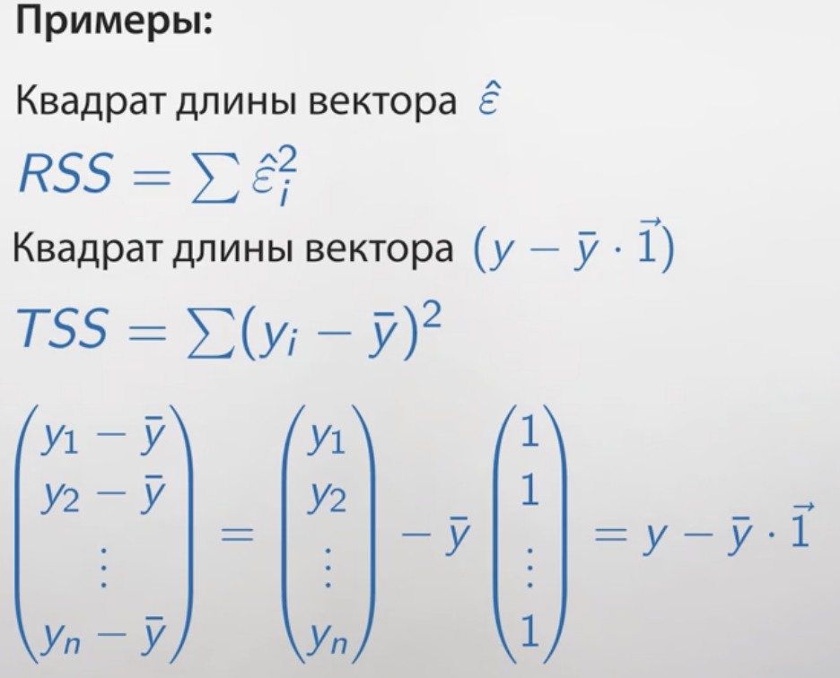
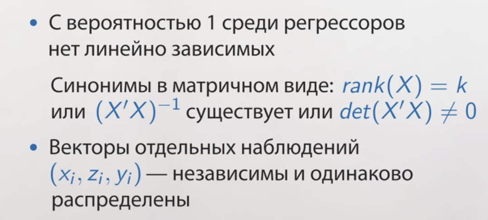
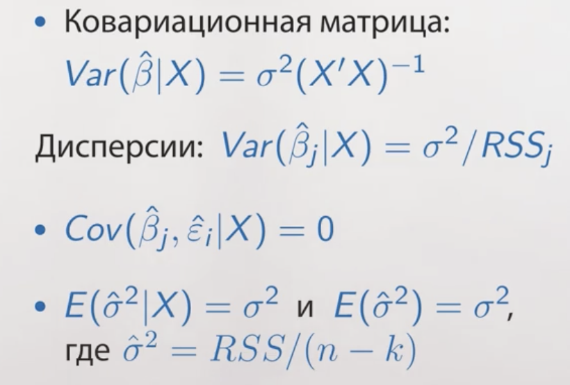
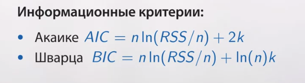
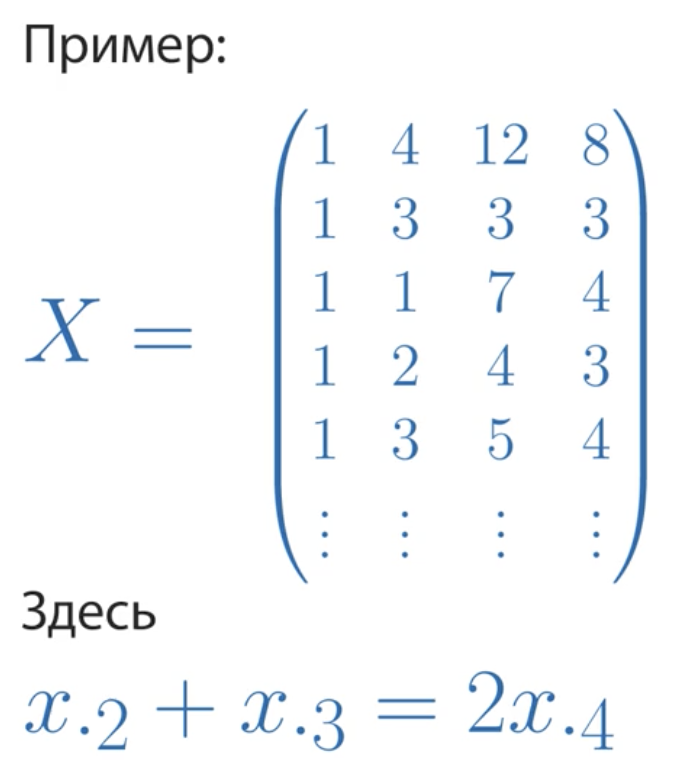
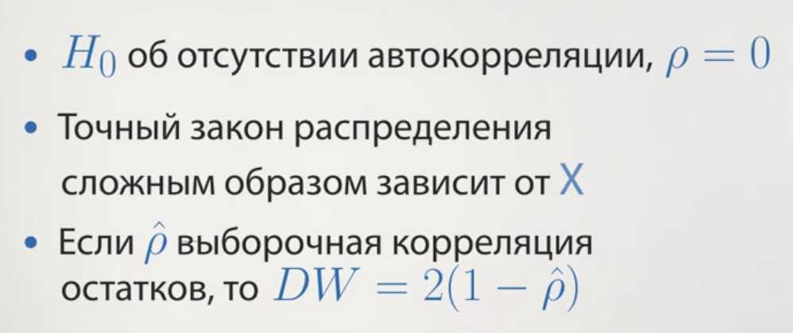

# Неделя 1

## Обозначения

* Одна зависимая (объясняемая) переменная: *y*

* Несколько регрессоров (предикторов, объясняющих переменных): *x, z...*

* По каждой переменной n наблюдений: $y_1, y_2...y_n$

Модель --- это формуля для объясняемой переменной.

### Пример

Возьмём например данные по машинам 1920-х годов. Тут видимая линейная взаимосвязь.


Модель для этих данных может иметь вид $y_i = \beta_1 + \beta_2x_i +  \varepsilon_i$

Что здесь есть что? У нас есть наблюдаемые переменные, 

* *y* — это длина тормозного пути

* *x* — это скорость, с которой ехала машина. 

* Есть неизвестные коэффициенты $ \beta_1, \beta_2$

* случайная составляющая, ошибка

То есть, $\beta_2$ показывает — насколько увеличивается тормозной путь, если машина разгонится на один лишний километр в час. И есть некая случайная составляющая $\varepsilon_i$, это может быть все что угодно:

  * водитель по-другому нажимал на тормоз, 
  * что-то там на дороге было другое, 

то есть это та часть, по которой у нас нет возможности предсказать, но, тем не менее, вот эта случайная ошибка она входит в y.

### План действий

* Придумать адекватную модель

* Получить оценки неизвестных параметров $\widehat\beta_1, \widehat\beta_2$

* Спрогнозировать, заменив неизвестные параметры на оценки $\widehat y_i = \widehat\beta_1 + \widehat\beta_2 x_i$

## Метод наименьших квадратов

Как найти  $\beta_1, \beta_2$? Собственно методом наименьших квадратов.

Если мы придумали какие-то оценки, $\beta_1, \beta_2$ то соответственно возникает такое понятие как ошибка прогноза

$$\widehat  \varepsilon_i = y_i - \widehat y_i$$

Есть суммарная ошибка, чтобы суммарная ошибка не занулялась одна в плюс, другая в минус, не компенсировали друг друга, мы возведем в квадрат. И посчитаем сумму квадратов ошибок прогноза, то есть сумма $\widehat  \varepsilon_i ^2$

$$Q(\widehat\beta_1, \widehat\beta_2) = \sum_{i=1}^{n} \widehat\varepsilon^{2}_{i} =  \sum_{i=1}^{n} (y_i - \widehat y_i)^2 $$


*Суть метода МНК*

Возьмите в качестве оценок такие коэффициенты $\widehat\beta_1, \widehat\beta_2$ при которых сумма квадратов ошибок прогноза будет минимальна

### Случай для одного регрессора

Всё сводится к тому, что в модели $$M_1: y_i = \beta + \varepsilon_i$$

$$\widehat\beta = \bar y$$


### Случай для двух регрессоров

Тут несколько сложнее, подробности на скриншоте


### Случай для множества регрессоров

Что мы получили:


Ещё раз пробежимся по терминам


### Графическое представление

Изобразим на графике, всё то, о чем мы только что проговорили.


В частности $\widehat\beta_1$, т.е. точка на оси ординат от пересечении с прямой регрессии, называют пересечением или Intercept-ом

Метод наименьших квадратов подбирает прямую так, чтобы суммарные расстояния от точек до прямой были минимальными.


### Множественные регрессоры

Случай множественных регрессоров принципиально не отличается от двух регрессоров. Поэтому рассмотрим на примере трёх предикторов.


### Суммы квадратов


Что есть что:

* RSS (Residual Sum of Squares) --- этот показатель меряет, насколько велики эпсилон с крышкой, насколько они далеко лежат от нуля.

* TSS (Total Sum of Squares) ---  этот показатель меряет, насколько каждый из $y_i$ не похож на $y$ среднее. Если $y_i$ далеко лежит от $y$ среднее, соответственно, это слагаемое в сумме квадратов будет большим. И вся сумма квадратов будет большой. 

* ESS (Explained Sum of Squares) --- она показывает, насколько прогнозное значение $y_i$ с крышкой далеко легло от $y$ среднего. 

## Лекбез по линейной алгебре

Язык эконометрики во многом — это язык линейной алгебры, нужно его знать.

### Обозначения


* Маленькой буквой $y$ мы будем обозначать вектор, то есть столбик из всех игреков, записанных друг под другом: у_1, у_2 и так далее, у_n. 

* Ну, соответственно, $х$ маленькое — это все иксы: х_1, х_2 и так далее, х_n, записанные друг под другом. 

* Аналогично $\widehat\beta$. 

* И еще введем обозначение: единичку со стрелочкой. Это будет вектор-столбец, то есть столбик из единичек в количестве n штук, потому что у нас в модели будет n наблюдений. 

Тогда для нашей модели

$$\widehat y = \widehat\beta_1 \cdot \overrightarrow 1 + \widehat\beta_2 \cdot x + \widehat\beta_3 \cdot z$$

* Большая буква *X* --- это все регрессоры, помещенные в одну большую табличку чисел, которые называются матрицей. 


* Рассмотрим ещё такое понятие как длина вектора


Где у нас бывают длины векторов: 



Есть одно замечательное применение. Если скалярное произведение векторов равно нулю, значит они перпендикулярны.


```{r}
x <- c(1,2, -3)
y <- c(-6,0,-2)

sum(x * y)
```

### Линейная модель регрессии в n-мерном пространстве


Есть вектор *y*, есть вектор из одних 1, я продолжаю этот вектор до прямой и оказывается, что 

* в простой модели без регрессоров спроецировав вектор *y* на эту прямую, я получу вектор *y* с крышкой --- предсказанные значения. 

Соответственно, мы получили попутно еще один факт: если любой вектор проецировать на вектор из 1, то получится вектор средних значений

## Геометрия множественной регрессии

Напомню, что мы вывели условие первого порядка


Это означает, что вектора перпендикулярны.

Облачко это все те вектора, которые можно получить, складывая с некоторыми весами вектор x, вектор z и вектор из единичек. Это гиперплоскость.

Мы получаем следующую интрпретацию метода наименьших квадратов:

  1. Первый геометрический факт
  Прогнозы, которые мы получаем по методу наименьших квадратов --- это проекция исходного вектора зависимых переменных *y* на множество векторов, получаемых с помощью сложения с разными весами вектора из единичек, вектора *x* и вектора *z*.
  
  2. Второй геометрический факт
  Если я спроецировать вектор *y* на прямую, порождаемую вектором из единичек, и спроецировать *y* с крышечкой на ту же самую прямую, то эти проекции попадут в одну и ту же точку.
  
  3. $TSS = ESS + RSS$
  
  4. $\frac{ESS}{TSS}= \frac{BC^2}{AB^2}=(\frac{BC}{AB})^2= (cos \varphi)^2$
  


## Коэффициент детерминации

Если в регрессию включён свободный член $\beta_1$ то действуют следующие правила:


Эти правила позволяют придумать простой показатель качества работы модели --- коэффициент детерминации.

Чем прогнозы точнее похожи на настоящие значения, тем меньше будут ошибки прогнозов и тем меньше будет сумма квадратов ошибок прогнозов RSS. Соответственно $\frac{ESS}{TSS} = R^2$ будет примерно равен 1 если RSS  будет у ноля. Соответственно мы получим коэффициент детерминации, который всегда лежит от 0 до 1. 

Другими словами --- коэффициент детерминации это доля объяснённого разброса в общем разбросе.


С одной стороны, коэффициент детерминации --- это доля объясненной дисперсии игрек, доля объясненного разброса. 

С другой стороны, коэффициент детерминации --- это выборочная корреляция между прогнозами и настоящим игрек, взятое в квадрат. 

Чем коэффициент детерминации выше, тем больше предсказание похожи на реальные значения. 
Чем коэффициент детерминации выше, тем выше доля объясненной дисперсии. 

#### Пример с фертильностью. МНК в R

Посмотрим как зависит фертильность от других 

```{r, include=FALSE}
t <- swiss
# нарисовать много диаграм рассеивания
# install.packages("GGally") # матрица диаграмм рассеяния
library("GGally")
str(t)
ggpairs(t)

```

Уже тут можно посмотреть много всяких корреляций.

Перейдём к оценке

```{r}
model2 <-  lm(data = t, Fertility ~ Agriculture + Education + Catholic)
# КОэффициенты
coef(model2)

# Спрогнозированные значения
fitted(model2)
# Остатки
residuals(model2)
# ПОказатель RSS
deviance(model2)
# Показатель R квадрат
report <- summary(model2)
report$r.squared

# Это тоже самое что
cor(t$Fertility, fitted(model2))^2
```


# Неделя 2

Вторая неделя --- стат.свойства оценок коэффициентов

Формулируем стандартные предпосылки --- они ведут к свойствам --- свойства позволят строить доверительные интервалы.

Для формулировки предпосылок --- сформулируем поняти условное мат.ожидание.

## Условное математическое ожидание


Если формально: это некая случайная величина s с тильдой, которая является, с одной стороны, функцией от r, и, с другой стороны, эта самая s с тильдой очень похожа на s, а именно: математической ожидание от s с тильдой равно математическому ожиданию от s, и ковариация между s и любой функцией от r равна ковариации между s с тильдой и той же самой функцией от r. 

То есть получается, что s с тильдой и s очень похожи, s с тильдой и s невозможно отличить, если смотреть только на математическое ожидание или на ковариацию с r, с r-квадрат, с любой функцией от r

Условное мат. ожидание --- это Верно! $E(y_i | x_i)$  это наилучший прогноз $y_i$ формулируемый с помощью $x_i$.

На практике 


### Пример

Здесь показано как рассчитывать


## Условное дисперсия

Если величины непрерывны и есть совместная функция плотности


### Свойства условного ожидания


Найдите $E(x_i^2+2x_i | x_i)$ это  $x^{2}_i+2x_i$. Потому что если мы знаем $x_i$, то и всё выражение слева мы легко спрогнозируем.

### Условная дисперсия и условная ковариация


Свойства:


*Пример *

Упростите $Var(x^{2}_i+2x_i+\varepsilon_i|x_i)$ это равно $Var(\epsilon_i | x_i)$ Потому что 
Вспомним свойство $Var(s+h(r) | r)=Var(s|r)$ В роли s выступает $\varepsilon_i$. А если интуитивно: хотим спрогнозировать выражение слева, зная $x_i$ часть $x_i^2+2x_i$ нам доподлинно известна и на точность прогнозирования (а именно её меряет условная дисперсия) не влияет.

## Геометрическая иллюстрация условного мат.ожидания


Запомнить

* Интерпретируем дисперсию как квадрат длины случайной величины, 

* Интерпретируем корреляцию между случайными величинами как косинус угла между ними.

С помощью условного математического ожидания мы сформулируем стандартные предпосылки на случайную составляющую $\varepsilon$, а миеннто три предпосылки

* Математическое ожидание от каждой случайной составляющей при известных иксах, то есть при известном каждом регресссоре для каждого наблюдения, я пишу коротко матрицу X. Условное математическое ожидание от $\varepsilon_i$ при всех известных регрессорах равна 0

* Условное математическое ожидание от $\varepsilon^2$ при всех условных регрессорах равна $\sigma^2$. Или можно точно так же сказать, что условная дисперсия $\varepsilon_i$  при известной матрице X равна $\sigma^2$.

* Kовариация между $\varepsilon_i$  и $\varepsilon__j$  при фиксированной матрице X равна нулю.


Предпосылки про ковариацию и дисперсию можно коротко записать с помощью такого понятия как ковариационная матрица


Когда мы говорим «ковариационная матрица некоего случайного вектора», мы имеем в виду здоровую табличку чисел. Первое число в первой строке — это дисперсия  $\varepsilon_1$ . Второе число в первой строке, то есть первая строчка, второй столбец, (1,2) координаты, — это ковариация  $\varepsilon_1$  и  $\varepsilon_2$. 

Соответственно, в ковариационной матрице, скажем, в третьей строчке, втором столбце находится ковариация  $\varepsilon_3$  и  $\varepsilon_2$, это третья строчка, второй столбец. С

оответственно, в этой матрице находятся и все дисперсии каждого  $\varepsilon$ , и все попарные ковариации:  $\varepsilon_1$  с  $\varepsilon_3$ ,  $\varepsilon_2$  с  $\varepsilon_7$ ... все-все-все ковариации и дисперсии находятся в одной матрице, в одной табличке чисел.


Соответственно, первые наши две предпосылки на \varepsilon можно как сформулировать?
Что ковариации равны нулю, а на диагонали дисперсии равны $\sigma^2$. То есть матрица принимает такой простой вид. 


Соответственно, в нашем случае наши предпосылки можно записать как ковариационная матрица вектора $\varepsilon$ при фиксированных регрессорах X равна $\sigma^2$ умножить на эту самую единичную матрицу, которая обозначается буковкой I, сокращение от английского «identity». 

### Итоги

* У нас есть предпосылки, что дисперсия $\varepsilon$ при фиксированных регрессорах X равна $\sigma^2$ умножить на единичную матрицу, что на самом деле просто означает, что дисперсия $\varepsilon_i$ при фиксированном X равна $\sigma^2$, а ковариация разных  $\varepsilon$  при фиксированном X равна нулю.

* И у нас есть линейная модель,


Это для примера двух объясняющих переменных. И, соответственно, эти предпосылки позволяют посчитать дисперсию любой оценки МНК $\beta_j$ с крышкой и любую ковариацию $\beta_j$ с крышкой и $\beta_l$ с крышкой. 

Мы посчитаем для начала дисперсию, условную, оценки метода наименьших квадратов и ковариацию оценки метода наименьших квадратов для случая парной регрессии.


## Условная дисперсия МНК оценок. Доказательство


Что мы получаем. Запишем примечания


Посчитаем в рамках предположений ковариацию $\widehat\beta_2$  и среднее

ПОлучаем не что иное как


Итого в парной регрессии мы имеем


Если регрессор $z$ сильно коррелирован с другими регрессорами, то Величина $RSS_z$ будет примерно равна 0 и поэтому дисперсия $Var(\widehat\beta_z|X)$ будет большой


Штрих --- это транспонированная матрица.


### Доказательство формулы для ковариационной матрицы

Этот фрагмент особо полезен тем, кто знает линейную алгебру. Оказывается, средствами линейной алгебры легко не только сразу посчитать дисперсию $\widehat\beta_1$ с крышкой или $\widehat\beta_2$ с крышкой, одним махом можно найти все эти дисперсии и все ковариации.

Свойства ковариационных матриц


В этой матрице находятся и дисперсии условные каждого  $\widehat\beta$, и ковариации каждого $\widehat\beta$ с каждым $\widehat\beta$. И в скалярном виде мы их выводили долго по отдельности и только для случая парной регрессии, а в матричном виде они выводятся легко, все и сразу, и этой формулой можно будет пользоваться.


## Оценка ковариационной матрицы

Константа $\sigma^2$ неизвестна, и именно эта константа входит в формулу для условной дисперсии любого оценённого коэффициента. А нам хочется строить доверительные интервалы для коэффициентов, проверять гипотезы, поэтому нам нужен какой-то способ оценить неизвестную константу.


## Статистические свойства оценок коэффициентов

Оценки коэффициентов, которые мы получаем методом наименьших квадратов, обладают рядом замечательных статистических свойств. Эти свойства, их очень много, и поэтому, чтобы как-то их было проще все осознать, мы их поделим на три части


Предпосылки для применения метода наименьших квадратов и для получения хороших свойств коэффициентов.

Предпосылки


Предположения на $\varepsilon_i$


Предпоссылки на регрессоры



Когда все эти предпосылки, которые мы сформулировали: 

  * предпосылки о зависимости y от x, 
  * предпосылки о распределении $\varepsilon$, 
  * предпосылки о регрессорах, 

когда все они выполнены, мы получаем, что верны три группы свойств.

### Базовые


Это очень хорошее свойство. Это говорит о том, что наш метод, конечно, может ошибаться, и оценка $\widehat\beta$, которую мы получаем, может не совпадать с настоящим $\beta$, но $\widehat\beta$ иногда будет больше настоящего $\beta$, иногда будет меньше настоящего $\beta$, но в среднем,$\widehat\beta$ попадает то влево, то вправо, но в среднем попадает в неизвестный коэффициент $\beta$


Это очень хорошее свойство. Оно говорит о том, что если вы хотите простую оценку, то есть линейную, хотите оценку несмещенную, которая в среднем бы попадала в неизвестную истину, то ничего лучше оценок метода наименьших квадратов у нас не получится. То есть математически это означает, что условная дисперсия$\widehat\beta$ при фиксированных регрессорах альтернативного больше либо равна, чем условная дисперсия $\widehat\beta$, полученная по методу наименьших квадратов опять же при фиксированных регрессорах. 



То есть это свойство говорит, что оценка $\widehat\sigma^2$, предложенная нами, — RSS, делённая на (n – k), — она тоже несмещённая, и она несмещённым образом оценивает $\sigma^2$.

### Асимптотические

Это те, что предполагают что число экспериментов велико


### Требующие нормальности


## Построение доверительных интервалов и проверка гипотез

Проверять гипотезы можно в двух случаях 

* Число наблюдений велико 

* Случайные ошибки нормальны

### Построение доверительного интервала


С ростом стандартной ошибки ширина доверительного интервала для коэффициента увеличивается


## Проверка гипотез

Нулевая гипотеза может только отвергаться или не отвергаться

#### Описание любого теста

* Предпосылки теста

* $H_0$ --- проверяемая гипотеза

* $H_1$ или $H_a$ --- альтернативная или другими словами конкурирующая гипотеза

* Формула для вычисления статистики

* Закон распределения статистики при верной $H_0$

#### Последовательность действий

1. Формулируем гипотезу $H_0$ и выбираем уровень значимости. Это вероятность ошибки первого рода или вероятность отвергнуть $H_0$ при условии, что она верна. $\alpha = P (отвергнуть H_0| принять H_0)$. Можно формулировать гипотезу и под неё собирать данные

2. Рассчитываем наблюдаемое значение тестовой статистики $S_obs$

3. Находим критическое значение тестовой статистики $S_cr$

4. (a) Сравниваем $S_obs$ и $S_cr$ и делаем вывод о $H_0$ --- устаревший вариант. Сейчас всё чаще делают так:

4. (b) Сравниваем P-значение и $\alpha$, делаем вывод о $H_0$. Если P-значение больше чем уровень $\alpha$, то гипотеза не отвергается. Если полученной P-значение меньше, то гипотеза отвергается

### Пример. Доверительный интервал для коэффициента бета

считается это всё вот так


`qt()` --- это функция в R

### Пример. Доверительный интервал для дисперсии

Мы опираемся на теорему RSS делённое на сигма квадрат

`qchisq()` --- это функция в R


### Пример. Проверка гипотезы о коэффициенте beta

Предпологаем что коэффициент при доле сельскохозяйственного мужского населения равен нулю --- другими словами фертильность не зависит от показателя того, насколько этот регион является сельскохозяйственным. Есть три способа проверить эту гипотезу 


В литературе, скажем в научных статьях, очень часто стандартные ошибки выписывают под коэффициентами.


### Интерпретация стандартной таблички

При оценке линейной модели регрессии, любой статистический пакет выдает более-менее стандартную табличку. Вот такую табличку выдает R.


1. Первый столбик в ней это, собственно, оценки коэффициентов.
Т.е. смысл этого столбика, что мы можем записать уравнение линейной регрессии по используя эти коэффициенты.

2. Второй столбик --- это стандартные ошибки. Это корни из диагональных элементов ковариационной матрицы

3. Третий столбик --- это компьютер автоматом проверяет гипотезу о том, что на самом деле, зависимости от данной переменной нет. Он делает это при помощи Т-статистики. Т.е. это первый столбец делить на второй. T-статистика, проверяющая гипотезу о незначимости коэффициента может принимать любое значение. Знак T-статистики определяется знаком оценки коэффициента, и по модулю она может быть произвольной

4. P-value

## Особенности проверки гипотез

* Если $H_0$ не отвергается, это говорит о том, что зависимости нет. 

* Надо говорить аккуратно: «$H_0$ не отвергается» — это означает, что данные не противоречат гипотезе $H_0$

* Значимость и существенность. Значимость это статистический факт --- равен коэффициент нулю или не равен. Существенность --- это на сколько он не равен нулю.

* Стандартизировать коэффициенты перед анализом. Чтобы получить одинаково интерпритируемые единицы измерения

* К сожалению, очень часто распространена такая порочная практика, что исследователь берет, включает кучу, не задумываясь о теоретической модели, включает кучу объясняющих переменных в свою модель и выбирает те из них, которые по t-статистикам оказались значимы. Это подход неправильный, поскольку как только мы согласились на некую вероятность ошибки первого рода, например, мы выбрали вероятность ошибки первого рода типичную в экономических приложениях 5%. «Я запустил регрессию на кучу переменных и отобрал те, которые значимы» — это неправильный подход. 


## Проверка гипотезы о связи коэффициентов

К примеру, мы хотим в рамках нашей модели проверить, что воздействие, рост фертильности, вызванный увеличением доли мужчин, занятых в сельском хозяйстве, одинаков по силе с ростом фертильности при росте католического населения, то есть я хочу проверить гипотезу о том, что разница этих двух коэффициентов равна нулю. Как это сделать?


Второй способ --- подобрать коэффициенты. Т.е. отнять и прибавить коэффициент при втором регрессоре. Программа автоматом рассчитает вероятность того, что разница коэффициентов равна нулю


## Задания на R

Подключаем нужные пакеты

```{r, include=FALSE}
library(memisc)
library(tidyverse)
library(psych)
library(lmtest)
library(sjPlot)
library(sgof)
library(foreign)
library(car)
library(hexbin)
#library(rlms)
#install.packages("rlms")
```

### Работа со случайными величинами

* Генерация случайных величин. 

100 величин, распределение нормально.
Любое распределение генерится в R функцией, которая начинается с *r* и далее название распределения.


```{r}
z <- rnorm(100, mean = 5, sd = 3)
z[56]
z[2:9]
qplot(z)
```

* Построим функцию плотности

Все функции плотности начинаются с буквы *d* (от density) в R.
```{r}
x <- seq(-10, 15, by = 0.5)
y <- dnorm(x, mean = 5, sd = 3)
qplot(x, y, geom = "line")
```

* Расчёт вероятностей

Все функции плотности начинаются с буквы *p* (от probability) в R.

```{r}
pnorm(3, mean = 5, sd = 3)
```

если я хочу найти вероятность того, что z лежит в диапазоне от 4 до 9, то это есть с точки зрения здравого смысла вероятность того, что z меньше 9 минус вероятность того, что z меньше 4

```{r}
pnorm(9, mean = 5, sd = 3) - pnorm(4, mean = 5, sd = 3)
```

* Квантили распределения. $P(Z<a)=0.7$ какое $a$

Все функции плотности начинаются с буквы *q* (от quantile) в R.

```{r}
qnorm(0.7, mean = 5, sd = 3)
```

Квантиль — это на самом деле, обратная функция к функции распределения. То есть, если, например, я хочу найти такое число а, чтобы вероятность того, что z меньше а была равна, скажем, 0.7. И вот надо найти такое а. То соответственно, это можно найти с помощью квантильной функции

Есть разные популярные распределения. chisq --- хи квадрат. t --- стьюдента. f --- Эф распределение

### Проверка гипотез о распределениях 

Множественная регрессия, проверка гипиотез

```{r}
h <- swiss
glimpse(h)
```

Мы оценим линейную модель регрессии. Будем предполагать, что фертильность, Fertility, зависит  от доли католического населения в данном кантоне, от показателя, насколько это регион сельскохозяйственный, и, скажем, от Examination.


```{r}
model <- lm(data = h, Fertility ~ Catholic + Agriculture + Examination)
```

Посмотрим отчет по этой моделе

```{r}
summary(model)
```

Отсюда можем сказать,  что 
гипотеза о том, что $\beta_1$ равно нулю, отвергается; 
гипотеза о том, что $\beta_2$ равно нулю, не отвергается; 
гипотеза о том, что $\beta_3$ равно нулю, не отвергается;
гипотеза о том, что $\beta_4$ равно нулю, отвергается.

Только значения коэффициентов, И также можем легко получить доверительные интервалы:

```{r}
coeftest(model)
confint(model)
```


* Проверка линейных гипотез

проверим линейную гипотезу о том, что коэффициент зависимости при доле католического населения и при доле населения, занятого в сельском хозяйстве, одинаковые.

Воспользуемся хитрым способом, в котором мы складываем две переменные --- способ с построением вспомогательной регрессии --- чтобы проверить гипотезу.

Значок `I` означает инструкцию для R, что надо трактовать `Catholic + Agriculture` — «плюс» в прямом смысле.

```{r}
model_aux <- lm(data = h, 
                Fertility ~ Catholic + I(Catholic + Agriculture) + Examination)
```

Выведем отчёт о модели

```{r}
summary(model_aux)
```

Коэффициент при Catholic незначим, потому что P-уровень равен `0.158483`. Это говорит о том, что гипотеза о том, что коэффициенты при Catholic и Agriculture равны, не отвергается.

Таким образом, мы смогли проверить гипотезу о том, что два коэффициента истинных, неизвестных нам, равны, и эта гипотеза в нашем случае не отвергается.

### Стандартизированные коэффициенты и эксперимент с ложно-значимыми регрессорами

Один из способов почувствовать существенный коэффициент или нет, — это посчитать стандартизированные коэффициенты $\widehat\beta$, то есть привести все объясняющие переменные и объясняемую переменную к неким универсальным единицам измерения, чтобы они были сравнимы, а именно: вычесть из каждой переменной её среднее и поделить на оценённое стандартное отклонение.

Шаг 1 --- Стандартизация коэффициентов

На шаге один мы преобразуем каждую переменную, масштабируем каждую переменную. Значит, создадим набор `h_st`, где мы изменим каждую переменную, функция называется `mutate_each`, в наборе данных `h`, а формула, по которой мы будем, функция, по которой мы будем менять каждую переменную, называется `scale`, она осуществляет как раз масштабирование, вычитание среднего и деления на стандартную ошибку.

```{r}
h_st <- mutate_each(h, "scale")
glimpse(h_st)
```

Шаг 2 --- построение модели

```{r}
model_st <- lm(data = h_st, Fertility ~ Catholic + Agriculture + Examination)
summary(model_st)
```

Шаг 3 --- визуализация коэффициентов. 

Шаг 4 --- принятие решения

#### Искусственный эксперимент

Сейчас мы на искусственных данных проиллюстрируем идею того, что нельзя просто так построить регрессию и отвечать на вопрос, а какие коэффициенты у меня значимы. 

Мы сочиним в нашем искусственном эксперименте совершенно несвязанный игрек, который никак не зависит от якобы объясняющих переменных. У нас будет 40 якобы объясняющих переменных, одна якобы зависимая, хотя на самом деле независимая, и мы будем строить, оценивать модель линейной регрессии. 

Генерим данные

```{r}
set.seed(42)
d <- matrix(rnorm(100*41, mean = 0, sd = 1), nrow = 100)
df <- data.frame(d)
glimpse(df)
```

Будем объяснять первую переменную, всеми оставшимися в наборе данных переменными. Для этого есть удобное сокращение в виде точки `.` 

```{r}
model_pusto <- lm(data = df, X1~.)

summary(model_pusto)
```

У нас получилось, что переменные X3 и X35 ылияют на первую переменную при 5% уровне значимости, а X19 и X32 влияют на 10% уровне значимости. 

С чем это связано? Это связано с тем, что когда мы фиксируем уровень значимости, мы соглашаемся на некоторую вероятность ошибиться.

Соответственно, когда мы зафиксировали уровень значимости 10%, это означает, что с вероятностью 10% мы в случае на самом деле отсутствия зависимости якобы её обнаружим.

#### Вывод

Соответственно, из этого искусственного эксперимента нужно сделать простой вывод, что стратегия «я оценю модель с большим количеством объясняющих переменных и выпишу из них значимые, и скажу, что от них игрек зависит», — неправильная, потому что в силу того, что есть для каждого регрессора десятипроцентный или пятипроцентный шанс сделать ошибку, при большом количестве регрессоров кто-то якобы значимым будет, даже если на самом деле никакой зависимости нет.

### Сравнить несколько моделей

Есть несколько моделей 

```{r}
model <- lm(data = h, Fertility ~ Catholic + Agriculture + Examination)
model2 <- lm(data = h, Fertility ~ Catholic + Agriculture)
```

Как нам лучше их сравнить. Сделаем табличку, сравниваем при помощи функции `mtable()` из пакета `memisc`

```{r}
compare_12 <- mtable(model, model2)
```

# Неделя 3

## Прогнозирование во множественной регрессии

Первый сюжет — это прогнозирование, как строить прогнозы и, более интересно, как строить доверительные интервалы для прогнозов. 
И второй сюжет — это как выбрать наилучшую модель.

*Прогнозирование.* 

Есть некоторая теоретическая модель, на примере двух объясняющих переменных:


соответственно, оценив неизвестные коэффициенты методом наибольших квадратов, мы получаем оценённую регрессию, которая нам позволяет делать точечные прогнозы.

Но интересно не точечные прогнозы построить, а интересно построить доверительный интервал. Интересно, вот мы, хорошо спрогнозировали, что завтра будет минус 20 градусов: это от минус 21-го до минус 19-ти? Или это от минус 40-ка до нуля?

*Интервальное прогнозирование*

Точность прогноза определяется шириной доверительного интервала. 

Допустим, я хочу построить прогноз для человека с заданным ростом, скажем, с ростом 170 сантиметров для мужчины. И тут возникает два варианта: 

* я могу строить доверительный интервал для веса среднестатистического мужчины с ростом 170 сантиметров, 

* а могу строить доверительный интервал, который называется предиктивный интервал, для конкретного мужчины с ростом в 170 сантиметров. 

В чём разница?

В первом случае средний вес всех мужчин, которые имеют рост 170 сантиметров — это какая-то константа. 
Вот эта вот одна константа — средний рост всех мужчин. Я его не знаю, и я имею выборку наблюдений, могу попытаться его спрогнозировать. Соответственно, ошибка прогноза, которая возникает, она связана только с тем, что у меня данные не по всем мужчинам Земли, а у меня данные только по небольшой случайной выборке. А вторая задача, если я пытаюсь спрогнозировать рост конкретного мужчины, который вот сейчас войдёт в комнату, и у него рост 170 сантиметров. Если я пытаюсь спрогнозировать его вес, то здесь источников ошибки два. Первый источник ошибки — это то, что я руководствовался при оценке модели выборкой, а второй источник ошибки состоит в том, что это не среднестатистический мужчина, рост которого равен константе, а это случайный мужчина ростом 170 сантиметров. *Поэтому во втором случае два источника ошибки, и предиктивный интервал будет шире. *

Оценки дисперсии


Подходить к оценке доверительного интервала можно двумя способами: либо нужно иметь большое количество наблюдений, либо нужно верить в нормальный закон распределения $\varepsilon_i$ при фиксированных иксах.


Предиктивный интервал --- аналогично


Предиктивный интервал для $y_i$ шире.  Дисперсия ошибки прогноза $y_i$ больше чем дисперсия ошибки прогноза $E(y_i|X)$ на $\sigma^2$.

Ещё раз о терминологии: 

* когда говорят «доверительный интервал», обычно имеют в виду доверительный интервал для среднего значения зависимой переменной, 
 
* когда говорят «предиктивный интервал», обычно имеют в виду интервал для значения зависимой переменной для конкретного наблюдения.

### Пример построения интервалов для прогнозов

Исследователь оценил по 2040 наблюдениям модель стоимости квартир в Москве и получил следующие результаты. 
Оценка цены квартиры равна минус 62 плюс 2.6 умножить на общую площадь 
Оценка неизвестной дисперсии $\varepsilon$ $\widehat\sigma^2 = 1154$. Известна так же оценка для неизвестных коэффициентов матрица $\widehat{Var}(\widehat{\beta}|X)$. Наша цель — мы хотим спрогнозировать стоимость квартиры площадью 60 метров

мы для данных регрессоров, для данного значения регрессоров хотим посчитать 

a) прогноз точечный price F с крышечкой и хотим посчитать два интервала. 

b) Один 95 %-ный доверительный интервал для неизвестной средней стоимости квартиры с площадью 60 метров. 

c) И хотим посчитать 95 %-ный предиктивный, предиктивный интервал для фактической стоимости одной случайно выбираемой квартиры опять же с площадью 60 метров. 

Еще раз, в чем разница между этими объектами b и с?  
b --- это средняя стоимость квартиры в Москве с площадью 60 метров.
c --- это стоимость случайно выбираемой квартиры в Москве с площадью 60 метров. 

Перейдем к построению доверительного интервала, у нас в каждом случае, в случае b и в случае c, есть ошибка прогноза.

В первом случае --- это на сколько наша спрогнозированная цена отличается от средней стоимости по Москве для квартиры размера 60 метров. 
А второй, на сколько наш прогноз отличается от конкретно выбранной случайной квартиры с площадью 60 метров. Во втором случае ошибка больше

Давайте сначала посчитаем дисперсию $\widehat{price}$ при фиксированных иксах. Расчёт:


Зная оценку дисперсии прогноза, мы можем легко оценить дисперсию ошибки прогноза в первом случае и дисперсию ошибки прогноза во втором случае. Давайте мы их сразу оценим. 


Вот у меня получается два доверительных интервала. 


То есть ширина доверительного интервала и ширина прогнозного интервала резко отличается. Почему? Потому что наша модель довольно хорошо точно оценивает среднюю стоимость квартиры с площадью 60 метров. И вот про среднюю стоимость квартиры в Москве, мы уверены, что она от 92 до 96. Однако если мы возьмем не некую мифическую среднестатистическую квартиру, а просто выберем наугад из всех предложений квартиру с площадью 60 метров, она, естественно, не среднестатистическая. Она может отличаться от среднестатистической как в плюс — быть дороже ее, так и быть дешевле нее. Поэтому наш доверительный интервал, наш предиктивный интервал для конкретного значения y, он оказывается шире и он соответственно равен от 94 минус 68, до 94 плюс 68.

### Интерпретация коэффициента при логарифмировании

Одним из частых преобразований при построении модели является логарифмирование.


Рассмотрим четыре варианта комбинации нелогарифмированной переменной и логарифмированной переменной.


1. Поскольку здесь производная $y_i$ по $x_i$ в первом случае равна $\beta_2$. Это означает что при росте икса на один игрик растёт на $\beta_2$

2. $\beta_2$ показывает на сколько процентов изменится y при росте x на 1 $\%$

3. Аналагочино предыдущему пункту. 100 $\beta_2$ это изменение y в процентах при росте x на единицу в абсолютном выражении. 

4. $\frac{\beta_2}{100}$ показывает примерно изменение, изменение y в абсолютных единицах при росте x на 1 $\%$.


### Дамми-переменные. Разные зависимости для подвыборок

Если объясняющая переменная (предиктор) принимает значение 1 или 0, то она называется дамми-переменной, это очень просто. Номинативная переменная.

#### Пример 1

Есть базовая модель --- Мы смотрим, как зарплата зависит от опыта работы и уровня образования.


В этой модели пол никак не учитывается, то есть мы предполагаем, что при равном опыте и при равном образовании зарплата определяется вот этой случайной составляющей $\varepsilon$, и то есть в среднем при равном опыте и при равном образовании зарплаты равны. 

#### Пример 2

Введём в модель пол --- которая равна 1 для мужчины, 0 – для женщины, для определенности. Тогда модель примет вид.


Это означает, что смысл коэффициента $\beta_4$  состоит в том, на сколько при одинаковом уровне обучения и стажа работы отличается зарплата у мужчин и женщин. 

#### Пример 3

В предыдущем примере зависимость, тем не менее, влияния опыта работы на зарплату у мужчин и женщин было одинаковое. С помощью дамми-переменных легко реализовать ситуацию, где мы предполагаем, что опыт работы по-разному влияет на заработную плату у мужчин и заработную плату у женщин. 
А именно, если в наше уравнение модели, помимо, собственно, переменной male, включить переменную male помножить на experience, то что мы получим? Мы получим, что для мужчин, у них male равно 1, для них уравнение превратится в 


Таким образом, мы с помощью дамми-переменных можем посмотреть, а правда ли, что стаж у мужчин и женщин по-разному влияет на заработную плату.

#### Пример 4

Если я поставлю дамми-переменную


То что это означает ---  что $\beta_5$показывает, насколько год, дополнительный год обучения, по-разному влияет у мужчин и женщин. Например, если $\beta_5$ меньше 0, это означает, что дополнительный год обучения для женщин больше увеличивает заработную плату, чем для мужчин. Если $\beta_5$ положительно, то, соответственно, дополнительный год обучения сильнее увеличивает заработную плату мужчин, нежели заработную плату женщин. 

### Факторные переменные с несколькими значениями

С помощью цифр это реализуется следующим образом. Выбирается один сезон за базовый. Вот сейчас у нас зима, поэтому будем считать, что базовый сезон – это зима. И, соответственно, мы вводим 3 дамми-переменных, каждая дамми-переменная по-прежнему принимает значение 1 или 0. Мы вводим переменную «весна», которая равна 1, если весна соответствует наблюдению, и 0 иначе; переменная «лето», которая принимает значение 1, если это наблюдений летнее, и 0 иначе; и переменная «осень», которая равна 1, если наблюдение осеннее, и 0 иначе


К примеру, исследователь интересуется объемом спроса на мороженое в зависимости от цены средней в киоске и сезона, в котором, значит, к которому относится наблюдение.


Соответственно, если наблюдение относится к зиме, то модель для этой части выборки, для зимних наблюдений превращается в совсем простую


$\beta_3$ – это насколько спрос на мороженое весной больше, чем спрос на мороженое зимой при той же самой цене, при фиксированной переменной price. Соответственно, $\beta_4$ показывает, насколько лето отличается от зимы. $\beta_5$ показывает, насколько осень отличается от зимы. 

#### Частая ошибка

Включать обе переменные сразу. Это неправильно


Неважно какую, уравнение для отдельных подвыборок получится совершенно одинаковым, неважно, какую вы включите, но если вы включите обе, то у вас возникнет жесткая линейная зависимость между регрессорами, а именно переменная male + переменная female всегда будет равняться единичке. И, соответственно, невозможно будет получить однозначные оценки метода наименьших квадратов в этом случае. Это связано с тем, что нарушена наша восьмая предпосылка. Мы говорили, что с вероятностью 1 среди регрессоров нет линейно зависимых. Если включить дамми-переменных слишком много на каждое возможное значение факторной переменной, то эта предпосылка о независимости регрессоров будет нарушена.

### Проверка гипотезы о нескольких линейных ограничениях

У нас фактически две разные модели, одна для мужчин, другая для женщин.

Естественно, возникает вопрос. А вообще, нужны ли разные модели для двух подвыборок? То есть вопрос: подвыборки отличаются или для них можно использовать одну и ту же модель? 


Нулевая гипотеза в том,  что сразу два коэффициента $\beta_4$ и $\beta_5$ одновременно равны нулю. Здесь альтернативная гипотеза состоит в том, что хотя бы один из коэффициентов $\beta_4$ или $\beta_5$ не равен нулю. 

Проверка гипотезы несколько шагов:

1. На первом шаге мы оцениваем так называемую неограниченную модель. Неограниченная модель предполагает, что выборки, подвыборки по мужчинам и по женщинам, модели могут отличаться. То есть мы оцениваем одну модель, куда входит и \beta_4 male и \beta_5, помноженная на male на education. В этой модели мы считаем RSS — сумму квадратов остатка.

2. Оцениваем ограниченную модель.то есть фактически мы просто оцениваем одно уравнение по всем наблюдениям, но не включаем переменную male, ни произведение male на education. То есть мы оцениваем по тем же наблюдениям модель с меньшим количеством регрессоров. Она называется ограниченной, из нее мы также вытаскиваем RSS, но этот RSS отличается — это RSS restricted. 


Оказывается что при верно нулевой гипотезе можно сконструировать дробь, которая асимптотически будет иметь $\chi^2$ распределение. 
А при предварительном предположении о нормальности ошибок $\varepsilon_i$-тых, при фиксированных $x$, ну, практически эта же дробь, только поделенная на количество ограничений $R$, она будет иметь f-распределение с r и (n-k) степенями свободы.


Вывод при проверке: Если f наблюдаемое больше f критического, то $H_0$ отвергается. 
Или если мы работаем в рамках большого количества наблюдений, то мы считаем $\chi^2$ наблюдаемое и если оно больше $\chi^2$ критического, то мы H_0 отвергаем.


Примечание


####  Пример проверки гипотезы о нескольких линейных ограничениях

 К примеру, исследователь оценил модель зависимости стоимости квартиры в Москве от ряда факторов. У исследователя была модель один (M1) и модель два (M2) 
 
M1 --- Логарифм стоимости квартиры объяснялся следующим образом: минус 0.215 плюс 0.83 умножить на логарифм общей площади плюс 0.268 помножить на логарифм жилой площади плюс 0.196 на логарифм площади кухни плюс 0.112 умножить на дамми-переменную, которая равна единичке для кирпичных домов и ноль иначе, минус 0.01 на расстояние до метро в минутах и плюс 0.1 на дамми-переменную, которая означает метро пешком. 


M2 --- А давайте вот мы уберём те переменные, которые характеризуют удаленность от метро. Собственно, и метро пешком или на транспорте, и время, — они характеризуют удалённость квартиры от метро, то есть эти две переменные, они отвечают за одну и ту же идею. Давайте мы их уберём, рассмотрим модель попроще.


Так же известно что в модели 1 сумма квадратов остатков RSS оказалась равна 62.6, а в модели 2 RSS оказался равен, сумма квадратов остатков, 69.3. И известно, что оценивание производилось по 2040-ка наблюдениям. 

*Вопрос* ---  какую модель следует предпочесть? Первую модель — она, конечно, более сложная, но она, вроде, и предсказывает получше, RSS поменьше? Либо вторую — она, может, чуть-чуть похуже предсказывает, но зато она проще? Вот вопрос, является ли разница RSS вызванной случайными факторами или у нас вот просто систематически мы пропустили в модели 2 значимые важные переменные?

*Формально*:


Решение: Эта гипотеза проверяется с помощью F-статистики.

В нашем случае два ограничения --- те, что заданы в нулевой гипотезе.
Ограниченной моделью является модель, где мы считаем, что \beta равны нулю, то есть более короткая модель ограниченная. 
М2 — это ограниченная модель, 
а М1 — это неограниченная модель. 
В неогрниченной модели оценивалось семь коэффициентов бета с крышкой.
Вероятность ошибки первого рода $5\%$.

Считаем Эф-значение. 


Получили 110.

Теперь посчитаем теоретическое эф критическое. Можно в R.


Получаем 3. 

Теперь нарисуем Эф распределение, для случаев с двумя степенями свободы у нас особый вид. Обычно оно выглядит по другому. Но это сейчас не главное, главное, что полученное наблюдаемое Эф существенно дальше.

То есть у нас разница между $RSS_r$ и $RSS_ur$ слишком велика. То есть мы попадаем в область, где $H_0$ отвергается. То есть первая модель предсказывает существенно лучше, это не случайность — такое большое отличие в RSS

Мы делаем вывод, что нам нужно предпочесть модель один а не модель два

### Гипотеза о незначимости регрессии

Вдруг все те объясняющие переменные, которые я использую, вдруг они все совершенно бесполезные, вдруг ни одна из них не помогает объяснить зависимую переменную $y$.

Математически эта гипотеза сводится к тому, что все коэффициенты $\beta$  равны нулю


Я буду разбирать ситуацию множественной регрессии на примере двух регрессоров. Я хочу проверить гипотезу о том, что те две объясняющие переменные x и z, которые я включил в модель, — это абсолютно полная ерунда, их не стоило включать, и мой y вообще ни от чего не зависит.

Оценим дме модели ограниченная и неограниченная.


Проверяем при помощи Эф-статистики. Оказывается можно оценить только одну модель --- первую, и вторую вообще не оценивать.

Вызвано это следующими фактами: 

мы знаем что $RSS_r > RSS_{ur}$ а так же знаем что $TSS_r = TSS_{ur}$.А это говорит о том что  $RSS_r=TSS_{ur}$ К этому пришли исходя из того что во второй модели предсказание будет равно просто среднему.


И тогда формула для проверки будет иметь вид


Хотя опять же на сленге часто говорят «мы проверили гипотезу о значимости регрессии». Когда говорят такие слова, имеют в виду на самом деле проверку гипотезы о незначимости регрессии, о том, что все коэффициенты равны нулю.

#### Пример проверки гипотезы о незначимости регрессии

РАссмотрим пример. Исследователь оценил зависимость заработной платы от количества лет обучения, 0,6 помножить на количество лет обучения плюс 0.157 помножить на опыт работы.

И исследователь хочет проверить гипотезу о том, что все включенные им факторы абсолютно бесполезны. То есть он хочет проверить гипотезу $H_0$ о том, что одновременно коэффициент истинный $\beta$ при количестве лет обучения равен нулю и коэффициент $\beta$ при опыте работы также равен нулю против альтернативной гипотезы о том, что хотя бы один из коэффициентов $\beta$ при переменной «количество лет обучения» или $\beta$ при переменной «опыт работы» не равен нулю. Еще известен коэффициент детерминации R = 0.09, уровень значимости равень 0.05 и количество измерений равно 3294


Для конкретной задачи значение эф статистики будет равно 


Но у нас тут ESS нет в этой задаче и RSS нет, а есть только коэффициент детерминации и поэтому чтобы решить, нам нужно немножко вспомнить, что такое коэффициент детерминации. Коэффициент детерминации — это ESS деленное на TSS. 

А еще мы знаем, что RSS плюс ESS равняется общей сумме квадратов TSS. Если мы поделим на TSS каждое слагаемое в этой части, то мы получим следующую формулу, что RSS делить на TSS плюс ESS делить на TSS равняется единице. Вот эта величина — это по определению $R^2$, стало быть, чтобы это равенство выполнялось, то эта величина — это единичка минус $R^2$.

Таким образом получаем F наблюдаемое


Теперь найдём F критическое --- для этого посчитаем это значение в R `qf(0.95, df1 = 2, df2 = 3291)`. Получаем что наблюдаемое много меньше критического. 

Таким образом, наблюдаемая статистика 165 попала в область, где $H_0$ отвергается и мы приходим к выводу, что гипотеза $H_0$ отвергается. Это означает, что хотя бы один из коэффициентов значим или мы просто говорим регрессия в целом значима. То есть есть среди включенных нами переменных те, которые влияют как-то, статистически связаны с заработной платой. Таким образом, в нашем случае, регрессия оказалась значима.

### Лишние и пропущенные переменные

Подведём итог.

Если выполнен ряд предпосылок:

1. истинная зависимость имеет вид $y_i = \beta_1 + \beta_2x_i + \beta_3z_i + \varepsilon_i$

2. Если мы оцениваем эту же модель с помощью метода наименьших квадратов, то есть мы, действительно, строим регрессию у на константу и те переменных, от которых он зависит. 

3. Eсли наблюдений больше, чем оцениваемых коэффициентов,

4. если имеет место строгая экзогенность, то есть математическое ожидание от случайной ошибки $\varepsilon_i$ при фиксированных регрессорах равно нулю

5. Если имеет место условная гомоскедастичность, то есть математическое ожидание от $\varepsilon_i$ в квадрате при фиксированных регрессорах равно $\sigma^2$, или, что тоже самое, что дисперсия $\varepsilon_i$ при фиксированных регрессорах равна $\sigma^2$.

6. Если имеет место условная некоррелированность случайных ошибок, корреляция $\varepsilon_i$, $\varepsilon_j$ при фиксированном X равна нулю,

7. Отдельные наблюдения являются случайной выборкой из некоего большого набора объектов. о есть регрессоры, относящиеся к разным наблюдениям, независимы, и вместе с тем разные наблюдения имеют одинаковые законы распределения

8. Что с вероятностью 1 среди объясняющих переменных, среди регрессоров, отсутствует линейная зависимость,

То у нас есть ряд Асимптотических свойств:


А так же свойств при нормальности


Теперь в рамках этих предпосылок отдельно оговорим два особых случая

* А что произойдет, если я включу лишние переменные. То есть на самом деле y зависит только от x, а я этого не знаю же на самом деле. И я буду строить, оценивать регрессию, оценивать зависимость y от x и от z. Что произойдет в этом случае, когда я включу лишнюю переменную? 

В случае если будет модель с лишними свойствами --- потеряна будет только эффективность. Будут слишком большие доверительные интервалы


* И что произойдет в противоположенном случае, когда я не включу переменную, от которой на самом деле зависимость есть? Тут всё плохо.

Лучше включить лишнюю, чем не включить нужную.


#### Мораль


### Тест Рамсея

С пропущенными понятно.
Гораздо более интересной является гипотеза о том — а вот у меня каких-то переменных нет. А может быть я их, как раз-то может быть их и надо было включить, а у меня их нет. Как проверить гипотезу о том, что не пропустил ли я чего-нибудь важное, за чем у меня нет наблюдений.

И вот тест Рамсея — это такая изящная попытка, успешная попытка проверить гипотезу о том, надо ли мне было включать те переменные, которых у меня на самом деле нет.

Итак, текст Рамсея, нулевая гипотеза у него состоит в том, что $H_0:y_i = \beta_1 + \beta_2 х_i + \beta_3 z_i + \varepsilon_i$

Альтернативная гипотеза --- есть неизвестные нам пропущенные регрессоры.

#### Алгоитм тест Рамсея

1. На первом шаге теста Рамсея оценивается исходная модель, и из нее получаются прогнозы yi с крышкой.

2. На втором шаге оценивается вспомогательная регрессия, то есть строится регрессия yi на исходные переменные и на степени прогнозов из регрессии на первом шаге.

3. считается Эф статистика проверяющая гипотезу о равенстве всех коэффициентов перед искусствеными переменными нулю.


Если на самом деле пропущенных переменных нет, то значение yi с крышкой не будет содержать в себе информацию о пропущенных переменных, ну и стало быть тогда $\gamma_1$, $\gamma_2$, $$\gamma_3$$ будут равняться нулю.


### Пример на тест Рамсея

Предположим, что исследователь оценил зависимость заработной платы от количества лет обучения и от опыта работы. И он хочет проверить гипотезу, что пропущенных регрессоров, пропущенных объясняющих переменных нету. То есть он хочет проверить гипотезу $H_0$ о том, что в модели нет пропущенных переменных. Против альтернативной $H_a$ о том, что есть пропущенные переменные. 

Чтобы проверить это исследователь в тесте Рамсея строится вспомогательная регрессия. Нам на уровне значимости 5 процентов нужно проверить что нет пропущенных переменных


Что говорит тест Рамсея? Тест Рамсея основан на следующей идее, что если, действительно переменных нет, то включение чего бы то ни было в уравнение, будет приводить к оценкам, близким к нулю, и соответственно, можно проверить с помощью обычной F-статистики. А ежели какие-то переменные на самом деле пропущены, то, скорей всего, эти пропущенные переменные, они хоть как-то связаны с включенными переменными, и, соответственно, они как-то будут связаны с y с крышкой. И, соответственно, включив y с крышкой в квадрате, y с крышкой в кубе, мы получим коэффициенты, которые не равны нулю. Поэтому проверка гипотезы о том, что в модели нет пропущенных переменных, у нас превращается конкретно в гипотезу о том, что \beta при y с крышкой в квадрате равен нулю, и о том, что \beta при y с крышкой в кубе равен нулю. То есть мы получаем обычный F-тест, только мы включили не отсутствующие у нас в данных переменные, а мы включили y с крышкой в квадрате, y с крышкой в кубе. Почему? Потому что в нем есть отчасти информация о пропущенных, отсутствующих у нас в данных переменных.

Считаем F-статистику, получаем что наблюдаемое значение больше критического. Значит нулевая гипотеза отвергается и у нас есть пропущенные наблюдения.


### Простые показатели качества модели

* $R^2$. Но у него есть проблема --- он в ограниченной модели всегда больше чем в неограниченной.

Чтобы нивелировать эту проблему. Был придуман $R^2_{adj}$ скоректированный $R^2$. В чём его суть

Мы оштрафовали обычный показатель на количество оцениваемых коэффициентов.


* Критерий Акаике 

* Критерий Шварца

 в данном случае --- лучше та модель, где штрафной критерий меньше. 

## Задания на R

### R --- графики и переход к логарифмам

Загрузим пакеты:

```{r, include=FALSE}
library("vcd")
library("devtools")
library("hexbin")
library("knitr")
```

Проиллюстрируем графически переход к логарифмам

```{r}
h <- diamonds
glimpse(h)
qplot(data=h, carat, price)
```

На графике видно, что связь не линейна. Построим в других осях

```{r}
qplot(data=h, log(carat), log(price))
```

Перейдём в ggplot, так

```{r}
ggplot(h, aes(log(carat), log(price))) + geom_hex()
```

Возьмём другой файл.

```{r}
f <- read.csv("datasets/flats_moscow.txt", sep = "\t", header = T, dec = ".")
glimpse(f)

ggplot(f, aes(totsp, price)) + geom_point()
```

Возьмём логарифм данных

```{r}
ggplot(f, aes(log(totsp), log(price))) + geom_point()
```


Как визуализировать много качественных данных. Мозаичный график!!

```{r}
mosaic(data=f, ~walk+brick+floor, shade = T)
```

Проинтерпритируем.

Мы поделили на квартиры в пешей доступности. Что мы видим --- доля кирпичных домов в пешей доступности от метро больше. Что означают площади --- количество наблюдений.
Что означают цвета --- независимость признаков.

### R: графики для качественных и количественных переменных

Заведём факторные переменные

```{r}
f <- mutate_each(f, "factor", walk, brick, floor, code)
glimpse(f)
```

Стриом график

```{r}
ggplot(f, aes(log(price), fill = brick)) + 
  geom_histogram(binwidth = 0.09, position = "dodge")
```

Можно функции плотности --- сглаженные гистограммы

```{r}
ggplot(f, aes(log(price), fill = brick)) + 
  geom_density(position = "dodge", alpha = 0.5)
```

Добавим несколько фасеток

```{r}
ggplot(f, aes(log(price), fill = brick)) + 
  geom_density(position = "dodge", alpha = 0.5) +
  facet_grid(walk~floor)
```

Дом с пешой доступность и керпичностью и этажностью сильно различается по цене

### Оценивание моделей с дамми-переменными в R

Оценим модель ноль

```{r}
model_0 <- lm(data=f, log(price)~log(totsp))
model_1 <- lm(data=f, log(price)~log(totsp)+brick)
model_2 <- lm(data=f, log(price)~log(totsp)+brick+brick:log(totsp))
```

вторая модель в конце это  переменная, которая равна произведению кирпичности дома помножить на логарифм общей площади, то есть эта переменная — она равна нулю, ну когда умножаем ноль на неважно какое число, мы получаем ноль, поэтому эта переменная равна нулю для некирпичных домов, и эта переменная равна логарифму общей площади для кирпичных домов. 

```{r}
summary(model_0)
mtable(model_2)
```

Для второй модели использовался не значок умножить. Потому что он означает нечто другое.

Значок умножить означает не алгебраичное умножение, а включение трёх коэффициентов. Т.е. их взаимодействие двух переменных

```{r}
model_2b <- lm(data=f, log(price)~brick*log(totsp))

mtable(model_2,model_2b)
```

Т.е видно что это эквивалентные модели.

Что означает каждая модель.

* Модель ноль. Она не отличает кирпичный дом или нет. Это модель для обоих типов.

* модель один. Она выдаёт разные зависимости для кирпичных и некирпичных. Т.е. последний коэффициент он зануляется для некирпичных домов, и получается две модели.

* модель два. Вместо дамми-переменной подставляем единицу и ноль. Опять получим две модели.
  
В чем разница. Модель ноль не разделяет кирпичные и не кирпичные --- мы проверяем только влияние площади квартиры.   Модель один говорит что есть зависимость от кирпичности. При одной и той же площади разная стоимость для кирпичных и некирпичных. Модель два и площадь по разному меняется для кирпичных и некирпичных домов


### Построение прогнозов

Как использовать модели для прогнозирования. Создадим новый датафрейм

```{r}
nw <- data.frame(totsp=c(60,60), brick= factor(c(1,0)))
nw
predict(model_2, newdata = nw)
```

У нас получисля логарифм прогнозов, постромм

```{r}
exp(predict(model_2, newdata = nw))
```

Построим доверительные интервалы

```{r}
predict(model_2, newdata = nw, interval = "confidence")
exp(predict(model_2, newdata = nw, interval = "confidence"))
```

Это стоимость среднестатистической квартиры. Построим прогнозное значение.

```{r}
predict(model_2, newdata = nw, interval = "prediction")
exp(predict(model_2, newdata = nw, interval = "prediction"))
```

Вот разница между доверительным интервалом пронозным и для средней стоимости квартиры. Пронозный шире.

### Проверка гипотезы о линейных ограничениях, графическое представление результатов

Чтобы выбрать между трех оцененных нами моделей, мы можем использовать F-тест

ЗАметим ограниченность модели ноль к одному, один к двум, ноль к двум. 
Соответственно, мы можем провести три теста, сравнивающих три модели.
Для этого есть специальный тест. Тест Вальда

```{r}
waldtest(model_0, model_1)
```

Мы видим что p-value  очень маленький. Это означает, что гипотезу H_0 надо отвергнуть, а гипотеза H_0 состоит в том, что у нас верна ограниченная модель в том, что ограничение выполнено. Соответственно, в нашем случае гипотеза H_0 о том, что верна модель 0 отвергается. 


```{r}
waldtest(model_1, model_2)
```

Df = 1 потому что различаются модели на один коэффициент.

Разница не такая большая как в предыдущем варианте. но п уровень значимости тоже мал.

```{r}
waldtest(model_0, model_2)
```

Понятно, что модель ноль хуже второй

Также мы можем проиллюстрировать, построить графики с линиями регрессии, даже в принципе не оценивая сами регрессии

```{r}
gg0 <- qplot(data=f, log(totsp), log(price))
gg0 + stat_smooth(method = "lm")

gg0 + aes(col=brick) + stat_smooth(method = "lm") + facet_grid(~walk)
```

Или тоже самое с библиотекой ggplot2

```{r}
f %>% 
  ggplot(aes(log(totsp), log(price), color = brick)) + 
  geom_point() +
  geom_smooth(method = "lm") + 
  facet_grid(~walk)
```

В модели, которую мы оценивали, мы никак не учитывали, находится ли квартира в пешей доступности от метро, а вот здесь на графиках видно очень интересный эффект, что если квартира не в пешей доступности от метро, walk равно 0, тогда зависимость для кирпичных и не кирпичных квартир, она практически одинаковая. Вот эти прямые, они совпадают. А вот если квартира в пешей доступности от метро, то уже мы видим разную зависимость для кирпичных и не кирпичных домов

### Ловушка дамми-переменных, информационные критерии, тест Рамсея

Рассмотрим такой маленький вопрос, а что было бы, если бы мы неправильно включили дамми-переменные, то есть мы бы использовали сразу две, например, дамми-переменные: одну, которая бы обозначала, что дом кирпичный, единичка, и нолик, что дом некирпичный, а вторую, наоборот, что единичка — дом не кирпичный, а нолик — дом кирпичный. 

Давайте мы создадим искусственно эту лишнюю дамми-переменную.

```{r}
f$nonbrick <- memisc::recode(f$brick, 1 <- 0, 0 <- 1)

model_wrong <- lm(data=f, log(price)~log(totsp)+brick+nonbrick)
summary(model_wrong)
```

R просто взял и выкинул лишнюю переменную. Круто. 


Проверим критерии Акаике. Напомню что Чем меньше штрафной критерий, тем лучше!

```{r}
mtable(model_0, model_1, model_2)
mtable(model_0, model_1, model_2)
```

Проверка гипотезы о пропущенных переменных. Тест РАмсея

```{r}
resettest(model_2)
```

df = 2, это означает что было включено две вспомогательные переменные две последовательные степени 2 и 3.

хотя на 5% уровне значимости мы ртвергаем нулевую гипотезу о том что пропущены значимые данные


### Нано-исследование

Грамотное программирование --- это оказывается вот такие вот отчёты писать в Rmd.
В этом исследовании мы рассмотрим цены на квартиры в Москве.
Подгружаем пакеты. Ониу у нас уже подгружены

Специальные настройки для таблиц. `pander()`

#### Тесты

По правилам курсеры я удалил ответы на тестирование


# Неделя 4

Программа недели мультиколлинеарность и метод главных компонент.

## Определение мультиколлинеарности

Мультиколлинеарность --- наличие между регрессорами линейной зависимости

* Строгая мультиколлинеарность --- идеальная линейная зависимость

* Не строгая мультиколлинеарность --- примерная линейная зависимость


## Строгая мультиколлинеарность

Например строгая мультиколлинеарность. 



Частая причина --- ошибочное включение дамми-переменной. Например в данных с мужчинами и женщинами завести переменную для каждого пола.


### Последствия строгой мультиколлинеарности

Проблема состоит в том, что оценки метода наименьших квадратов являются не единственными в такой ситуации. Т.е. абсолютно разные модели будут давать одинаковые оценки.


### Что делать?

Нужно правильно завести переменные. 

## Нестрогая мультиколлинеарность

Например температура и квадрат температуры.
 Например, если рассмотреть такие регрессоры потенциальные, как стаж работы, количество лет обучения и возраст, то между ними существует примерное соотношение. Возраст примерно равен количеству лет обучения, плюс стаж работы. Понятно, что есть люди не работавшие. Понятно, что есть кто-то, кто болел или просто решил не выходить на работу, но в целом для большинства людей, которые обучались, а потом вышли на работу, соответственно, возраст будет равен сумме двух оставшихся переменных. 
 
### Последствия нестрогой мультиколлинеарности

Получаются большие стандартные ошибки.


В свою очередь, стандартные ошибки делают

* широкие доверительные интервалы

* незначимые коэффициенты

* Чувствительность модели к добавлению или удалению наблюдения

### Как проявляется?

- Несколько коэффициентов незначимы по отдельности. Исследователь видит несколько групп незначимых коэффициентов. То есть второй, скажем, регрессор незначим, третий регрессор незначим. Он их выкидывает оба, а модель при этом резко ухудшается.

### Как обнаружить

* Показатель вздутия дисперсии (Variance Inflaction Factor) $VIF_j = \frac{1}{1-R^2_j}$

* Выборочные корреляции 


Смотрят выборочные корреляции между отдельными регрессорами, и если они слишком велики, то это тоже является показателем мультиколлинеарности. Тут нет никакой строгой границы, но тем не менее в ряде источников приводят границы для показателя вздутия дисперсии — 10 и для корреляции — около 0,9. То есть такие показатели — значения коэффициентов вздутия дисперсии больше 10 или корреляции между регрессорами больше 0,9 — может говорить о потенциальном наличии, о потенциальной проблеме мультиколлинеарности.

## Что делать с мультиколлинеарностью


Жертвуем несмещённостью, чтобы снизить дисперсию


### Пример

Исследователь оценил модель зависимости $y$ от нескольких объясняющих переменных.
И между регрессорами, между объясняющими переменными x, z и w, потенциально ожидается мультиколлинеарность.

Известно, что при построении регрессора x на остальные z и w R-квадрат второй во вспомогательной регрессии равен 0,5. То есть это имеется в виду R-квадрат в регрессии x на остальные регрессоры.

На скрине будут разные гаммы, но записанные одними буквами.

Итак мы хотим узнать, то что под вопросами


Для ответа на эти вопросы воспользуемся показателем вздутия дисперсии. Он считается отдельно для каждого регрессора


Условно говоря, строгих границ нет, но если больше 10, то говорят что они скорее всего линейно зависимы

Соответственно, по имеющимся вспомогательным регрессиям мы можем сделать вывод, что да, мультиколлинеарность, скорее всего, имеет место, а связаны между собой переменные z и w.

## Ридж и LASSO регрессия

Второй способ борьбы с мультиколлинеарностью --- это включение штрафа в сумму наименьших квадратов.

Соответственно, мы минимизируем не просто сумму квадратов остатков, а мы минимизируем сумму квадратов остатков плюс штраф за слишком большие коэффициенты. Мы штрафуем нашу модель за то, что коэффициенты $\widehat{\beta}$ оказываются слишком далеко от 0.

1. Ридж регрессия

2. Второй алгоритм называется LASSO, где мы штрафуем нашу сумму квадратов остатков на сумму модулей оцененных коэффициентов, опять же с весом \lambda.


### Пример

Ридж регрессия вводит штрафной коэффициент лямбда. Как выбирать лямбда?


## Метод главных компонент

1. Сумма весов главных компонент должна равняться единичке


Исходные переменные центрированы, а значит и среднее у каждой главной компоненты равно нулю

### Пример

Мы для удобства центрируем. Переносим начало координат в центроиду и далее смотрим куда вытянуты наши данные и переносим под этим углом первую координату. И перпендикулярно ей строим вторую координату.


Посчитаем на практике на небольшом искусственом примере.


### Свойства главных компонент

1. Главных компонент столько же сколько исходных

2. Суммарная дисперсия, суммарный разброс всех исходных регрессоров равен суммарному разбросу всех главных компонент. 

3. Вставка из линейной алгебры


### Что дают главные компоненты

* Помогают визуализировать сложный набор данных 

* Увидеть наиболее информативные переменные

* Увидеть особенные наблюдения

* Переход к некоррелированным данным

### Подводные камни на практике

* Разницы единицы измерения

* Бездумное применение метода главных компонент при отборе переменных для построения регрессии. Из-за того, что метод главных компонент выбирает самую изменчивую переменную или несколько самых изменчивых, он не дает никакой гарантии, что будет выбрана переменная сильнее всего связанная с объясняемой переменной.

Разные единицы измерения решается легко: нормируем переменную. Со вторым камнем сложнее.


## Задания на R

### доверительные интервалы при мультиколлинеарности

Подготовим пакет

```{r}
library("HSAUR") # из этого пакета возьмем набор данных по семиборью
library("psych") # описательные статистики
library("lmtest") # тесты для линейных моделей
library("glmnet") # LASSO + ridge
library(tidyverse)
```

```{r}
h <- cars
ggplot(cars, aes(speed, dist)) + 
  geom_point()
```

Построим модель

```{r}
model <- lm(data=h, dist~speed)
summary(model)
```

Если посмотреть на отчет по этой модели, то в этой модели, конечно, никакой мультиколлинеарности нет, видно, что коэффициент прекрасно значим. 

Мультиколлинеарность проявляется в том, что у нас получается широкий доверительный интервал и коэффициент получается незначимым.

Поскольку по графике нельзя сказать --- строгая тут линейная зависимость или слабая квадратичная или линейная. 


```{r}
h <- mutate(h, speed2 = speed^2, speed3 = speed^3)

model_mk <- lm(data=h, dist~speed + speed2 + speed3)
summary(model_mk)
```

Если посмотреть на эту модель. То у нас тут нет ни одного значимого коэффициента. Однако, если обратить внимание на p-value всей модели, оно будет очень маленьким. 
Соответственно --- модель в целом предсказывает хорошо, но коэффициенты по отдельности не значимы. О чём это говорит? перед нами мультиколлинеарность.

Посмотрим коэффициенты вздутия дисперсии

```{r}
vif(model_mk)
```

Т.е. у нас есть индикация мультиколлинеарности. И аналогично мы можем посмотреть на корреляции.

```{r}
x0 <- model.matrix(data=h, dist~0 + speed + speed2 + speed3)
cor(x0)
```

Корреляции очень высокие. Посмотрим как работают обе модели. 

```{r}
nd <- data.frame(speed = 10, speed2 = 100, speed3 = 1000)
```

Построим два интервала. Предиктивный для модели с одним объясняющим предиктором

```{r}
predict(model, newdata = nd, interval = "prediction")
```

Соответственно это предиктивный интервал, для модели с одной объясняющей переменной без мультиколлинеарности.

```{r}
predict(model_mk, newdata = nd, interval = "prediction")
```

Интервал изменился несущественно. 

Однако если я посмотрю на значимость и доверительные интервалы для отдельных коэффициентов, то разница существенная.

```{r}
confint(model)
confint(model_mk)
```

### LASSO регрессия в R

Борьба с мультиколлинеарностью. Ридж и Лассо

Для этой регрессии требуется отдельно получить регрессоры в отдельную матрицу (X0) и в один вектор отдельный зависимую объясняемую переменную (y). lambda --- это у нас вектор штрафов. Последовательность векторов нужно указывать от большего к меньшему.

```{r}
y <- h$dist
x0 <- model.matrix(data=h, dist~0 + speed + speed2 + speed3)
lambdas <- seq(50,0.1, length = 30)
```

Оценим сначала LASSO

```{r}
m_lasso <- glmnet(x0, y, alpha = 1, lambda = lambdas)
```

Построим ряд графиков, чтобы визуализировать результаты оценивания лассо-регрессии.

```{r}
plot(m_lasso, xvar = "lambda", label = TRUE)
```

У нас в модели имеется коэффициент перед скоростью, перед скоростью в квадрате, перед скоростью в кубе. И, соответственно, по горизонтали здесь на графике отложим логарифм лямбды, а по вертикали отложим размер коэффициента. 

Единичка — это размер первого коэффициента. Двоечка и троечка, здесь они сливаются, коэффициенты практически равны нулю. Это размер второго и третьего коэффициента. 

 Соответственно, если lambda очень маленький, то есть маленький минус 2 логарифм lambda — это означает очень маленький lambda. Это означает, что практически мы имеем МНК оценки, то есть никакого штрафа за размер \beta c крышкой у нас нет. Соответственно, здесь у нас первый коэффициент равен 2 с небольшим, а остальные два равны 0. Однако, если мы увеличиваем lambda, то при большом размере штрафа, при размере штрафа около, соответственно, Е. Ну то есть логарифм около одного, соответственно, сам коэффициент штрафа около 2,7. Резко падает первый коэффициент, ну и потихоньку при огромном-огромном размере штрафа все коэффициенты равны 0.
 
 Соответственно, у нас получается некая содержательная первая интерпретация. 
 
Второй график. Показывает долю объяснённой дисперсии.

```{r}
plot(m_lasso, xvar = "dev", label = TRUE)
```

Соответственно, если я хочу объяснить очень, ну практически максимум, который может объяснить метод наименьших квадратов разброса, то мне надо взять первый коэффициент, равный чуть больше 2, ну и остальные около 0. Однако, если я согласен пожертвовать небольшим количеством... смотрите, я жертвую совсем небольшим процентом объясненной дисперсии. То есть где-то от, ну, наверное, 0,67. Если я снижу желаемую долю объясненной дисперсии до 0,63, то коэффициент резко падает. Коэффициент резко приближается к 0. То есть, приблизив резко коэффициент к 0, вот такое вертикальное падение в процентах, оно очень большое, я получу всего лишь небольшую жертву в виде потери доли объясненной дисперсии. Соответственно, имеет смысл, если я хочу, чтобы коэффициенты были небольшие, с небольшой дисперсией, соответственно, можно чуть-чуть пожертвовать долей объясненной дисперсии зависимой переменной.

```{r}
plot(m_lasso, xvar = "norm", label = TRUE)
```

Здесь по горизонтали отложена, собственно, величина штрафа, то есть это сумма модулей $\widehat{\beta}$ И мы видим, что первый коэффициент, он, собственно, практически полностью определяет нам величину штрафа. Чем больше совокупная сумма модулей $\widehat{\beta_1}$  + $\widehat{\beta_2}$ + $\widehat{\beta_3}$, тем больше первый коэффициент, а два остальных колеблются около 0.

Посмотрим на сами коэффициенты. 

```{r}
coef(m_lasso, s=c(0.1, 1))
```

Коэффициент при speed2 точно попал в ноль.

### Ридж-регрессия и идея оценки лямбды

основное отличие от лассо регрессии с точки зрения R это `alpha = 0`

```{r}
m_rr <- glmnet(x0, y, alpha = 0, lambda = lambdas)
```

Возникает вопрос --- как выбрать штрафной коэффициент лямбда.

Здесь используется метод кросс-валидации.

Кратко лишь скажу, что строятся, наши данные разбиваются на десять случайных групп. Соответственно, по девяти группам мы оцениваем модель и предсказываем, находим сумму квадратов ошибок для десятой группы и соответственно, посчитав десять вариантов суммы квадратов ошибок, мы выбираем то lambda, при котором сумма квадратов ошибок каждый раз выкидывая одну группу, будет наименьшей. Соответственно, покажем как реализовать этот метод на примере регрессии lasso.

```{r}
cv <- cv.glmnet(x0, y, alpha=1) # кросс-валидация для лассо-регрессии, потому что альфа = единице
plot(cv)
```

Cоответственно, что сделал компьютер? Компьютер перебрал разные варианты lambdas и обнаружил, при каком lambda сумма квадратов остатков, посчитанная путем кросс-валидации будет наименьшей. 
И вторая оценка это там, где резко увеличив величину штрафа, мы не сильно проиграем в сумме квадратов ошибок.

Соответственно есть две ошибки, две идеи оценивать lambda с крышкой. Одна – по минимуму суммы квадратов ошибок. Другая – с некоторой подстраховкой, которая предпочитает модель с коэффициентами более близкими к нулю.

можно вытащить из нашей, алгоритма можно вытащить lambda минимизирующая сумма квадратов ошибок. 
```{r}
cv$lambda.min
cv$lambda.1se
```

и можно выбрать для каждого из lambdas, можно посмотреть, чему равны коэффициенты. Соответственно, в первом случае можно посмотреть коэффициенты из модели,

```{r}
coef(cv, s = "lambda.1se")
```

### Метод главных компонент в R

Возьмём данные по результатам спортивного соревнования

```{r}
h <- heptathlon
h <- select(h, -score)
glimpse(h)
describe(h)
```

Нужно стандартизировать данные, так как разброс переменных слишком разный.

```{r}
cor(h)
```

Еще можно перед методом главных компонент посмотреть на корреляции. И здесь как раз мы видим, что корреляции бывают довольно высокие. Ну, вот, например, корреляция между прыжками в длину и бегом с препятствиями — минус 0,91. Ну, тут связано, конечно... Отрицательность корреляции означает то, что прыжок в длину чем длиннее, тем лучше, а результат бега с препятствиями — чем меньше время, тем лучше, поэтому корреляция разумно, что она отрицательная. 

Примение метод главных компонент.

```{r}
h.pca <- prcomp(h, scale  = TRUE) # scale, это к тому что нужно стандартизировать.
```

Вытащим данные ---  новые иксы и веса первой главной компоненты

```{r}
pca1 <- h.pca$x[,1]
v1 <- h.pca$rotation[,1]
```

v1 --- веса, с которыми старые переменные результаты отдельных видов спорта входят в новую синтетическую переменную.

Посмотрим описание по главным компонентам

```{r}
summary(h.pca)
```

Значит 80 процентов данных можно описать первыми двумя компонентами.

Визуализируем две главные компоненты

```{r}
biplot(h.pca, xlim=c(-1,1))
```

### Несколько примеров

```{r}
h <- airquality
glimpse(h)

ggplot(h, aes(Ozone, Temp)) +
  geom_point()

model <- lm(data = h, Ozone ~ Solar.R + Wind + Temp)

vif(model)
```


Оценим ту же самую модель методом LASSO! Для этого нам надо сделать ряд вещей (в том же порядке, в каком они делались на лекциях):

0) На подготовительном этапе нужно убрать все наблюдения, где есть NA (пропущенные значения). Это делается командой na.omit. К примеру, если Ваши данные находятся в переменной data, команда будет: data<-na.omit(data). Это убирает из data все строки, где есть NA и позволяет работать с данными, не думая о пропущенных значениях.

1) Выделим зависимую переменную в отдельный вектор, а регрессоры (Wind, Solar.R и Temp) - в отдельный объект model.matrix

2) Создадим вспомогательную последовательность значений параметра $\lambda$ следующим образом: seq(50,0.1,length=30)

3) Оценим модель при помощи команды glmnet (из пакета glmnet), используя построенные на шаге 2 lambda и параметр alpha = 1 (что соответствует LASSO, при других alpha можно получить Ридж-регрессию или эластичную сеть)

Посмотрим на коэффициенты модели при lambda = 1. Для этого используем команду coef с опцией s=1. В ответ введите коэффициент при переменной Temp с точностью до третьего знака после запятой. Не забывайте про округление!


```{r}
h <- na.omit(h)
y <- h$Ozone
x0 <- model.matrix(data=h, Ozone~0 + Wind + Solar.R + Temp)
lambda <- seq(50,0.1,length=30)
m_lasso <- glmnet(x0, y, alpha = 1, lambda = lambda)
coef(m_lasso, s=1)

m_rr <- glmnet(x0, y, alpha = 0, lambda = lambda)
coef(m_rr, s=2)

plot(m_lasso, xvar = "norm", label = TRUE)

h.pca <- prcomp(x0, scale = TRUE)

data <- as.data.frame(h.pca$x)

ggplot(data, aes(PC2, PC3)) + geom_point()

```

# Неделя 5

## Гомоскедастичность


Если бы гетероскедастичность придумали в Древней Руси, ее бы называли *разноразбросие*. 
Что такое гетероскедастичность?

В отличие от условной гомоскедастичности в условной гетероскедастичности предполагается, что дисперсия $\varepsilon_i$ при фиксированных Х не постоянна, то есть не равна константе и как-то определяется самими регрессорами.

### Условная и безусловная гетероскедостичность. Примеры


Чтобы лучше разобраться в разнице между условной гетероскедастичностью и безусловной гетероскедастичностью, рассмотрим три случая, три простых примера. 

  * Случай А
  
  
  
  * Случай Б. Опять же в силу того, что закон распределения пары $\varepsilon_2$, $x_2$ точно такой же, как закон совместного распределения пары $\varepsilon_1$, $x_1$, то поэтому аналогичные характеристики для $\varepsilon_2$ будут полностью совпадать с характеристиками для $\varepsilon_1$
  
  
  
  С одной стороны --- имеет место условная гетероскедостичность. С другой стороны имеет место безусловная гомоскедостичность.
  
  * Случай C. Безусловная гетероскедастичность.

  
  
### Последствия гетероскедастичности для малых выборок

#### Когда логично ожидать гетероскедастичность

* Безусловной гетероскедастичности не бывает

* Условная возникает при наличии "размера" объекта. Размером может быть что угодно: на предприятии это может быть, скажем, численность персонала. Или размером может быть расходы людей на отдых. То есть как только у нас в выборке могут попасться объекты разного размера, что бы этот размер ни значил, скорее всего, есть основания подозревать наличие условной гетероскедастичности.

* Условная присутстсвует практически всегда.

Сделаем утверждение. Что сейчас мы говорим о случаях, когда кроме гетероскедастичности всё ок


Мы используем прежние формулы.


Рассмотрим от изначальных трёх группах


Итак, поочереди. 

#### Конечная выборка без предположения о нормальности


На этот раз последнее свойство не выполнено, и, соответственно, получаемые нами оценки, хотя они несмещённые, они не самые лучшие: у них не самая маленькая дисперсия, которая могла бы быть.

#### Конечная выборка c предположением о нормальности


Если мы, игнорируя нарушение предпосылки, будем по-прежнему использовать эту t-статистику, то окажется, к сожалению, что она только называется t-статистикой, а t-распределения она не имеет. И проверять таким образом гипотезу с помощью неё о значимости отдельного коэффициента или строить доверительные интервалы для значимости отдельного коэффициента сейчас нельзя.

К сожалению, для конечных выборок, несмотря на то, что \varepsilon нормально, в силу того, что нарушена одна из предпосылок, оказывается, что RSS, деленное на \sigma² при фиксированном X, уже не имеет хи-квадрат распределение с n – k степенями свободы.

F-статистика тоже не работает.

Итог: все свойства, которые связаны с точным законом распределения в конечной выборке, перестали выполняться. Ппроверять гипотезы с помощью эф или тэ статистики уже нельзя.

#### Асимптотические свойства


#### Итоги 

* сами $\widehat{\beta}$ по-прежнему довольно хороши, их можно интерпретировать, их можно использовать при прогнозировании. 

* Проблема лежит в $se(\widehat{\beta_j})$ Эти стандартные ошибки, к сожалению, несостоятельны. То есть даже при большом количестве наблюдений дисперсия оценки оценивается неправильно.

Что делать? Ответ: использовать другие стандартные ошибки.

### Робастные стандартные ошибки и обнаружение гетероскедастичности

Обозначение HC означает *heteroskedasticity consistent* устойчивые к состояниям гетероскедостичности.


### Суть корректировки

Мы вместо старой формулы для стандартных ошибок $\widehat{\beta_j}$ используем новую формулу для стандартных ошибок $\widehat{\beta_j}$, которую мы будем помечать стандартные ошибки с индексом НС, то есть состоятельные в условиях гетероскедастичности. 


сли мы используем эту формулу, то что меняется? К сожалению, точных распределений в конечных выборках получить не удается. Однако ассимптотические результаты с использованием новых стандартных ошибок совпадают со старыми. То есть если мы в формуле t-статистики вместо обычных стандартных ошибок будем использовать стандартные ошибки устойчивой гетероскедастичности, то t-статистики при большом количестве наблюдений будут иметь нормальные распределения, а это как раз нам и нужно для проверки гипотез о значимости коэффициентов.

Соответственно, с точки зрения практика, все довольно просто. Мы, если исследователь использует R, он запускает R, там есть команда `vcovHC()` для оценки ковариационной матрицы оценки коэффициентов, и, соответственно, эта оценка является состоятельной, и ее можно прекрасно использовать для проверки гипотез, построения доверительных интервалов для коэффициентов, построения доверительных интервалов для прогнозов. 

#### Когда следует использовать робастные оценки

* Как только есть случайная выборка и объекты могут быть разного "размера". И поэтому, как только мы ожидаем условную гетероскедастичность, мы тут же вместо обычных стандартных ошибок используем стандартные ошибки Уайта или современную подправку стандартных ошибок, и, соответственно, тогда спокойно проверяем гипотезы о значимости отдельного коэффициента или строим доверительные интервалы или строим доверительные интервалы для прогнозов

#### Как обнаружить гетероскедостичность

1. Графически. 

Если вы оцените на первом шаге модель методом наименьших квадратов, а потом по горизонтали отложите тот регрессор, который, вы подозреваете, связан с условной дисперсией $\varepsilon$, то, соответственно, вы можете по вертикали отложить просто модуль остатка, модуль $\widehat{\varepsilon}$ и $\widehat{\varepsilon}^2$. То есть в каком-то смысле расстояние от $\widehat{\varepsilon}$ до нуля. 


2. Формальные тесты

* Тест Уайта 

* Тест Голдфельда-Квандта

### Тест Уайта

* Этот Тест асимптотический --- то есть он применим, когда у вас достаточно много наблюдений. 

* Не требуется нормальность остатков

Как работает? Он делается с помощью одной дополнительной вспомогательной регрессии.


Сначала оценивается исходная модель. И оценив исходную модель, вы получаете остатки $\widehat{\varepsilon}$ с крышкой. И дальше вы оцениваете вспомогательную регрессию, то есть вы берете квадраты полученных в первой регрессии остатков \varepsilon с крышкой i-тая в квадрате. И строите регрессии на те переменные, от которых, по вашему мнению, может зависеть условная гетероскедастичность, условная дисперсия \varepsilon. Если вы не знаете, от каких факторов может зависеть условная дисперсия \varepsilon, тогда в качестве факторов берут исходные регрессоры, их квадраты и попарные произведения исходных регрессоров в основной модели.

После этого вы в вспомогательной регрессии вы считаете  $R^2$ вспомогательной и умножаете его на n, получаете значения статистики Уайта.

И Уайт в своей работе доказал, что при верной $Н_0$, то есть при гипотезе об условной гомоскедастичности, то есть при условии о том, что дисперсия $\varepsilon_i$-тых при фиксированном x постоянна, эта статистика имеет  $\chi^2$ распределение с n минус 1 степенью свободы, где n — это число параметров во вспомогательной регрессии, а, соответственно, n минус 1 — это количество осмысленных объясняющих переменных во вспомогательной регрессии, то есть кроме единичного столбца.

Соответственно, если значение статистики Уайта оказывается слишком большим, то гипотеза Н0 отвергается. А если значение статистика Уайта небольшое, то есть до критического порога, соответственно, Н0 о гомоскедастичности не отвергается.


#### Пример теста Уайта

Предположим, исследователь оценил модель. Он оценивал зависимость спроса на мороженое, $q_i$, то есть количество купленного мороженого в киоске, от некоторых объясняющих переменных. Ну, например, это была $p_i$, средняя цена мороженого в киоске, плюс $\beta_3$ умножить на $a_i$, на ассортимент, то есть количество разных видов мороженого, которые продаются в i-том киоске, плюс $\beta_4$ помножить на $d_i$, $d_i$ — это расстояние от киоска до ближайшей остановки общественного транспорта, плюс случайная ошибка.

И вот исследователь оценил эту модель и хочет проверить, а есть ли в модели гетероскедастичность. То есть исследователь хочет протестировать $H0$ о том, что гетероскедастичности на самом деле нет условной и есть условная гомоскедастичность, то есть хочет проверить гипотезу, что условная дисперсия равна константе сигма квадрат, против альтернативной гипотезы о том, что условная дисперсия $\varepsilon_i$ при фиксированных X не равна сигма квадрат, то есть зависит от i.


Помимо нулевой гипотезы зададимся вопросом как выглядит вспомогательная регрессия. Выглядит она следующим образом


W-статистика считается просто  по принципу n помножить на  $R^2$ во вспомогательной регрессии на втором шаге.

Теперь найдём критическое значение W. Это хи-квадрат распределение с 9 (в нашем случае т.е. n-1 в общем) степенями свободы. В R это его найти можно `qchisq(0.95)`


Значит, хи-квадрат критическое равно 16,9, а наблюдаемое значение статистики Уайта оказалось рано 30. Соответственно, у нас получается вывод, что значение статистики Уайта слишком далеко от математического ожидания хи-квадрат распределения, то есть оно вышло за хи-квадрат критическое. Это говорит о том, что R-квадрат слишком большой. Это говорит о том, что размер остатка, измеряемый как $\widehat{\varepsilon}^2$, хорошо объясняется регрессорами, чего в условиях гомоскедастичности не должно быть. Значит, мы получаем вывод, что H0 о том, что у нас имеет место гомоскедастичность, эта H0 отвергается в пользу H альтернативное о том, что имеет место условная гетероскедастичность.

### Тест Голдфельда-Квандта

При проведении теста Голдфельда-Квандта на условную гетероскедастичность, предполагается, что есть некоторая переменная, от которой зависит эта самая условная дисперсия ошибок.


Процедура теста


В тесте Голдфельда-Квандта предполагается, что наблюдения можно упорядочить по любому регрессору, не обязательно по регрессору, включенному в модель. ПОтому что тест Голдфельда-Квантда основан на отделении наблюдений с предположительно высокой условной дисперсией от наблюдений с предположительно низкой условной дисперсией. Критерий разделения может быть любым.


#### Пример теста Голдфельда-Квандта

Исходная модель такая же как в примере выше.

Делим на две группы.

И, к примеру, исследователь предположил, что величина дисперсии условной $\varepsilon_i$-того при фиксированных регрессорах что она зависит монотонно от расстояния до метро. Ну если киоск рядом с метро или рядом с какой-то остановкой общественного транспорта другой, то, соответственно, можно ожидать, что там бывают какие-то пики, когда приезжает много пассажиров, когда там рабочие дни там больше, а если киоск удален от остановки, то, соответственно, там, скорей всего, можно ожидать меньше разброс $\varepsilon_i$-тых.

исследователь предположил, что условная дисперсия зависит от d_i-тых, и зависит отрицательно.

У него было 200 наблюдений он выкинул 40 из центра. И посчитал RSS по двум оставшимся выборкам


Считаем статистику. Получаем что нулевая гипотеза отвергается. То есть в наших данных имеет место условная гетероскедастичность.


### Последствия гетероскедостичности


 В редких случаях, когда всё-таки удаётся построение более эффективных оценок, нужно очень хорошо понимать, как конкретно устроена условная дисперсия \varepsiloni при фиксированном X. То есть вы должны чётко осознавать или сделать какие-то очень ограничивающие предположения о структуре дисперсии. Если вы их сделали, то вы можете получить более эффективные оценки, чем оценки метода наименьших квадратов.
 
#### Пример с известной структурой гетероскедастичности


предположим, что мы исследуем результат по математике, средний результат, скажем, ЕГЭ в разных классах, в разных школах. То есть, соответственно, mi — это средний результат какого-то i-того класса по математике, и мы предполагаем, что у нас есть следующие данные. Нам доступно, скажем: размер класса ri — размер i-того класса, плюс мы опросили учащихся класса и выяснили некое среднее количество времени, которое учащиеся каждого класса тратили на домашнее задание по математике, там, скажем, тут введём переменную ti, плюс $\varepsilon_i$. Такая простая, несложная модель, то есть средний результат каждого класса — это, соответственно, размер каждого класса и это средние затраты времени, измеренные во времени на занятие математикой.

Итак первый вопрос --- какую структуру гетероскедостичности логично ожидать в этой модели?

второй вопрос --- как получить эффективные оценки бета с крышкой.

Решение первого вопроса 

Поскольку mi — это средний результат класса, то что собой представляет mi? Это складываются результаты каждого ученика: mi первого ученика плюс mi второго ученика плюс и так далее плюс mi — всего у меня в i-том классе ri учеников. И делится, естественно, на количество учеников в классе. Соответственно, если, скажем, предположить, что результаты учащихся независимые и имеют одинаковую дисперсию, то есть если сделать предположение, что дисперсия результата каждого ученика mij, — то есть это результат учащегося, j-тый номер учащегося в i-том классе, — если предположить, что эта дисперсия равна какой-то, пусть будет \sigma-квадрат, и mij независимы, то тогда мы получим результат, что дисперсия mi как дисперсия среднего арифметического, — она, соответственно, равна \sigma-квадрат, делённое на количество наблюдений, то есть на ri. То есть у нас имеет место условная гетероскедастичность, но не абы какая, а вполне определённой структуры. А если нам структура гетероскедастичности доподлинно известна, что бывает очень редко, то есть эта модель с усреднением — один из немногих примеров такой ситуации, — то мы можем легко откорректировать гетероскедастичность. 


### Итоги


Правильно делать так --- как только у вас есть теоретические основания подозревать наличие гетероскедастичности, надо использовать устойчивые робастные стандартные ошибки.

## Задания на R

### функции циклы

подробно не будем останавливаться разберём лишь пример считывания большого объёма данных

```{r}
all_data <- NULL
for (fname in c("datasets/file01.csv", "datasets/file01.csv")) {
  temp <- read.csv(fname)
  all_data <- rbind(all_data, temp)
}

```

### Прежние оценки для сравнения

Подготовка библиотек

```{r}
library("sandwich") # vcovHC, vcovHAC
library("lmtest") # тесты
library("car") # еще тесты
library("dplyr") # манипуляции с данными
library("broom") # манипуляции
library("ggplot2") # графики
```

Первый пакет. sandwich, который оценивает оценки... получает робастные стандартные ошибки/


```{r}
h <- read.table("datasets/flats_moscow.txt", header = TRUE)
head(h)
tail(h)

qplot(data=h, totsp, price)
```

На этом графике мы видим типичное проявление условной гетероскедастичности. При маленьких значениях общей площади, когда total span мало, то мы видим, ну, конечно, и цена мала, но нас интересует не малость цены, а малость разброса цены. При малом значении общей площади вот здесь вот колебания по вертикали стоимости квартир небольшие. А если я возьму большую площадь, 120 метров, то, соответственно, у меня разброс данных гораздо больше. Средний, конечно, тоже больше, да, но меня интересует вот именно сейчас разброс по вертикали при заданном значении общей площади. 

 В принципе, я вижу, что разброс данных большой при больших total span, при малых total span – маленький разброс по вертикальной оси цены. Это говорит об условной гетероскедастичности.
 
Тем не менее имеет смысл строить самую простую модель

```{r}
model <- lm(data=h, price~totsp)
summary(model)
```

Ну, помимо оценок коэффициентов и их стандартных ошибок t-статистк и p-значений, есть у нас F-statistic, которое проверяет гипотезу о незначимости регрессии в целом с ее p-значением, но сейчас, в условиях гетероскедастичности, часть из этих показателей рассчитывается по неправильным формулам. Ну, в частности, если мы посмотрим на тесты на значимость каждого коэффициента coeftest (model), то в этой табличке сами оценки коэффициентов по прежнему хорошие, не смещенные, состоятельные, однако вот эти стандартные ошибки считаются по умолчанию по формулам, которые годны только для случая условной гомоскедастичности, а для нашего случая мы визуально диагностировали гетероскедастичность, ну и кроме того, было логично ожидать просто по здравому смыслу, даже не глядя на график, что разброс цен для больших квартир больше, чем разброс цен для маленьких квартир, то поэтому вот эти стандартные ошибки, они уже считаются по некорректным формулам. 

```{r}
coeftest(model)
confint(model)
```

Ковариационная матрица считается неверно:

```{r}
vcov(model)
```

### Доверительные интервалы при гетероскедастичности 

Проверим наличие гетероскедостичности при помощи остатков. Добавим их в модель

```{r}
h <- augment(model, h)
glimpse(h)
```

Добавились новые переменны

* .resid --- остатки

* .fitted --- прогнозное значение стоимости квартиры

Построим график зависимости как зависит от регрессора размер остатка. По горизонтали объясняющая переменная, в данном случае это общая площадь. F по вертикали отложим абсолютное значение остатка модуль остатка

```{r}
qplot(data=h, totsp, abs(.resid))
```

ЧТо видим --- когда общадь маленькая разброс ошибок небольшой. когда плозадь большая разброс ошибок больше. Что ещё раз подтверждает гетероскедастичность.

### Робастные оценки

Давайте попробуем, соответственно, вместо ковариационной матрицы, оцениваемой стандартными формулами по умолчанию, получить оценки устойчивой гетероскедастичности.

```{r}
vcovHC(model)
vcov(model)
```

Как изменились стандартные ошибки? Видно, что оценки стандартных ошибок существенно выросли.

### Проверека гипотезы о равенстве нулю коэффициентов с использованием верных стандартных ошибок.

```{r}
coeftest(model, vcov. = vcovHC(model))
coeftest(model)
```

Оценки коэффициентов не поменялись. Однако стандартные ошибки меняются сильно.

Теперь построим, не только проверим гипотезы, но и построим доверительные интервалы устойчивой гетероскедастичности.

Поскольку асимптотически эти t-статистики имеют нормальное распределение, то мы можем использовать соответствующие квантили, отступить от оцененного коэффициента 2,59 влево и вправо на две стандартных ошибки и получить 95 процентный доверительный интервал. 

Помещаем результаты в одтельную таблицу.

```{r}
conftable <- coeftest( model, vcov. = vcovHC(model))
ci <- data.frame(estimate = conftable[,1], 
                 se_hc = conftable[,2])
```

Теперь добавим границы доверительногт интервала

```{r}
ci <- mutate(ci, left_ci = estimate - 1.96*se_hc,
             right_ci = estimate + 1.96*se_hc)
ci
```

мы видим, что гетероскедастичность чуть-чуть расширила доверительный интервал, то есть сделала оценки менее точными.

```{r}
confint(model)
```

### Тесты на гетероскедастичность

#### Тест Уайта 

или по другому его называют тест Бройша-Пагана.

```{r}
bptest(model)
```

 В чем состоит этот тест? Помимо оценки основной регрессии оценивается вспомогательная регрессия, где квадраты остатков \varepsilon с крышкой в квадрате проверяется их зависимость от тех же объясняющих переменных, что и в исходной модели
 
  оказалось, что гипотеза о том, что зависимости во вспомогательной регрессии нет, эта гипотеза отвергается в силу маленького p-value. 
  
  То есть, у нас имеет место гетероскедастичность, так как гипотеза об условной гомоскедастичности была отвергнута.
  
  Чтобы провести все-таки классический вариант теста Уайта, где во вспомогательной регрессии включаются не только исходные регрессоры, но и их квадраты, попарные произведения, надо это отдельно, специально указать 
  
```{r}
bptest(model, data = h, varformula = ~ totsp + I(totsp^2))
```

во вспомогательной регрессии окажется две объясняющих переменных (смотри на df), соответственно, получится классическая формула статистики Уайта, и тут опять гипотеза о том, что зависимости во вспомогательной регрессии нет, отвергается, значит, имеет место условная гетероскедастичность.
  
тот же самый результат можно записать по другому, короче и немного яснее

```{r}
bptest(model, data = h, varformula = ~ poly(totsp, 2))
```

#### Тест Голдфелда-Квандта

для теста Голдфелда-Квандта уже надо указать некую переменную, которая объясняет гетероскедастичность, то есть от которой условная дисперсия \varepsilon i-того зависит монотонно.

```{r}
gqtest(model, order.by = ~totsp, data = h, fraction = 0.2) 
# фракшн --- доля выкинутых наблюдений из серёдки
```

Этот тест оценил две модели. Далее тест поделил два RSS это значение находится в GQ и равно 8.2. СНова у нас p-value очень мал, значит нулевая гипотеза отвергается. Значит присутствует гетероскедостичность.

### Какие меры кроме робастных оценок можно применять

Можно прологарифмировать исходные данные. 

```{r}
# qplot(data = h, log(totsp), log(price))
# gqtest(model2, order.by = ~totsp, data = h, fraction = 0.2)
```

Здесь на графике разброс данных уже не так сильно отличается.

```{r}
model2 <- lm(data = h, log(price) ~ log(totsp))
```

Это позволит сократить отношение RSS. Для данной модели почти в 4 раза


### Обратим внимание на порядок действий.

1. сначала использовал робастные стандартные ошибки

2. а потом, собственно, выяснял, есть ли гетероскедастичность или нет.


К сожалению, очень распространена практика, когда исследователь сначала проверяет гипотезу, есть гетероскедастичность или нет, и, соответственно, узнав, что гетероскедастичность есть, тогда используются робастные стандартные ошибки, а если гетероскедастичности по тестам не обнаружено, используются обычные стандартные ошибки. Эта практика, к сожалению, неверная, потому что двойное тестирование всегда приводит к неправильным рассчитываемым по умолчанию уровням значимости, поэтому двойного тестирования следует избегать. Как только у вас есть теоретические основания ожидать гетероскедастичность, а у нас они есть, логично предположить, что разброс цены квартиры связан с ее размером, то надо использовать робастные стандартные ошибки даже до, собственно, тестирования гипотезы о том, есть гетероскедастичность или нет.

## Экзамен

```{r}
library("Ecdat")
library("glmnet") # LASSO + ridge
library("lmtest")
library("car")
library("dplyr") # манипуляции с данными
library("ggplot2") # графики
```


```{r}
data(ChickWeight)
glimpse(ChickWeight)

#5
ChickWeight %>% 
  filter(Time == 10) %>% 
  summarise(mean = mean(weight)) %>% 
  round(digits = 2)

#6
ChickWeight %>% 
  filter(Time == 21) %>% 
  group_by(Diet) %>% 
  summarise(mean = mean(weight))


#7
model <- lm(data = ChickWeight, weight ~ Time + Diet)
summary(model)
round(0.7453, 2)

-245+0.08
```

$$test-statistic = \frac{\hat{\beta}_2 + \hat{\beta}_3 - (\beta_2 + \beta_3)}{\sqrt{\widehat{Var}(\hat{\beta}_2 + \hat{\beta}_3)}}$$]

```{r}
#12

data("diamonds")
glimpse(diamonds)
qplot(data = diamonds, log(price), color = cut) + facet_grid(~cut)

#13
model <- lm(data=diamonds, price~carat+table+x+y+z+depth)
summary(model)

#14
model <- lm(data=diamonds, price~carat+table+x+y+depth)
summary(model)

round(-102.490 - (qt(0.95, 53934))*3.084, 2)
-102.490 + (qt(0.95, 53934))*3.084
```

```{r}
#19
data(BudgetFood)
glimpse(BudgetFood)

model <- lm(data = BudgetFood, wfood ~ totexp + size)
summary(model)

nd <- data.frame(size=4,totexp=700000)
predict(model, newdata=nd, interval="prediction", level=0.9)
```

```{r}
#20
model <- lm(data = BudgetFood, wfood ~ totexp + size)
resettest(model)

#21

h <- na.omit(BudgetFood)
model_r <- lm(data=h, wfood~totexp+size)
model_ur <- lm(data=h, wfood~totexp*sex+size*sex)
waldtest(model_r,model_ur)
```


```{r}
#26
data(mtcars)

model <- lm(data=mtcars, mpg~disp+hp+wt)
vif(model)
round(7.324517, 2)

#27
data <- mtcars[,c(3,4,6)]

pca <- prcomp(data, scale  = TRUE)
v <- pca$x[,1]
round(sqrt(sum(v^2)),2)
summary(pca$rotation)

data <- as.data.frame(pca$x)
data <- cbind(data, mtcars$mpg)

model1 <- lm(data=data, mtcars$mpg~PC1+PC2)
summary(model1)

model2 <- lm(data=data, mtcars$mpg~PC1+PC2+PC3)
summary(model2)

```

Для чего можно проверять гипотезу о том, что несколько коэффициентов одновременно равны нулю?
Для того чтобы понять, необходимо ли добавлять в короткую (ограниченную) модель дополнительные регрессоры

# Неделя 6

## Автокорреляция

Автокорреляция --- это ситуация, в которой нарушается предпосылка теоремы Гаусса-Маркова о независимости различных ошибок между собой.

Итак, для проверки гипотез, для построения доверительных интервалов и получения качественных выводов об оценках мы предполагали, что ошибки, относящиеся к разным наблюдениям, \varepsilon_i и \varepsilon_j независимы или, строго говоря, что математическое ожидание произведения двух разных ошибок при фиксированных Х равно 0. Что произойдет, если эта предпосылка будет нарушена, и что с этим можно сделать? Во-первых, когда логично ожидать, что у нас будет автокорреляция, то есть что математическое ожидание произведения двух разных ошибок не будет равняться 0? 

Ситуация автокорреляции возникает при наличии некоторой близости наблюдений. 

Близость может быть, как правило, в двух смыслах: **во времени** или в **пространстве**

### Автокорреляцию подробно изучают

Наприме две дисциплины:

* Анализ временных рядов

* Пространственная эконометрика

### Проблема

Даже в очень простой ситуации может случиться так, что оценки \beta с крышкой в ситуации коррелированных ошибок не являются состоятельными. 

#### Пример

В идеале, при отсутствии ошибок полностью, математическое ожидание равнялось бы


Если бы не было ошибок, т.е. отсутствовала случайная составляющая, то мы бы наблюдали следующую идеальную картину. Игрики ложились бы на соответствующие иксы


не было бы никаких проблем с оценкой коэффициентов бета один и бета два. 
Мы бы просто по двум точкам определили бы прямую.

А теперь предположим, что все наши ошибки одинаковы и при этом принимают одновременно одни и те же значения, равные либо -1, либо +1. 


Соответственно, я буду наблюдать один из двух вариантов: либо я буду наблюдать прямую на единичку выше, чем настоящая, либо на единичку ниже


И, соответственно, сколько бы ни было наблюдений, даже если n стремится к бесконечности, то сколько бы ни было наблюдений, увидев одну из этих двух пунктирных прямых, я никогда не смогу понять, где же была настоящая, была ли настоящая выше пунктирной или ниже пунктирной, поскольку у меня по-прежнему с ростом количества наблюдений нет никакой информации о том, чему же были равны \varepsilon: 1 или -1.

Автокорреляции имеют очень богатую структуру.

Мы рассмотрим автокорреляцию довольно простой структуры, мы рассмотрим структуру авторегрессии порядка p или автокорреляции порядка p = 1. Со следующими свойствами


Это означает, что сегодняшняя ошибка \varepsilon_t равна какой-то константе ρ помножить на предыдущую, вчерашнюю ошибку $\varepsilon_{t-1}$, плюс еще одна случайная составляющая u_t. Вот эти новые случайные составляющие u_t предполагаются независимыми между собой, одинаково распределенными, не зависящими от регрессоров, с нулевым математическим ожиданием и, в частности, с постоянной конечной дисперсией \sigma-квадрат(u). Рассмотрим последствия, к которым приводит автокорреляционная схема первого порядка. Какая структура корреляций структура временной зависимости возникает между ошибками \varepsilon_t?

### Свойства автокорреляции первого порядка

Мы предпологаем, что имеет место автокорреляционная схема первого порядка.
$\rho$ это некий коэффициент от -1 до 1.


Для начала мы получим представление для $\varepsilon_t$ только через $u_t, u_{t-1}, u_{t-2}$ и так далее, без $\varepsilon$. Сделать это можно следующим образом. 

Мы сделаем это на примере, для удобства возьмем $\rho$, равное 1/2. В этом случае


Мы будем подставлять одно значение от другого, процесс повторим бесконечного долго, до тех пор пока степень при коэффициенте $\varepsilon_{k}$ не станет очень большим и не занулит этот коэффициент.

Соответственно, какие выводы мы можем получить из этого представления для \varepsilon_t?

* Дисперсия \varepsilon_t постоянна, потому что характеристики $u_t$ постоянно.

* не поменяются все различные ковариации


Теперь, когда мы поняли, что характеристики \varepsilon_t во времени не меняются, это свойство мы будем отдельно изучать через некоторое время, и оно будет называться «стационарность».

Знание этого свойства позволяет понять, как же зависят \varepsilon между собой и чему равны коэффициенты \gamma_1 и $\gamma_2$ и так далее. Давайте попробуем их найти.


Соответственно, мы получили первое наше уравнение, то что в углу.
Теперь посчитаем ковариацию двух соседних \varepsilon.


Аналогично находим ковариацию \varepsilon_t и \varepsilon_{t-2}. 


Точно такой же логикой приходим к тому, что для k-того случая. Так же посчитааем корреляцию и ковариацию.


Как ведут себя ковариация $Cov(\varepsilon_t,\varepsilon_t−k$) и корреляция $Corr(\varepsilon_t,\varepsilon_t−k)$ в авторегрессии первого порядка с ростом k при положительном $ρ$?


Какой качественный вывод?

То есть мы обнаружили, что для авторегрессии первого порядка Corr(\varepsilon_t, \varepsilon_{t-k}) равна ρ^(k). Это означает, что зависимость убывает во времени. Чем дальше друг от друга по времени находятся две ошибки \varepsilon_t и \varepsilon_{t-k}, тем слабее связь, корреляция между ними. Потому что если я возведу число ρ от -1 до 1 в высокую степень k, то есть возьму две далеко отстоящие друг от друга ошибки, то я получу маленькую корреляцию. А если я возьму корреляцию \varepsilon_t и \varepsilon_{t-1}, то будет ρ^(1), и по модулю она будет гораздо выше. То есть авторегрессионная схема первого порядка подразумевает данную конкретную структуру корреляции между \varepsilon и, в частности, означает, что корреляция между \varepsilon, отстоящими далеко друг от друга по времени, очень маленькая.

## Последствия автокорреляции

Автокорреляция порядка P более богатая, а именно


Из этого в частности следует, что 


Посмотрим, как взаимодействует предпосылка об автокорреляции с другими предпосылками. 


Во временных рядах обычно нарушается предпосылка о строгой экзогенности (второе поинт).

### Включение прошлого значения

Для возможности включения прошлого значения зависимой переменной в регрессоры есть два подхода.

Первый подход — это ослабить предпосылки, 
и второй подход — это использовать принципиально другой метод, метод максимального правдоподобия, и работать с ним, а не с методом наименьших квадратов и не с его свойствами.
В основном, большая часть временных рядов построена на методе максимального правдоподобия, поэтому мы не будем разбирать варианты с ослаблением предпосылок, которые подходит для того, чтобы принять метод наименьших квадратов для временных рядов.

### Что произойдёт если использовать прежние формулы для оценок коэффициентов


У нас были три группы свойств


1. Конечная выборка без предположения о нормальности $\varepsilon$


2. Конечная выборка с предположением о нормальности $\varepsilon$


3. Асимптотические свойства


### Выводы


## Робастные стандартные ошибки и тест Дарбина-Уотсона

Что можно сделать, чтобы устранить негативные последствия автокорреляции? Одна из стандартных мер, которая не требует больших усилий от практика — это исправить стандартные ошибки.То есть использовать другую формулу, а именно формулу для оценки ковариационной матрицы оценок \beta с крышкой состоятельной в условиях автокорреляции и гетероскедастичности. **HAC** расшифровывается как **heteroscedasticity and autocorrelation consistent**. 
Следовательно, у нас получатся другие стандартные ошибки, и если мы с помощью них будем проверять гипотезы, то уже асимптотическое распределение статистики, t-статистики будет нормальным 0,1, и мы можем проверять гипотезы и строить доверительные интервалы. 

Робастная (устойчивая) к условной автокорреляции оценка ковариационной матрицы была предложена Нью-Вестом 
 


### С точки зрения практика

Всё просто. 
Мы меняем одни стандартные ошибки на рассчитываемые по другим формулам, и использование оценки ковариационной матрицы Нью-Веста решает проблему тестирования гипотез об отдельном коэффициенте и построении доверительных интервалов для отдельного коэффициента. 


### Какие проблемы не решаются

Во-первых, оценки \beta с крышкой остаются неэффективными, и, конечно, не решаются проблемы с распределением статистик в конечных выборках даже с предположением о нормальности \varepsilon.


### Что делать в R


### Когда на практике следует использовать эту формулу

* Как только вы подразумеваете наличие зависимости между близкими наблюдениями в ваших данных и не хотите заниматься специально моделированием этой структуры зависимости. То есть, если ваши данные представляют собой временные ряды или ваши данные — это данные, где имеет место географическая близость между отдельно взятыми наблюдениями, во всех этих случаях имеет смысл использовать ошибки, стандартные ошибки Нью-Веста, то есть состоятельные в условиях автокорреляции.


### Как обнаружить автокорреляцию

Можно графически. Oценивают исходную модель с помощью метода наименьших квадратов, получают остатки в исходной модели, то есть \varepsilon_1 с крышкой, \varepsilon_2 с крышкой и так далее. А дальше на графике по одной оси, по горизонтальной оси откладывают предыдущий остаток \varepsilon_{t–1} с крышкой, а по вертикали откладывают следующий остаток \varepsilon_t с крышкой. Соответственно, если зависимости между остатками нет, то облако получающихся точек будет примерно похоже на круг.


А если зависимость есть, то распределение точек будет отлично от круглого облака точек. Причём если положительная автокорреляция то будет облако из первой четверти в третью


А если будет отрицательная, то из второй в четвёртую.


### Формальные тесты на автокорреляцию

Два, пожалуй, самых известных теста — это тест Дарбина-Уотсона и тест Бройша-Годфри. Несмотря на большую применимость теста Бройша-Годфри, тест Дарбина-Уотсона достаточно популярный, поэтому я начну свое изложение с него, хотя, конечно, он уступает тесту Бройша-Годфри по своим возможностям, то есть по предпосылкам использования. 

#### Тест Дарбина-Уотсона 

##### Описание

Предназначен для тестирования автокорелляции только первого порядка. То есть для тестирования гипотезы в рамках предположения $\varepsilon_t = ρ \varepsilon_{t–1} + u_t$ мы в рамках этого предположения тестируем гипотезу о том, что $\rho$ = 0.


##### Процедура

Построить модель метом наименьших квадратов, посчитать статистику


##### Распределение статистики Дарбина-Уотсона 

К сожалению, распределение статистики Дарбина-Уотсона, даже при выполнении гипотезы H0 об отсутствии автокорреляции является довольно неприятным. Оно сложным образом нетривиальным зависит от X. К счастью, можно сделать некоторые простые качественные выводы, основываясь на том, что статистика Дарбина-Уотсона примерно равна 2 *(1 – оценку корреляций ρ).



##### Качественные выводы

если статистика Дарбина-Уотсона около нуля, это означает корреляцию ρ с крышечкой, оцененную около единички. То есть статистика Дарбина-Уотсона около нуля означает сильную зависимость между сегодняшним \varepsilon и предыдущим, сильную положительную зависимость. Статистика Дарбина-Уотсона около 2 означает отсутствие автокорреляции. И статистика Дарбина-Уотсона около 4 означает сильную отрицательную корреляцию, примерно равную –1 между сегодняшним \varepsilon и вчерашним. 


##### Что делать в R

Несмотря на сложный закон распределения статистики Дарбина-Уотсона, на практике все довольно просто. Статистические пакеты, такие как R, автоматически рассчитывают P-значение для теста Дарбина-Уотсона, поэтому мы просто можем сравнить посчитанное в R P-значение с уровнем значимости. Если оно оказывается меньше 5 % посчитанное P-значение, то мы отвергаем гипотезу об отсутствии автокорреляции и таким образом признаем наличие автокорреляции, а если P-значение велико, больше 5 %, то мы не отвергаем гипотезу об отсутствии автокорреляции.


#### Тест Бройша-Годфри

##### Описание

Он предназначен для тестирования автокорреляции произвольного порядка p, то есть мы предполагаем, что \varepsilon_t = φ_1 \varepsilon_{t-1} + φ_2 \varepsilon_{t-2} +... + φ_p \varepsilon_{t-p} + u_t. Этот тест, в отличие от теста Дарбина-Уотсона, не требует нормальности остатков, и этот тест допускает ряд нарушений предпосылки о строгой экзогенности, то есть теперь математическое ожидание от \varepsilon_t при условии x, при фиксированных регрессорах не обязано равняться 0. И этот тест, конечно, асимптотический, то есть он верен при больших n. Проверяет он гипотезу H_0 об отсутствии автокорреляции, то есть о том, что φ_1 = φ_2 = φ_3 и так далее. Все они равны 0.


##### Процедура

Процедура теста Бройша-Годфри состоит из построения двух регрессий: первой регрессии, основной, ту самую, которую мы хотим оценить, из нее мы получаем остатки \varepsilon_1 с крышкой, \varepsilon_2 с крышкой и так далее. И на втором шаге мы строим вспомогательную регрессию \varepsilon_t с крышкой на исходные регрессоры, которые были на шаге 1, и предыдущие значения остатков, \varepsilon_{t-1} с крышкой, \varepsilon_{t-2} с крышкой и так далее до шага p, а некий шаг p, порядок автокорреляции мы предполагаем. И в этой второй вспомогательной регрессии мы находим коэффициент детерминации R-квадрат. Назовем его R² вспомогательный. И потом мы R² вспомогательный домножаем на количество наблюдений минус p, предполагаемый порядок автокорреляции, и получаем статистику Бройша-Годфри. При верной H0 об отсутствии автокорреляции статистика Бройша-Годфри имеет асимптотический χ² распределения с p-степенями свободы.


##### Распределение статистики Бройша-Годфри

При верной H0 об отсутствии автокорреляции статистика Бройша-Годфри имеет асимптотический χ² распределения с p-степенями свободы. Соответственно, на графике мы видим простой критерий. Если статистика Бройша-Годфри оказывается больше χ² критического, то гипотеза об отсутствии корреляции отвергается, а ежели статистика Бройша-Годфри оказывается небольшой, меньше χ² критического, то гипотеза об отсутствии автокорреляции не отвергается. 


##### Пример расчёта

Итак, исследователь оценил по 19 наблюдениям зависимость инвестиций в момент времени, t от процентной ставки и валового национального продукта. В рамках двух предположений, предположение А, что имеет место автокорреляция первого порядка в остатках, то есть сегодняшний остаток – это \gamma_1 помножить на вчерашнюю случайную составляющую. В рамках этого предположения необходимо оценить корреляцию между случайной составляющей вчерашней и сегодняшней. И в рамках предположения B, что ошибки в модели, \varepsilon_t, подчиняются авторегрессионной схеме второго порядка, то есть сегодняшние ошибки зависят от вчерашних и позавчерашних с коэффициентами \gamma_1 и $\gamma_2$ соответственно. В рамках второго предположения B с помощью вспомогательной регрессии провести тест Бройша-Годфри на наличие автокорреляции. Известно, что в вспомогательной регрессии остатков \varepsilon_t с крышкой на процентную ставку, валовый национальный продукт и предыдущие остатки, R-квадрат вспомогательный был равен 0,075. 


**Решение**

В рамках предположения А.

В рамках этого предположения авторегрессионной схемы первого порядка, мы знаем, что можно оценить корреляцию с помощью статистики Дарбина-Уотсона, поскольку имеет место следующая связь между ними: статистика Дарбина-Уотсона – это 2(1 - ρ с крышкой). Отсюда оценка корреляции


В рамках предположения B

Если мы работаем в рамках второй модели, в рамках предположения B об авторегрессионной схеме второго порядка и хотим протестировать наличие автокорреляции, то мы должны построить вспомогательную регрессию и извлечь из нее R², а R² равен 0.075. Соответственно, статистика Бройша-Годфри – это есть количество наблюдений минус порядок авторегрессий, помножить на R-квадрат во вспомогательной регрессии. Следовательно, в нашем случае мы получаем (19 - 2)0.075, это примерно равно 1.28. При верном предположении H_0, то есть я проверяю гипотезу H_0 о том, что одновременно \gamma_1 = 0 и $\gamma_2$ = 0, то есть о том, что на самом деле автокорреляции нет, против альтернативной о том, что хотя бы один из коэффициентов не равен 0, \gamma_1 не равна 0 или $\gamma_2$ не равна 0. При этих предположениях статистика Бройша-Годфри имеет χ² распределения с p-степенями свободы. В данном случае это χ² распределения с двумя степенями свободы. Функция плотности χ² с двумя степенями свободы имеет примерно следующий вид. Здесь где-то находится справа 5 %, слева – 0.95, отмечаем χ² критическое. Следовательно, здесь около 0 H_0 не отвергается, а при большом значении χ² статистики Бройше-Годфри гипотеза H0 отвергается. Наблюдаемое значение статистики Бройша-Годфри равно 1.28, осталось определить критическое. Критическое мы можем определить с помощью R, нам нужно значение квантильной функции χ² распределения с двумя степенями свободы. Квантиль порядка 0.95, соответственно, χ² критическое равняется квантиль χ² распределения, квантиль порядка 0.95, степени свободы равны двум, и если эту команду запустить в R, то мы получим, что квантиль равна примерно 5.99. В нашем случае наблюдаемое значение статистики Бройша-Годфри равно 1.28, а критическое равно 5.99. Следовательно, мы приходим к выводу, что H0 не отвергается.


**Что это означает?**

Это означает, что при предположении об авторегрессионной схеме второго порядка мы не можем отвергнуть гипотезу, у нас недостаточно данных, конечно, 19 наблюдений – это довольно мало. У нас не хватает данных, чтобы отвергнуть гипотезу о полном отсутствии автокорреляции в этой модели. 

## Выводы

В этой лекции мы рассмотрели ситуацию нарушения предпосылки о некоррелированности ошибок модели \varepsilon_i, \varepsilon_j. Эта проблема называется автокорреляцией. Если автокорреляция подчиняется авторегрессионной схеме порядка p, то эта проблема не является такой страшной. Мы просто используем специальные стандартные ошибки Ньюи-Уеста, которые позволяют нам проверять гипотезы и строить доверительные интервалы. А если же мы хотим углубленно заняться моделированием структуры автокорреляции, то нам необходим другой метод, не только метод наименьших квадратов, но и метод максимального правдоподобия, о котором мы поговорим в следующей лекции.


## Работа в R

### Работа с данными

Подготовка данных скриптом для шестой недели. Данные как правило данные в текстовом формате. Для обработки временных переменных используем лубридэйт

```{r}
library("lubridate")
x <- c("2010-02-09", "2010-12-24")
y <- ymd(x)
y + days(20)
y - years(10)
```

Тут подробно про lubridate

```{r}
vignette("lubridate")
```

Создадим данные.

```{r}
x <- rnorm(5)  # пять N(0,1) случайных величин
x

y <- ymd("2014-01-01") + days(0:4)  # даты к этим величинам
y
```

Пакет, который реализует, в частности, возможность нерегулярных дат, например, данные могут быть с пропусками, не каждый день, – это пакет zoo. Соответственно, мы введем объект от ts, это наш временной ряд. Это будет zoo(x,order.by=y), а упорядочены наши наблюдения будут в порядке, задаваемом переменной y.

```{r}
ts <- zoo(x, order.by = y)  # склеим числа и даты в один временной ряд
ts
```

функция lag есть в разных пакетах, и действует, она, увы, по-разному

```{r}
# функция lag из пакета stats:
stats::lag(ts, -1)  # лаг, то есть прошлое значение ряда
stats::lag(ts, 1)  # форвардный лаг, то есть будущее значение
# функция lag из пакета dplyr
#dplyr::lag(ts, -1)  # не должна сработать
dplyr::lag(ts, 1)  # лаг, то есть прошлое значение ряда
```

Tе же пять чисел, только оформленные как квартальные данные

```{r}
ts2 <- zooreg(x, start = as.yearqtr("2014-01"), freq = 4)
ts2
```

 те же пять чисел, только оформленные как месячные данные

```{r}
ts3 <- zooreg(x, start = as.yearmon("2014-01"), freq = 12)
ts3
```

### Базовые действия с временными рядами

Рассмотрим встроенный набор данных, многомерный временной ряд под названием Investment, data("Investment")

```{r}
data("Investment")
start(Investment)  # момент начала временного ряда
end(Investment)  # окончания
time(Investment)  # только моменты времени
coredata(Investment)  # только сами числа без дат

```

Действия с пропущенными значениями. Для этого создадим искусственные значения

```{r}
dna <- Investment  # скопируем набор данных Investment
dna[1, 2] <- NA  # и внесем туда искусственно пропуски
dna[5, 3] <- NA
```

Собственно очень простые два способа это скопировать предыдущее значение и линейно апроксимировать.

```{r}
na.approx(dna)  # линейная аппроксимация
na.locf(dna)  # заполнение последним известным значением
```

### Загрузка данных из внешних источников

Подключаем библиотеки

```{r}
library("sandwich") # vcovHC, vcovHAC
library("lmtest") # тесты
library("car") # еще тесты
library("zoo") # временные ряды
library("xts") # еще ряды
library("dplyr") # манипуляции с данными
library("broom") # манипуляции
library("ggplot2") # графики

library("sophisthse")
library("quantmod") # загрузка с finance.google.com
library("rusquant") # загрузка с finam.ru
library("sophisthse") # загрузка с sophist.hse.ru
library("Quandl") # загрузка с Quandl
```


Теперь рассмотрим открытые источники финансовых и экономических данных, доступные в Интернете. Ну, пожалуй, самые известные — это Google и Yahoo, то есть, если мы наберем finance.google.com, то мы получим финансовую базу данных Гугла. АНалогчино для yahoo.
Русские есть финам и что-то еще нагугить можно.

#### загрузка данных с sophist.hse.ru 

```{r}
a <- sophisthse("POPNUM_Y")
a
```

другие названия рядов можно глянуть на http://sophist.hse.ru/hse/nindex.shtml. 
например, CPI_Y_CHI --- индекс потребительских цен

#### загрузка данных с quandl

это огромная база, по ней есть удобный поиск https://www.quandl.com/

```{r}
 b <- Quandl("FRED/GNP")
 b
```


#### загрузка данных finance.yahoo.com

```{r}
# Sys.setlocale("LC_TIME", "C")  # это шаманское заклинание позволяет избежать проблем с русской кодировкой месяцев под windows
```

цены акций компании Apple:

```{r}
library("quantmod")
getSymbols(Symbols = "AAPL", from = "2010-01-01", to = "2014-02-03", src = "yahoo")
head(AAPL)
tail(AAPL)
```


#### загрузка данных с finam.ru 

цены акций компании Газпром

```{r}
getSymbols(Symbols = "GAZP", from = "2011-01-02", to = "2014-09-09", src = "Finam")
head(GAZP)
tail(GAZP)

plot(GAZP)
```

Давайте, например, построим четыре цены: открытия, закрытия, минимальную и максимальную на одном графике: autoplot (GAZPOM).

```{r}
autoplot(GAZP[,1:4], facets = 2)
```

Или вот ещё с объёмом торгов

```{r}
chartSeries(GAZP)
```

## Построение робастных доверительных интервалов

Теперь перейдем к анализу какого-нибудь набора данных.

возвращаемся к набору данных с инвестициями в R есть два популярных формата
хранения табличных данных это data.frame для невременных рядов и zoo или xts
для временных рядов некоторые функции заточены под один формат, некоторые - под
другой мы превращаем data.frame Investment в zoo временной ряд

```{r}
d <- as.zoo(Investment)
autoplot(d[, 1:2], facets = NULL)
```

Посмотрим, от чего зависят реальные инвестиции. Значит, оценим модель, равняется линейная модель. Данные возьмем из набора данных d и посмотрим, от чего зависит переменная реальной инвестиции. И в качестве объясняющих возьмем реальную процентную ставку и, соответственно, реальный GNP.

простая линейная модель.

```{r}
model <- lm(data = d, RealInv ~ RealInt + RealGNP)
summary(model)
```

Можем посмотреть на проверку гипотез о равенстве коэффициентов нулю и можем посмотреть доверительные интервалы, 

```{r}
coeftest(model)  # тесты на коэффициенты
confint(model)  # доверительные интервалы для коэффициентов
```

В этих трех командах по умолчанию используются некорректные для автокорреляции станадртные ошибки

### Поиск автокорреляции

Попробуем определить теперь, есть ли в нашей модели автокорреляция. 

Для этого сначала посмотрим на графики остатков, как текущее значение остатка модели зависит от прошлого значения остатков модели. 

Добавим к исходных данным остатки и прогнозы

```{r}
d_aug <- augment(model, as.data.frame(d))
glimpse(d_aug)
```

Нас интересуют в данном случае остатки: как сегодняшний остаток зависит от вчерашнего и зависит ли вообще. Для начала мы построим график. Возьмем данные из вот этого расширенного набора данных d. По горизонтали отложим предыдущий остаток, то есть lag (.resid), а по вертикали отложим текущее значение остатка, .resid.

```{r}
qplot(data = d_aug, lag(.resid), .resid)  # график остатка от предыдущего значения
```

Теперь посмотрим обычная оценка ковариационной матрицы. Она **не** годная в условиях автокорреляции

```{r}
# не годная в условиях автокоррелляции
vcov(model)
```

А теперь посчитаем робастная оценка ковариационной матрицы годная в условиях автокорреляции

```{r}
# ГОДНАЯ в условиях автокоррелляции
vcovHAC(model)
```

В первом случае оценка дисперсии, например, коэффициента при реальной процентной ставке  5,6, а во втором та же самая дисперсия практически в три раза больше. 
Это говорит о том, что способ построения доверительных интервалов по умолчанию занижает их ширину, и правильные доверительные интервалы будут шире. 

Давайте попробуем сделать корректную проверку гипотез и, соответственно, построить правильные доверительные интервалы. 

**Матрица vcovHAC даёт ошибки, робастные и к гетероскедастичности, и к автокорреляции**

### Построение правильных доверительных интервалов

Используем функцию coeftest на отсутствие воздействия объясняющих переменных на зависимую, то есть coeftest(model), и, соответственно, указываем, что ковариационная матрица должна использоваться правильная, vcoHAC(model). Можно сравнить результаты исходного теста и теста с использованием робастной автокорреляции ковариационной матрицы.

```{r}
# тестируем гипотезы о равенстве коэффициентов нулю с помощью правильной оценки
# ковариационной матрицы
coeftest(model, vcov. = vcovHAC(model))
```

Ну, мы видим, что, к счастью, качественно результаты о значимости коэффициентов не поменялись. Первые два, как были незначимы, так и остались незначимы. Третий коэффициент, как был значим, так и остался значим.

### Построение корректных доверительных интервалов

```{r}
# строим корректные при автокоррреляции доверительные интервалы
conftable <- coeftest(model, vcov. = vcovHAC(model))
ci <- data.frame(estimate = conftable[, 1], se_ac = conftable[, 2])
ci <- mutate(ci, left_95 = estimate - 1.96 * se_ac, right_95 = estimate + 1.96 *
  se_ac)
ci
```

## Тесты на автокорреляцию

Переходим к формальным тестам на автокорреляцию. Два самых популярных теста – это тест Дарбина-Уотсона и тест Бройша-Годфри. 

### Тест Дарбина-Уотсона

Проведем тест Дарбина-Уотсона для нашей модели.

```{r}
# Durbin-Watson H0: нет автокорреляции Ha: автокорреляции 1-го порядка
dwt(model)
res <- dwt(model)
res$dw  # значение статистики DW
res$p  # симуляционное p-value.
```

В силу небольшого количества наблюдений и симуляционных свойств алгоритма может колебаться

```{r}
res$r  # оценка корреляции
```

### Тест Бройша-Годфри

```{r}
# Тест Бройша-Годфри H0: нет автокорреляции Ha: автокорреляция k-го порядка
bgtest(model, order = 2)
# H0 не отвергается
```

Ну и так же можно вытащить нужные данные

```{r}
res <- bgtest(model, order = 2)
res$statistic  # значение статистики BG
res$p.value  # P-значение
```

### Итоги

мы попали в такую ситуацию, которая некоторых пугает, хотя на самом деле не должна. Если один тест отверг H_0, вот здесь результатом теста было отвержение H_0, а тест Бройша-Годфри у нас H0 не отвергнул. Что делать в таком случае? Ответ очень простой: гипотеза отвергается. Почему? Потому что что означает фраза «гипотеза не отвергается»? Это означает: не хватило данных, чтобы ее отвергнуть. Соответственно, одному тесту хватило данных, чтобы отвергнуть H_0, поэтому вывод: H_0 отвергается. Таким образом, в наших данных имеет место автокорреляция. В нашем случае было логично ожидать появления автокорреляции, потому что наши данные являются временным рядом и вполне логично, что сегодняшнее значение показателя связано со вчерашним. 

# Экзамен

 ggplot2, sandwich, lmtest, car, dplyr, broom и Ecdat
 
```{r}
data(Griliches)
glimpse(Griliches)

model <- lm(data=Griliches, lw80 ~ age80+iq+school80+expr80)
summary(model)

model_est <- model$coefficients
vcov(model)[3,2] - vcovHC(model)[3,2]


```

Посмотреть разные оценки можно командой coeftest(model,vcov. = vcovHC(model,type="HC0")), где в type вместо HC0 можно вводить тот тип, который Вы изучаете.

```{r}
coeftest(model,vcov. = vcovHC(model,type="HC0"))
coeftest(model,vcov. = vcovHC(model,type="HC1"))
coeftest(model,vcov. = vcovHC(model,type="HC2"))
coeftest(model,vcov. = vcovHC(model,type="HC3"))
```

Тест Бройша-Пагана проводится командой bptest. Не забудьте прописать опцию varformula = ~ ВашаПеременная, которая задаёт предполагаемую модель для остатков. 

```{r}
bptest(model, data = Griliches, varformula = ~ iq)

```

Проверим наличие гетероскедастичности в нашей модели при помощи теста Голдфельда-Квандта. Предположим, что разброс остатков зависит от опыта работы (expr80), выкидывать будем 20% наблюдений. Какое значение тестовой статистики мы получим?

```{r}
gqtest(model, order.by = ~expr80, data = Griliches, fraction = 0.2)
# фракшн --- доля выкинутых наблюдений из серёдки
```

Оцените модель зависимости объёма выпуска (q) от капитала (k) и технологий (A). Оцените обычную ковариационную матрицу и матрицу, устойчивую к гетероскедастичности и автокорреляции.

Насколько изменилась оценка дисперсии коэффициента при капитале (k)? В ответ введите модуль разности оценок для обычной и устойчивой к гетероскедастичности и автокорреляции матриц.


```{r}
data(Solow)
glimpse(Solow)
model <- lm(data=Solow, q~k+A)

coeftest(model,vcov. = vcovHC(model))
coeftest(model,vcov. = vcov(model))
0.0020131 - 0.0034331

3.3e-06
```

Оцените модель зависимости объёма выпуска (q) только от капитала (k). Проведите тест Дарбина-Уотсона. Чему равно значение тестовой статистики (статистики Дарбина-Уотсона)?

```{r}
model <- lm(data=Solow, q~k)
dwt(model)
```

Оцените модель зависимости объёма выпуска (q) только от технологий (A). Проведите тест Бройша-Годфри с максимальным порядком корреляции, равным 3. Чему равно значение тестовой статистики?

```{r}
model <- lm(data=Solow, q~A)
bgtest(model, order = 3)
```

И (для удобства) сохраните цену закрытия акций Google (GOOG$GOOG.Close) в отдельную переменную, с которой мы и будем дальше работать. Оцените регрессию цены на два её лага (прошлое и позапрошлое значения). В ответ введите R квадрат этой модели округленный до двух знаков после запятой.

```{r}
getSymbols(Symbols = "GOOG",from="2010-01-01", to="2014-02-03",src="yahoo")
goog_close <- GOOG$GOOG.Close


lagged <- cbind(goog_close, lag_down = stats::lag(goog_close, -1), lag_up = stats::lag(goog_close, 1))

names(lagged) <- c("GOOG.Close", "lag_down", "lag_up")
head(lagged)

model <- lm(data=lagged, GOOG.Close~lag_down+lag_up)
summary(model)
```

Получился равен почти единице


# Домашнее задание

## Получение данных

```{r}
library("rlms") # подклчючаю библиотеку для работу с rlms
df <- rlms_read("datasets/r22i_os_31.sav") # подгружаю данные
glimpse(df)
```

## Подготовка данных

Отберём несколько переменных
  
  * Заработной платой на основе вопроса rj13.2
  
  * Возрастом на основе переменной rh6 и года проведения опроса
  
  * Полом на основе переменной rh5
  
  * Образованием на основе переменной r_diplom
  
  * Типом населенного пункта на основе переменной status
  
  * Удовлетворенностью работой в целом на основе переменной rj1.1.1.

```{r}
new_df <- df[,c("rj13.2","rh6", "rh5", "r_diplom", "status", "rj1.1.1")]
glimpse(new_df)
```

Теперь введём новую переменную возраст.

Год рождения респондента (переменная rh6) - числовая переменная, чтобы перейти от года рождения к возрасту нужно, как несложно догадаться, вычесть из года проведения опроса (2013) год рождения респондента (возможными расхождениями, связанными с месяцем рождения, можно пренебречь).

```{r}
new_df <- mutate(new_df, age = 2013 - rh6) # создаем новую переменную
```

Отобрать только два типа населённого пункта: город и областной центр (должно остаться 10692 записи). Согласно описания данных, параметр status это --- ТИП НАСЕЛЕННОГО ПУНКТА, где

1 --- областной центр
2 --- город
3 --- ПГТ
4 --- село

```{r}
new_df <- filter(new_df, status == 1 | status == 2) # отбираем по нужным условиям

# проверяю
new_df %>% 
  group_by(status) %>% 
  tally()
```

Нам нужно оставить NA по условию а так же, отобрать только две категории степени удовлетворенности работой в целом: полностью удовлетворен и скорее удовлетворен. Согласно описанию данных --- rj1.1.1 это ответ на вопрос "Насколько Вы удовлетворены или не удовлетворены Вашей работой в целом"

1 --- ПОЛНОСТЬЮ УДОВЛЕТВОРЕНЫ

2 --- СКОРЕЕ УДОВЛЕТВОРЕНЫ

3 --- ИДА,ИНЕТ

4 --- СКОРЕЕ НЕ УДОВЛЕТВОРЕНЫ

5 --- СОВСЕМ НЕ УДОВЛЕТВОРЕНЫ

99999997 ЗАТРУДНЯЮСЬ ОТВЕТИТЬ

99999998 ОТКАЗ ОТ ОТВЕТА

99999999 НЕТ ОТВЕТА

```{r}
# отбираю по нужным условиям
new_df <- new_df %>% 
  filter(is.na(rj1.1.1) | rj1.1.1 == 1 | rj1.1.1 == 2)

# проверяю
new_df %>% 
  group_by(rj1.1.1) %>% 
  tally()
```

 Отобрать только тех людей, у кого образование входит в одну из следующих категорий:

Категория 1: окончил 0 - 6 классов;
Категория 2: незаконченное среднее образование (7 - 8 кл);
Категория 3: незаконченное среднее образование (7 - 8 кл) + что-то еще;
Категория 4: законченное среднее образование;
Категория 5: законченное среднее специальное образование;
Категория 6: законченное высшее образование и выше;
То есть таким образом Вы выбросите варианты "Затрудняюсь ответить", "Отказ от ответа" и "Нет ответа" (должно остаться 9089 записей).

В наших данных таких значений нет и так:

```{r}
new_df %>% 
  group_by(r_diplom) %>% 
  tally()
```

Из переменной тип населенного пункта сделать дамми-переменную, равную 1 для города и 0 для областного центра.

```{r}
# Вспомним что есть что
new_df %>% 
  group_by(status) %>% 
  tally()
# Введём новые значения
new_df <- new_df %>% 
  mutate(status = ifelse(status == 2,1,0))
```

Из переменной удовлетворённость работой сделать дамми-переменную, равную 1 для полностью удовлетворен и 0 для скорее удовлетворен.

```{r}
# Вспомним что есть что
new_df %>% 
  group_by(rj1.1.1) %>% 
  tally()
# Введём новые значения
new_df <- new_df %>% 
  mutate(rj1.1.1 = ifelse(rj1.1.1 == 1,1,0))
```

Из переменной пол сделать дамми-переменную, равную 1 мужчин и 0 для женщин.

```{r}
# Вспомним что есть что
new_df %>% 
  group_by(rh5) %>% 
  tally()
# Введём новые значения
new_df <- new_df %>% 
  mutate(rh5 = ifelse(rh5 == 1,1,0))
```

Нет оснований считать, что эффект, к примеру, получения образования в виде 7-8 классов по сравнению с 0-6 классами такой же, как у получения высшего образования по сравнению со средним специальным образованием (оба примера - соседние категории), поэтому переменную образование необходимо превратить в набор фиктивных переменных. Использовать будем следующие категории:

Незаконченное среднее образование (категории от 1 до 3 из пункта 6) --- категория 1
Законченное среднее образование (категория 4 из пункта 6) --- категория 2
Законченное среднее специальное образование (категория 5 из пункта 6) --- категория 3
Законченное высшее образование (категория 6 из пункта 6) --- категория 4

```{r}
new_df <- new_df %>%
  mutate(r_diplom = ifelse(r_diplom <= 3, 1,
                           ifelse(r_diplom == 4, 2,
                                  ifelse(r_diplom == 5, 3, 4))))
```


Создать массив данных, очищенный от пропущенных наблюдений, NA. Таким образом, у Вас должно получиться 2984 наблюдения в массиве без NA! 

```{r}
clean_data <- na.omit(new_df)
```

## Вопросы

Исследователь Вовочка захотел более подробно изучить возрастную структуру полученных им данных и обнаружил, что максимальный возраст респондента в его выборке равен

```{r}
summary(new_df)
```

Как настоящий исследователь Вовочка решил проверить, сколько пропущенных значений в переменной, которая представляет для него главный интерес, в заработной плате. Оно равно

```{r}
new_df %>% 
  group_by(rj13.2) %>% 
  tally() %>% 
  arrange(desc(n))
```

Вовочка решил показать на графике, какое же распределение имеет заработная плата. Посмотрев на гистограмму, Вовочка сделал следующий вывод

```{r}
ggplot(clean_data, aes(rj13.2)) +
  geom_histogram()

hist(clean_data$rj13.2)
```

Ниже представлены два графика, которые изобразил Вовочка. Деление на 0 и 1 Вовочка сделал по переменной пол. Но он забыл подписать ось X.

```{r}
# Первый график это доход в тысячах рублей, обрезанный справа значением 100
ggplot(clean_data, aes(rj13.2/1000)) +
  geom_histogram(bins = 30) + 
  facet_grid(~rh5) +
  scale_x_continuous(limits = c(0, 100))
# Второй график это возраст в годах
ggplot(clean_data, aes(age)) +
  geom_histogram(bins = 8) + 
  facet_grid(~rh5)
```

Теперь Вовочка решил оценить влияние возраста, пола, 3 фиктивных переменных на образование (не включая фиктивную переменную на самый низкий уровень образования), фиктивной переменной на проживание в городе и удовлетворенности работой на заработную плату респондентов. Сначала он решил проверить регрессию на значимость в целом и получил следующее значение тестовой статистики:

```{r}
for_model <- clean_data %>% filter(r_diplom != 1)

model <- lm(data = for_model, rj13.2~age+rh5+r_diplom+status+rj1.1.1)
summary(model)

#model2 <- lm(data = clean_data, rj13.2~age+rh5+r_diplom+status+rj1.1.1)
summary(model2)
```


# Неделя 7

## Суть метода максимального правдоподобия

Пример --- я приезжаю в город. Там работает фонтан. У меня две гипотезы:

1. Фонтан работает каждый день. Вероятность встретить такое событие --- 1

2. Фонтан работает раз в году. Мне посчастливилось встретить его. Вероятно события --- $\frac{1}{365}$

**Метод максимального правдоподобия говорит, что выбирайте ту гипотезу, при которой вероятность имеющихся наблюдений максимальна.** Соответственно, согласно этому простому принципу, мы, приехав в город и увидев в первый вечер работающий вечером фонтан, скорей всего предположим, что, наверное, здесь каждый вечер работает фонтан.

Или если говорить строго математически


У нас есть некий неизвестный параметр θ, и мы хотим его оценить, то есть хотим придумать некое θ с крышкой, которое бы заменяло нам неизвестный параметр θ. Метод максимального правдоподобия говорит: возьмите такое значение θ с крышкой, при котором вероятность получить имеющиеся данные максимальна.

### Пример задачи

Есть дискретная случайная величина.

Пусть мы наблюдаем количество звонков, сколько раз вам позвонили за первый день, за второй день, за третий день и за четвертый. В первый день вам не позвонили ни разу, во второй день — один раз, в третий день — два раза, в четвертый день — ноль раз. И у вас есть некая модель, которая зависит от неизвестного параметра p. И, соответственно, мы хотим оценить с помощью метода максимального правдоподобия неизвестный параметр p. 


Оценим неизвестный параметр p с помощью метода максимального правдоподобия.

Поскольку мы предполагаем в модели, что y_i-тые независимы, то эта вероятность равна произведению вероятностей.


Сделаем трюк. Гораздо легче максимизировать сумму, потому что есть такое простое правило, что производная суммы равна сумме производных. Логарифмируем и возьмём производную.


## ML в непрерывном случае

В непрерывном случае, когда переменные y_1 и y_2 будут непрерывны, то есть принимают любые значения из интервала, вместо вероятности имеющейся выборки мы будем использовать плотность вероятности.

ак правило, наблюдения предполагаются независимыми, то есть совместная функция плотности f от y_1, y_2,..., yn и заданного параметра θ разлагается в произведение плотностей f от y_1 помножить на f от y_2 помножить и так далее, на f от y_n. И поскольку нам надо будет эту функцию максимизировать, то есть надо будет искать её производную, а производную от произведения искать сложно. Гораздо легче искать производную от суммы. Поэтому мы будем всегда использовать стандартный трюк с логарифмированием: мы предварительно будем логарифмировать функцию плотности.

В общем случае, для непрерывных случайных величин в методе максимального правдоподобия следует максимизировать cовместную функцию плотности.

### Пример задачи

Итак, у нас есть снова наблюдения: y_1 = 1.1, y_2 = 2.7 и так далее, y_100 = 1.5. Всего у нас 100 наблюдений за некоторой случайной величиной. И нам известно, что сумма всех y_i равна двумстам по i от 1 до 100. Помимо данных у нас, как всегда, имеется модель. Наша модель состоит в том, что y_i наблюдения отдельны, независимы. И на этот раз y_i непрерывны с функцией плотности, задаваемой следующим соотношением: 


Такой закон распределения называется экспоненциальным, и наша задача — найти по имеющимся наблюдениям и данной модели оценку \lambda с крышкой метода максимального правдоподобия.

В отличие от дискретного случая мы выпишем не вероятность получить наши данные, а плотность вероятности. Итак, f(y_1,y_2,..., y_100), совместная функция плотности, равняется. По предположению независимости мы можем разбить эту функцию: произведение отдельных плотностей.


Далее. Мы подставим в формулу для функции плотности. Получим, что это \lambda на e в степени минус \lambday_1 помножить на \lambda на e в степени минус \lambday_2 помножить на и так далее, на \lambda на e в степени минус \lambday_100. Или если записывать с помощью значка «произведение», произведение по i от 1 до 100 \lambda помножить на e в степени минус \lambday_i. Применяем наш старый трюк с логарифмированием. Логарифм функции правдоподобия, — подчеркнём, что он зависит от \lambda, — будет равняться: произведение при логарифмировании превращается в сумму по i от 1 до 100, \lambda превращается в логарифм \lambda, а при логарифмировании экспоненты степень слезает вперёд, соответственно, плюс минус \lambda на y_i. 

сли немножко упростить это выражение, — поскольку логарифм \lambda, это слагаемое не зависит от номера, от i, и у нас 100 слагаемых, — то мы получим 100 помножить на логарифм \lambda минус \lambda на сумму y_i. 

Теперь наша задача — максимизировать это выражение по \lambda: l от \lambda максимизируем по \lambda. Берём для этого производную, получаем: 100 помножить на 1/\lambda с крышкой минус сумма y_i равняется 0. И отсюда выражаем оценку \lambda с крышкой. Мы получим, что 100 делить \lambda с крышкой равняется сумма y_i. Или, наконец, оценка в общем виде: \lambda с крышкой равняется 100 поделить на сумму y_i. В нашем случае, поскольку сумма y_i нам дана и она равна двумстам, мы получаем конкретное значение оценки: \lambda с крышкой равняется 100/200, равняется 1/2.


## ML и построение доверительных интервалов

Оценки, получаемые методом максимального правдоподобия, оказывается, обладают рядом хороших свойств.


1. При выполнении некоторых технических предпосылок, они оказываются состоятельными, это означает, что с увеличением размера выборки оценка θ с крышкой становится все более и более похожа на неизвестный параметр θ. 

2. Во-вторых, оценки θ с крышкой являются асимптотически несмещенными, то есть с ростом размера выборки математическое ожидание от оценки, от θ с крышкой, становится все более и более похожа на неизвестный параметр θ. 

3. И в-третьих, и это самое главное, оценки метода максимального правдоподобия асимптотически эффективны. Это означает, что никакой другой метод при большом количестве наблюдений не может дать оценки лучше, чем метод максимального правдоподобия. То есть дисперсия оценок θ с крышкой, полученных методом максимального правдоподобия, меньше либо равна дисперсии любых других асимптотически несмещенных оценок при n стремящимся к бесконечности. 


Более того, кроме указанных свойств, которые говорят, что при большом размере выборки θ с крышкой похожа на настоящее θ, оказывается, что θ с крышкой асимптотически нормально распределено. То есть при большом количестве наблюдений θ с крышкой имеет нормальное распределение. Как мы уже сказали, математическое ожидание будет равно у этого нормального распределения θ, а дисперсию, существует так называемая форма, которая называется информацией Фишера, которая равна минус математическому ожиданию от второй производной логарифмической функции правдоподобия. Для тех, кто знаком с матрицами, мы укажем формулу для многомерного случая, что информация Фишера — это минус математическое ожидание от матрицы Гессе. 


Значит, трактуя оценку метода максимального правдоподобия как случайную величину, мы получаем, что ее математическое ожидание или среднее примерно равно θ, а дисперсия примерна равна информации Фишера в минус первой степени. Соответственно, у нас появляется способ оценить дисперсию θ с крышкой, полученную методом максимального правдоподобия. Это есть наблюдаемая информация Фишера в минус первой степени. Где наблюдаемая информация Фишера — это минус вторая производная функции правдоподобия в точке θ с крышкой. 


Наличие оценки диспресии θ с крышкой позволяет нам строить доверительные интервалы. Поскольку мы знаем, что θ с крышкой имеет распределение, похожее на нормальное при больших n, мы получаем стандартную формулу для доверительного интервала. θ лежит в диапазоне от θ с крышкой минус критическое значение нормальной статистики, помножить на стандартную ошибку θ с крышкой, до оценки максимального правдоподобия плюс Ζ критическое умножить на стандартную ошибку. 

### Пример задачи

Теперь мы в нашей задаче построим доверительный интервал помимо точечной оценки \lambda. Напомним условия.


Для построения 95-процентного доверительного интервала нам потребуется вторая производная, с помощью которой мы оценим дисперсию оценки \lambda с крышкой.

Оценка дисперсии \lambda с крышкой равна наблюдаемой информации Фишера в минус первой степени, это будет 1 делить 400, и, соответственно, стандартная ошибка \lambda с крышкой — это корень из дисперсии, это корень из 1 делить 400, и это равняется 1 делить 20.
Находим наблюдаемую информацию Фишера.


95 проц-ый доверительный интервал имеет следующий вид: от \lambda с крышкой минус Ζ критическая помножить на стандартную ошибку \lambda с крышкой, до \lambda с крышкой плюс критическое значение нормального распределения помножить на стандартную ошибку \lambda с крышкой. Конкретно для уровня значимости 95 процентов Ζ критическое равно 1,96. Соответственно, мы получаем доверительный интервал от 0.5 − 1.96 * 1/20, до 0.5 + 1.96 * 1/20. 0.5 + 1.96 * 1/20. Если считать устно, что 1.96 примерно равно 2, то получается 0,5 − 1/10, 0.5 + 1/10 и 95 процентный доверительный интервал имеет вид от 0.4 до 0.6. Соответственно, вторая производная помимо точечной оценки \lambda с крышкой равной 1/2, позволило нам получить доверительный интервал, что с надежностью 95 процентный доверительный интервал от 0.4 до 0.6 накрывает неизвестные значения параметра \lambda.


## Проверка гипотез. LR тест

Помимо точечных оценок, интервальных оценок, интерес представляет проверка гипотез. Если у нас есть какая-то нулевая гипотеза, которую мы хотим проверить, и эта нулевая гипотеза сформулирована в виде системы из q уравнений на неизвестные параметры, и есть какая-то альтернативная гипотеза о том, что хотя бы одно из условий не выполнено, то эту гипотезу можно проверить с помощью так называемого теста отношения правдоподобия, по-английски Likelihood Ratio Test, и мы его будем сокращать отсюда LR. Формула для статистики LR — это 2 умножить на разницу значения функции правдоподобия в точке Θ с крышкой минус значение функции правдоподобия в Θ с крышкой при верной H_0. 


Оказывается, что если верна H0, эта статистика имеет хи-квадрат распределение с q степенями свободы.

### Пример

Допустим, что мы оцениваем параметры $\theta$ и $\phi$ некоторого распределения по 100 наблюдениям. Нулевая гипотеза состоит в том, что вместе выполняется следующие равенства: $\theta + 2\phi = 4$ и $5\theta + 10\phi = 20$ Какую тестовую статистику следует применить? Ответ --- $\chi^2_1$

Если разделить второе уравнение на 5, то получится первое уравнение, так что в действительности ограничение всего лишь одно. В общем случае, в качестве степеней свободы следует применять ранг системы уравнений.

### Пример 2

Рассмотрим проверку гипотез на примере: проверим в нашей задаче гипотезу о том, что $\lambda = 1$, против альтернативной гипотезы о том, что $\lambda$ не равно 1, на уровне значимости 5 процентов.

Мы установили, что точечная оценка $\lambda$ методом максимального правдоподобия, $\lambda$ с крышкой, равна 1/2, доверительный интервал от 0.4 до 0.6.


А теперь с помощью метода максимального правдоподобия мы проверим гипотезу H0 о том, что $\lambda = 1$, против альтернативной гипотезы о том, что $\lambda$ не равно 1, на уровне значимости, скажем, 5 процентов.


Для этого посчитаем значение статистики отношения правдоподобия, Likelihood Ratio Test. Я напомню в сторонке, что функция правдоподобия $l(\lambda)$ равняется 100 помножить на логарифм $\lambda$ минус $\lambda$ помножить на сумму $y_i$. 

Он равен 2 помножить на значение функции правдоподобия в точке, где $\lambda$ равно оценке методом максимального правдоподобия, минус значение функции правдоподобия, когда в качестве оценки используется нулевая гипотеза. 


Теперь нам надо понять, отвергается ли гипотеза H0 при таком значении LR статистики или нет. Итак, мы проверяем гипотезу H0 о том, что $\lambda = 1$, против альтернативной гипотезы о том, что истинное значение $\lambda$ не равно 1, при уровне значимости 5 процентов

Мы знаем, что, теоретически, при верной H_0, LR статистика имеет хи-квадрат распределение с одной степенью свободы. В данном случае q = 1, так как у нас одно уравнение, $\lambda = 1$: наша нулевая гипотеза описывается с помощью одного уравнения, это одно уравнение. 


Мы рисуем график функции плотности хи-квадрат распределения. Здесь у нас значение хи-квадрат, здесь плотность вероятности. Функция плотности у хи-квадрат с одной степенью свободы имеет вот примерно такой вид. Где-то здесь находится хи-квадрат критическое. Мы хотим, чтобы площадь слева равнялась 0.95, а площадь справа равнялась 0.05. Здесь будет область, где H0 отвергается, а слева от хи-квадрат критического будет область, где H0 не отвергается. В нашем случае хи-квадрат критическое — это хи-квадрат критическое для хи-квадрат распределения с одной степенью свободы. Его можно найти либо по таблицам хи-квадрат распределения, либо выполнив вот такую команду в R: это квантиль хи-квадрат распределения, квантиль порядка 0,95, и степени свободы, degrees of freedom, равны 1. И по табличкам или с помощью R можно выяснить, что это значение равно 3.84. Соответственно, критическое значение хи-квадрат статистики равно 3,84, а наблюдаемое значение LR статистики равно 62. Наше хи-квадрат критическое — это 3,84, а наблюдаемое значение LR статистики лежит существенно дальше. И мы получаем вывод, что LR статистика попала в область, где H_0 отвергается. Соответственно, мы получаем вывод: H0 о том, что \lambda = 1, — эта гипотеза отвергается.

## Логит-модель и пробит-модель

Мы будем оценивать логит и пробит- модели именно с помощью метода максимального правдоподобия. Что такое логит и пробит-модели? В этих моделях мы пытаемся объяснить некую бинарную переменную, то есть переменную, которая принимает значения: либо 0, либо 1. Каждое наблюдение, каждое y_i — это либо 0, либо 1.


Соответственно, мы предполагаем, что существует некая невидимая нами, скрытая, ненаблюдаемая переменная $y_i*$. 
И $y_i = 1$, когда $y_i* > 0$. И $y_i = 0$, когда скрытая переменная отрицательна. И модель строится не для $y_i$, которое либо 0, либо 1, а именно для скрытой ненаблюдаемой переменной $y_i*$. Модель имеет вид как на скрине выше

Разница логит и пробит-моделей состоит в спецификации случайной составляющей $\varepsilon_i$. А именно

*  пробит-модели \varepsilon_i предполагается стандартными нормальными случайными величинами с матожиданием 0 и дисперсией 1, 

* а в логит-модели \varepsilon_i, предполагается, имеет специальное логистическое распределение.


Вероятность $P(y_i = 1)$


## Вероятность для логит-модели

Функция плотности логистической случайной величины $f(u)$ имеет следующий вид


на принимает одинаковые значения. И ее график, если построить его, то окажется, что он выглядит очень похоже на привычную кривую плотности для нормального распределения. То есть центр на нуле, там же максимум, и кривая плавно убывает к плюс и минус бесконечности. И отличие логистического распределения от нормального состоит в том, что функцию распределения, я напомню, что функция распределения $F(t)$ — это вероятность того, что, соответственно, случайная составляющая больше либо равна t. Вот эту функцию у логистического распределения можно посчитать в явном виде. У нормального, к сожалению, это остается интегралом, который в явном виде не берется, а у логистического распределения без проблем можно посчитать.


И также очень компактную формулу имеет так называемое логарифмическое отношение шансов.


Таким образом мы получили, что в логистической модели вероятность того, что y_i равно 1, определяется как 1 деленное на 1 + экспонента в точке − $\beta_1 + \beta_2 x_i$, а очень красиво выглядит логарифмическое отношение шансов.
Это, к сожалению или к счастью, верно только для логит-модели, для пробит-модели интегралы в явном виде не берутся и таких наглядных формул не существует.


### Вероятность и отношение шансов

Интерпретация коэффициентов в логит-модели. Для начала разберёмся с разницей между вероятностью и отношением шансов. Есть вероятность того, что y_i будет равен единичке, и есть отношение шансов вероятности того, что y_i = 1, делить на вероятность того, что y_i = 0. Давайте себе представим несколько ситуаций, чтобы лучше почувствовать разницу между этими понятиями. Представим себе, что вероятность того, что Вася сдаст экзамен: y_i = 1 — это будет означать, что Вася сдаст экзамен. И рассмотрим две ситуации: ситуация до подготовки и после. В первом случае вероятность того, что Вася сдаст экзамен, пусть равняется 2/3, или, примерно, 0.66. А, скажем, вероятность того, что он сдаст его после подготовки, равна 3/4, равно 0.75. Если перейти к отношению шансов, то отношение шансов, вероятность того, что он сдаст, делить на вероятность того, что не сдаст, равняется, соответственно, 2/3 делить на 1/3, и равняется 2 к 1. И во втором случае отношение шансов сдать экзамен к вероятности не сдать экзамен равно, аналогично, 3/4 к 1/4, 3 к 1. 


В логит-модели мы можем проинтерпретировать коэффициенты благодаря пониманию, что такое отношение шансов. Итак, предполагаем, что $y_i*$, скрытая переменная, — это $\beta_1 + \beta_2x_i + \varepsilon_i$. И, с другой стороны, логарифмическое отношение шансов, как мы вывели, равняется той же самой линейной функции $\beta_1 + \beta_2x_i$. 
Соответственно, смысл коэффициента $\beta_2$ следующий. Можно говорить про ненаблюдаемую характеристику, а именно: с ростом икса на единичку ненаблюдаемая характеристика, именно склонность к $y_i = 1$, — она абстрактная, поэтому она тяжело интерпретируется, — с ростом x на единичку склонность к событию $y_i = 1$ растёт на $\beta_2$. Ну это совсем ужасно, потому что мы не понимаем, что такое склонность к y_i = 1. 

Однако логарифмическое отношение шансов, логарифм отношения шансов, позволяет дать более понятный смысл коэффициенту $\beta_2$, а именно: из-за того, что с ростом x логарифм отношения шансов растёт на $\beta_2$, то есть с ростом x на единичку логарифм отношения шансов, логарифм шансов, растёт на $\beta_2$. Вот это уже даёт нам совершенно понятное понимание, поскольку мы можем перевести рост логарифма к процентному росту шансов. Следовательно, с ростом x на единичку отношение шансов, то есть дробь: вероятность того, что $y_i = 1$, к вероятности того, что $y_i = 0$, растёт на $\beta_2$, умноженное на $100\%$. Таким образом, мы получаем, например: если $\beta_2 = 0.02$, то при росте x на единичку мы получаем прирост отношения шансов на $2\%$.

## Предельные эффекты и прогнозы

Как мы уже сказали, логит- и пробит-модели оцениваются с помощью метода максимального правдоподобия. Итак, у нас есть наблюдения, например $y_1 = 1$, $y_2 = 0$, есть логит-модель. Соответственно, у нас есть функция правдоподобия, то есть вероятность получить нашу выборку. Поскольку мы предполагаем, наблюдения независимы, то вероятность получения нашей выборки равна произведению вероятностей: $P(y_1 = 1) * P(y_2 = 0) * ...$ 

К сожалению, в явном виде задача не решается, то есть несмотря на то, что можно выписать функцию правдоподобия, можно взять её производные аналитически, — решить получающееся уравнение аналитически не получается. Поэтому мы будем использовать численные способы решения этой задачи в R. 

Получаемые коэффициенты $\beta_1$ с крышкой, $\beta_2$ с крышкой, к сожалению, плохо интерпретируемы, потому что они показывают, насколько меняется скрытая переменная при изменении x на единичку. 
А смысл этой скрытой переменной, к сожалению, очень редко бывает очевиден. Поэтому вместо этого в логит- и пробит-моделях считают предельные эффекты, то есть на сколько увеличится вероятность того, что y = 1, с ростом x на единицу. Соответственно, поскольку вероятность того, что y = 1, — это функция распределения, мы берём производную от функции распределения по x и получаем $\beta_2$ умножить на функцию плотности в точке ($\beta_1$ + $\beta_2$x).


Так мы видим, этот предельные эффект в отличие от МНК-моделей зависит от x, то есть вероятность того, то есть реакция вероятности на изменение объясняющей переменной, — она разная для разных наблюдений: для одного наблюдения она может быть больше, для другого меньше, тем не менее знак одинаковый. Поскольку функция плотности всегда положительна, то знак предельного эффекта определяется знаком коэффициента $\beta_2$

### Два средних предельных эффекта

Есть средний предельный эффект по наблюдениям, это означает, что мы считаем предельный эффект для каждого наблюдения, смотрим, на сколько увеличится вероятность для первого наблюдения быть равным единичке, если мы увеличим x на единичку, смотрим, насколько увеличится вероятность для второго наблюдения быть равным единичке, если мы x увеличим на единичку, и потом мы усредняем по всем наблюдениям. И второй подход: рассмотрим некое среднестатистическое наблюдение, то есть рассмотрим x, равный x среднему, и посчитаем для него предельный эффект. Эти предельные эффекты, как правило, чуть-чуть отличаются.


### Прогнозирование

 помощью логит-моделей можно не только рассчитывать предельные эффекты, то есть насколько увеличится вероятность того, что $y = 1$ при росте x, но и прогнозировать, собственно, эту самую вероятность того, что $y_i = 1$. Для этого сначала мы спрогнозируем скрытую переменную, получим $y*$f с крышкой. Нижний индекс f обозначает, что это прогноз. Получив точечный прогноз $y*$, мы можем, используя логистическую функцию F от $y*$, получить прогноз вероятности. Ну а поскольку мы знаем, что $y*$ с крышкой — это случайная величина, потому что случайными величинами являются $\beta_1$ с крышкой и$\beta_2$ с крышкой, — мы можем посчитать для неё доверительный интервал и, применив функцию F к границам этого доверительного интервала, получить доверительный интервал для вероятности. 
 


### Разница логит и пробит

На практике разница между логит- и пробит-моделями оказывается несущественной. Несмотря на то, что коэффициенты отличаются примерно в 1.6 раза, отличие в прогнозах и в предельных эффектах минимальное. Разница в 1.6 раза вызвана тем, что логит можно примерно представить себе как модель, где скрытая переменная $y*i = \beta_1 + \beta_1 x_i$ плюс нормальное распределение с математическим ожиданием ноль и дисперсией, равной 1.6 в квадрате. Поделив уравнение для ненаблюдаемой скрытой переменной на 1.6, я получу уравнение: $y_i*/1.6 = \beta₁/1.6 + \beta₂/1.6 x_i$ плюс нормальное стандартное распределение, — что соответствует пробит-модели. И, действительно, мы видим, что \beta₁ в пробит-модели соотносится с $\beta₁/1.6$ из логит-модели. А поскольку для определения истинного значения y, 0 или 1, важно только сравнение скрытой переменной с нулём, то условие, что $y_i*/1.6 > 0$ полностью совпадает с условием, что $y_i* > 0.$


## Несуществование оценок логит-модели

Логит и пробит-модели, единственная проблема от которой они страдают — это то, что в некоторых случаях оценки метода максимального правдоподобия не существуют.

### Пример

Оценим логит-модель, то есть мы предполагаем, что $y_i = 1$ или $0$.


У нас есть наблюдение: $y_1 = 0, y_2 = 0, и y_3 = 1$. Это наблюдение за нашей бинарной переменной. И мы пытаемся ее объяснить с помощью некоторой объясняющей переменной $x_1 = 1, x_2 = 2, x_3 = 3$.

Давайте изобразим графически нашу ситуацию


Что является техническим препятствием при нахождении оценок логит-модели при "идеальном прогнозировании"? Отсутсвие максимума у функции правдоподобия

Следовательно, вот в таком простом примере с тремя наблюдениями и одним регрессором, случай очень простой — три наблюдения, один регрессор, уже оказалось, что бывает такое, что оценки метода максимального правдоподобия в логит-модели не существует.

Оказывается, в ситуации, когда возможно идеальное прогнозирование, оценки логит- и пробит- модели не существуют, как показывает этот пример

Указанная нами проблема логит- и пробит- моделей, как правило, она возникает при большом количестве дамми-переменных, то есть переменных типа 0 или 1, используемых в качестве регрессоров. Признаком является то, что метод максимального правдоподобия, задача оптимизации, не сходится. R, как правило, выводит сообщение: `fitted probabilities numerically 0 or 1 occurred`. Соответственно, решением ее является либо регуляризация, либо использование байесовского подхода, которые лежат за пределами нашего вводного курса. 
В сегодняшней лекции мы рассмотрели метод максимального правдоподобия, а также применили его к логит- и пробит-моделям. Логит- и пробит-модели предназначены для моделирования зависимой переменной, которая принимает бинарные значения, то есть 0 или 1. 
В этой ситуации, если использовать метод наименьших квадратов, то можно получить прогнозируемые вероятности больше 1 или меньше 0, что, конечно, не есть хорошо. В следующий раз мы применим метод максимального правдоподобия к оценке модели временных рядов.

## Занятия на R

Графики для качественных переменных в R

На сегодняшнем практическом занятии мы будем исследовать набор данных о пассажирах «Титаника» и с помощью логит- и пробит-моделей попытаемся определить, какие факторы влияют на вероятность выживания пассажира.

источник и описание данных http://lib.stat.cmu.edu/S/Harrell/data/descriptions/titanic.html


```{r}
library("dplyr") # манипуляции с данными
library("erer") # расчет предельных эффектов
library("vcd") # графики для качественных данных
library("ggplot2") # графики
library("reshape2") # манипуляции с данными
library("AUC") # для ROC кривой

# при загрузке файлов R автоматом переделывает все строковые переменные в факторные
# эта шаманская команда просит R так не делать :)
options(stringsAsFactors = FALSE)

# читаем данные по пассажирам Титаника
t <- read.csv("datasets/titanic3.csv")
glimpse(t)
```

объясняем R, какие переменные считать факторными и сразу смотрим описательные статистики

```{r}
t <- mutate(t, sex = as.factor(sex), pclass = as.factor(pclass), survived = as.factor(survived))
summary(t)
```

После этого необходимо обязательно построить графики, обязательно смотрите на ваши данные на графиках. Когда у вас есть зависимая объясняемая качественная переменная, то, как правило, имеет смысл рассмотреть несколько графиков: график, где вы пытаетесь ее объяснить с помощью другой качественной переменной и график, где вы ее пытаетесь объяснить с помощью другой количественной переменной. Давайте рассмотрим эти несколько типов графиков. 

### Мозаичный график

```{r}
mosaic(data = t, ~sex + pclass + survived, shade = TRUE)
```

На этом графике видно, на самом деле, соотношение между всеми качественными переменными в нашем наборе данных. Давайте посмотрим, сначала мы делили нашу выборку по переменной sex — по полу. Вот мы видим, что женщин существенно меньше, чем мужчин. Затем всех женщин мы делили на тех, кто ехал в первом классе, во втором и в третьем. Видно, что в третьем классе женщин ехало больше, чем во втором и больше, чем в первом. А во втором меньше всего ехало женщин. Если посмотреть на отделение мужчин по классам, то, опять же, видно, что больше половины мужчин ехало в третьем классе. И точно так же дальше мужчины и женщины каждого класса делятся на выживших и не выживших. Ну, например, если посмотреть на женщин третьего класса, то видно, что примерно половина из них выжили, а половина из них не выжили. Если посмотреть на мужчин третьего класса, то большая часть из них не выжили и меньшая часть из них выжили. Ежели, например, посмотреть на женщин первого класса, то из них не выжило очень мало и выжило большинство. Цветовая закраска соответствует автоматической проверке гипотезы о независимости признаков. Соответственно, синие клеточки означают, что в эту категорию попадает больше наблюдений, чем попадало бы при независимости признаков, а красные клеточки означают, что в эту категорию попадает меньше наблюдений, чем попадало бы при независимости признаков.


### График виолончель

Если поделить пассажиров на выживших и не выживших и отложить по вертикали количественную переменную, а именно возраст, то мы видим, что возраст меняется от нуля практически до 80, и распределение по возрастам среди выживших и не выживших примерно одинаковое.

```{r}
qplot(data = t, x = survived, y = age, geom = "violin")

# и старый добрый 'ящик с усами'
qplot(data = t, x = survived, y = age, geom = "boxplot")
```

Последние два варианта показывают лишь распределение выживших и не выживших, а не их количество, на графике-мозаике же можно сравнить количество выживших и не выживших, причём особенно наглядно это будет, если указать переменную survived первой.

### Функция плотности

Сглаженная

```{r}
ggplot(data = t, aes(x = age, y = ..count.., fill = survived)) + 
  geom_density(position = "stack")

ggplot(data = t, aes(x = age, y = ..count.., fill = survived)) + 
  geom_density(position = "fill")
```

Что нам говорит этот график? Этот график нам говорит, что среди совсем юных пассажиров большая часть выжила, среди пассажиров пожилого возраста большая часть погибла. И вот это последнее наблюдение: этот график не отражает количество людей, а отражает только соотношение. И мы видим, что вот самый пожилой он все-таки выжил. После того как мы проанализировали данные графически, можно переходить к оценке модели. Мы оценим логит- и пробит-модели.

## Оценивание коэффициентов и прогнозирование скрытой переменной

Оценим логит модель.

Логит-модель относится к классу обобщенных линейных моделей. То есть R позволяет оценивать не только логит- и пробит-модели, но и гораздо более широкий класс моделей, поэтому отсюда сокращение GLM — generalized linear models. 

```{r}
# Оценивание логит и пробит моделей
m_logit <- glm(data = t, survived ~ sex + age + pclass + fare, family = binomial(link = "logit"),
  x = TRUE)
m_probit <- glm(data = t, survived ~ sex + age + pclass + fare, family = binomial(link = "probit"),
  x = TRUE)
# отчеты об оценке моделей
summary(m_logit)
summary(m_probit)
```

Выпишем и проинтерпретируем уравнения полученной регрессии.


Рассмотрим коэффициент перед непрерывной переменной — возраст. И перед переменной дискретной — пол. Sex male, которая равна 1, если пассажир — мужчина, и 0, если пассажир — женщина. Коэффициент $\beta_2$ с крышкой при age = -0,03 Это означает, что с ростом переменной «возраст» на 1, то есть на 1 год (она измеряется в годах) отношение шансов P с крышечкой (y = 1) делить на P с крышечкой (y = 0), это отношение шансов падает, раз коэффициент отрицательный, и падает оно на… умножаем на 100, получаем процентное падение на 3%. Аналогично можно проинтерпретировать коэффициент при любой непрерывной переменной, например, при переменной «тариф». $\beta$ с крышкой fare = 0.0003, значит с ростом тарифа на одну единицу (он измерялся в фунтах) логарифмическое отношение шансов, то есть отношение вероятности того, что y = 1 к вероятности того, что y = 0, растет на 0,0003, а само отношение шансов растет на 0.03%.


Теперь проинтерпретируем качественный коэффициент «пол», который принимает значения: 0 базовой категории для женщин и 1, переменная sex male = 1, для мужчин. Здесь величина коэффициента большая, поэтому интерпретировать производную очень плохо, лучше посчитать изменения именно аккуратно, с учетом экспоненты. Соответственно, что мы получим? Если логарифм отношения шансов, если логарифм отношения шансов, в него входит в качестве составной части: -2,49 умножить на дамми-переменную, обозначающую пол участника, то это означает, что само отношение шансов, вероятность того, что y = 1 делить на вероятность того, что y = 0, это есть экспонента, от -2,49, помножить на дамми-переменную, обозначающую пол участника, помножить на остальные составляющие. Соответственно, при изменении, при сравнении двух пассажиров, одного с женским полом, женщины и мужчины, мы получим, что отношение шансов меняется в экспоненту от -2,49 раз. То есть, если переменная sex male меняется от 0 до 1, то есть мы сравниваем двух пассажиров — женщину и мужчину, то получается, что это отношение шансов домножается, вернее, делится на экспоненту от 2.49, это примерно 12. То есть мы можем сказать, что отношение шансов, шансы у женщин примерно в 12 раз больше, чем у мужчин. Раз коэффициент отрицательный, значит при переходе от 0 к 1 отношение шансов падает. И отношение шансов падает примерно в 12 раз.

### оценка ковариационной матрицы оценок коэффициентов

```{r}
vcov(m_logit)
```

### Задаче прогнозирования и задаче оценки предельных эффектов

Как мы уже говорили, к сожалению, коэффициенты в логит- и пробит- моделях интерпретируются плохо. Гораздо проще интерпретировать спрогнозированные вероятности или предельные эффекты. На сколько увеличивается вероятность выжить при росте одной или другой переменной на 1. Давайте перейдем к задаче прогнозирования и задаче оценки предельных эффектов. Для начала мы создадим новый искусственный набор данных, для которого и будем прогнозировать.

Скажем, мы спрогнозируем вероятность выжить для мужчин, которые едут 2-м классом всех возможных возрастов. Соответственно, мы установим, что age меняется. Последовательность от, скажем, 5-ти до 100 лет. 

```{r}
# создаём новый массив данных для прогнозирования
newdata <- data.frame(age = seq(from = 5, to = 100, length = 100), sex = "male",
  pclass = "2nd", fare = 100)
# посмотрим на начало этой таблички
head(newdata)
```

### Прогнозы по логит модели

```{r}
# прогнозируем по логит модели
pr_logit <- predict(m_logit, newdata, se = TRUE)
# соединим прогнозы и новый массив данных в единую табличку:
newdata_pr <- cbind(newdata, pr_logit)
head(newdata_pr)  # глянем на начало таблички
```

Прогнозы по логит-модели = команда predict, мы используем логит-модель, m_logIt, используем набор данных new data и, поскольку мы хотим строить не только точечные прогнозы, но и доверительные интервалы, то указываем, что нам нужны стандартные ошибки, se = TRUE

Давайте посмотрим, что у нас получилось. Видна переменная: возраст, пол, класс пассажира, тариф fare, fit — это предсказанная, скрытая переменная y со звездочкой, и se.fit — это стандартная ошибка данной переменной. Residual. scale — это какой-то вспомогательный… единичка, она нам не понадобится.

## Доверительный интервал для вероятности и LR тест в R

Теперь наша задача перейти от спрогнозированных скрытых переменных к прогнозу вероятности.

```{r}
# применив логистическую функцию распределения получим границы доверительного интервала
newdata_pr <- mutate(newdata_pr, 
                     prob = plogis(fit), 
                     left_ci = plogis(fit - 1.96 * se.fit), 
                     right_ci = plogis(fit + 1.96 * se.fit))
head(newdata_pr)  # глянем на результат
```

Визуализируем данные

```{r}
# посмотрим на графике как меняется доверительный интервал для вероятности
qplot(data = newdata_pr, x = age, y = prob, geom = "line") + 
  geom_ribbon(aes(ymin = left_ci,
  ymax = right_ci), alpha = 0.2)
```

Мы видим теперь не только точечные прогнозы вероятности выжить, но и доверительные интервалы. Причем заметно, что точность прогнозирования растет с ростом возраста. Поскольку у нас мало детей и больше пассажиров в возрасте, то поэтому доверительный интервал сокращается с увеличением возраста пассажира, его ширина сокращается.

### Сравнение моделей

Проведем LR тест R при построении разных моделей автоматом использует максимальное количество полных наблюдений поэтому часто выходит, что ограниченная и неограниченная модель оцениваются на разном наборе данных но в таком случае их нельзя сравнивать с помощью LR теста поэтому мы сначала создадим набор данных t2 без пропущенных значений и на нем оценим короткую и длинную модели H0: beta(pclass)=0, beta(fare)=0

```{r}
t2 <- select(t, sex, age, pclass, survived, fare) %>% na.omit()
```

Каковы могли быть последствия того, что мы бы оценили модель без финансовых переменных по полным данным? Модель финансовых переменных оценивалась бы по большему количеству переменных, что изменило бы оценки параметров

В модели без финансовых переменных меньше объясняющих переменных, а значит, меньше наблюдений было бы выкинуто из-за пропусков, что могло изменить оценки параметров. Тестовая статистика не зависит от числа наблюдений.

После этого на этой выборке, на которой оценивалась первая модель, оценим вторую модель m_logit2 равняется glm. Данные мы берем из набора данных t2, формула будет более простой, мы пытаемся предсказать вероятность выживет или не выживет только с помощью физической характеристики человека, а именно пол и возраст. И точно так же, как и ранее указываем семейство моделей биноминальное, family равняется binomial, и уравнение связи логит-. И указываем, что нам потребуются, возможно, в дальнейшем иксы для оценивания предельных эффектов. 
```{r}
# оцениваем ограниченную модель
m_logit2 <- glm(data = t2, survived ~ sex + age, family = binomial(link = "logit"),
  x = TRUE)
```

Теперь, когда у нас оценена вторая модель более простая, мы можем их сравнить с помощью теста отношения правдоподобия lr-теста. lrtest модель logit и модель logit2. Мы видим результаты теста, тест нам говорит, что гипотеза отвергается, потому что p-value очень мало. То есть гипотеза о том, что финансовые переменные не оказывают влияния на вероятность выжить, отвергается

```{r}
# проводим LR тест
lrtest(m_logit, m_logit2)
```

## Предельные эффекты в R

Перейдем к оцениванию предельных эффектов. Тут все просто. В R уже есть готовая команда для оценивания предельных эффектов, надо только указать какие, в каком смысле средние предельные эффекты мы имеем в виду.

```{r}
maBina(m_logit)  # предельные эффекты для среднестатистического пассажира
```

Если же мы хотим посчитать средний эффект, усреднить его по всем пассажирам Титаника, то мы должны указать немножко другую опцию 

```{r}
# усредненные предельные эффекты по всем пассажирам
maBina(m_logit, x.mean = FALSE)
```

 Считается насколько увеличение возраста на 1 год для каждого пассажира, насколько это увеличит или уменьшит его вероятность выжить, а затем берется среднее арифметическое по всем пассажирам. Соответственно, при такой постановке задачи, если мы каждому пассажиру увеличим возраст на 1 год, а потом усредним вероятность выжить по всем пассажирам, то получится, что она падает на 0.005
 
### Интерпретация предельных эффектов

По умолчанию R выдают предельные эффекты для среднестатистического наблюдения


Ну, например, предельный эффект при увеличении возраста на единичку, предельный эффект на вероятность того, что пассажир выживет, то есть на вероятность того, что y равен единичке, оцененный при средних значениях регрессоров, этот предельный эффект равен –0,008. 

Это означает, что для среднестатистического пассажира, при увеличении возраста на единичку вероятность падает на –0.008, на восемь тысячных, то есть примерно на один процентный пункт падает вероятность выжить. 

Кто такой среднестатистический пассажир? Это пассажир, у которого средний возраст, средний возраст, средний возраст равен по выборке 30-ти годам, но более того, это средний пассажир, который средний, в том числе, по таким дискретным характеристикам, как пол. Этот пассажир гипотетический на 36\% женщина и на 64\% мужчина. Этот среднестатистический пассажир на 25% едет первым классом, на 21\% вторым классом и на 54\% третьим классом. И для такого среднестатистического пассажира вот он эффект увеличения возраста на 1 год на вероятность выжить

Сравним предельные эффекты усредненные по всем пассажирам. 


То есть мы рассчитаем предельный эффект вероятности, предельный эффект на вероятность выжить от увеличения возраста для каждого пассажира, и после этого усредним по всем пассажирам. То есть мы рассчитываем эту величину не для среднестатистического пассажира, а рассчитываем для каждого пассажира, получаем n эффектов и считаем средний арифметический эффект по этим n эффектам. И он, согласно результатам оценивания, равен –0.005. То есть, если я каждому пассажиру увеличу гипотетически возраст на 1 год, то в среднем по всем пассажирам вероятность выжить уменьшится на пять тысячных, то есть на половину процентного пункта. 

Для дискретных переменных R автоматически считает разницу вероятностей, а не производную. То есть если рассмотреть коэффициент, предельный эффект при переменной пол, то R автоматически считает следующую разницу: вероятность того, что y_i-тое равно единичке при условии, что дамми-переменная пол равен единичке, то есть мужчина минус вероятность того, что y_i-тое равно нулю при условии, что этот пассажир женщина. 
При этом опять же эту разницу вероятностей можно считать в двух вариантах. Один вариант — для среднестатистического пассажира, для среднестатистического пассажира, который имеет возраст 30 лет, на 36\% женщина и на 60\% мужчина и так далее, и усреднять по всем пассажирам.

## Метод наименьших квадратов к номинативным переменным

Теперь сделаем вид, что мы не знаем про логит и пробит модели и попробуем применить старый обычный метод наименьших квадратов. Что произойдет в этом случае, если мы применим неподходящий метод к данному набору данных?

```{r}
# обычный МНК
m_ols <- lm(data = t, as.numeric(survived) ~ sex + age + pclass + fare)
summary(m_ols)
```

Я еще раз скажу, что его применять некорректно, но надо всегда иметь в виду, что вы можете реализовать применить даже тот метод оценивания на компьютере, который к этому набору данных не применим. Здесь надо всегда иметь в виду, что компьютер какие-то результаты да выдаст, но вот интерпретировать их надо будет осторожно. 

Давайте попробуем с помощью этой модели предсказать вероятности, как мы предсказывали их с помощью модели логит. Предсказанные вероятности по модели ols predict, модель ols для набора данных newdata. 

```{r}
# прогнозы по обычному МНК
pr_ols <- predict(m_ols, newdata)
head(pr_ols)
```

А теперь посмотрим на сами предсказанные вероятности. На первые несколько предсказанных вероятностей. И мы видим, что в этом случае модель для нашего набора данных newdata прогнозирует вероятности 1.37, 1,36, что явно не соответствует действительности, поскольку вероятности должны лежать в диапазоне от 0 до 1. Тем не менее, несмотря на такой очевидный недостаток метода наименьших квадратов применительно к прогнозированию бинарных переменных, тем не менее для средних наблюдений, для среднестатистического индивида метод наименьших квадратов вполне может дать адекватные результаты.

Прогноз вероятности для бинарной переменной может быть? Метод наименьших квадратов никак не ограничивает способность переменной принимать какое-либо значение.

## ROC кривая

Когда мы спрогнозировали вероятность, у нас получились числа от 0 до 1. Но при этом, когда нас просят сделать конкретный прогноз, так выживет человек или нет, то мы можем установить любой порог отсечения. Мы не обязаны поступать по принципу: если спрогнозируемая вероятность больше 0.5, то мы прогнозируем, что он выживет; если спрогнозируемая вероятность меньше 0.5, то он погибнет. Мы можем установить любой порог отсечения, скажем, сказать, что для тех пассажиров, у которых прогнозная вероятность больше 0.4, мы будем прогнозировать таких выжившими. Порог прогнозирования мы выбираем сами. Естественно, выбор порога, начиная с которого мы считаем людей выжившими, он влияет на вероятность разных ошибок. Давайте посмотрим, что будет происходить, если мы будем устанавливать разные пороги.

Для начала спрогнозируем вероятности не для выдуманного нами набора данных new data, а для исходного набора данных 

```{r}
# ROC кривая спрогнозируем скрытую переменную для исходного набора данных
pr_t <- predict(m_logit, t, se = TRUE)
```

Я напомню, что команда predict по умолчанию прогнозирует значение скрытой переменной, и ее необходимо дополнительно… применить к ней логистическую функцию распределения, чтобы получить прогнозные вероятности.

```{r}
# соединим прогнозы с исходным набором данных
t <- cbind(t, pr_t)
# применим логистическую функцию распределения, чтобы получить вероятности
t <- mutate(t, prob = plogis(fit))
# глянем выборочно на результат:
select(t, age, survived, prob)
```

еперь на основании этих данных мы переберем разные пороги отсечения и посмотрим, как влияет порог отсечения на вероятность неправильной классификации пассажира. Построим ROC-кривую

```{r}
# получим все данные для ROC кривой:
roc.data <- roc(t$prob, t$survived)
str(roc.data)
```

 fpr — это false positive rate — это, соответственно, доля ошибочно классифицированных не выживших пассажиров. И true positive rate (tpr) — это доля верно классифицированных выживших пассажиров. 
 
Теперь построим графики

```{r}
# три графика для выбора порога отсечения по горизонтали --- пороги, по вертикали
# --- чувствительность чувствительность = число выживших верно предсказанных
# выжившими / общее количество выживших
qplot(x = roc.data$cutoffs, y = roc.data$tpr, geom = "line")
```

По горизонтали на графике отмечены возможные пороги отсечения, а по вертикали отмечен показатель tpr (true positive rate), то есть в нашем случае это доля верно классифицированных выживших пассажиров. Соответственно, если я выбираю низкий порог отсечения, например, 0.25, это означает, что я большое количество пассажиров прогнозирую выжившими, потому что как только прогнозная вероятность оказывается больше 0.25, я считаю, что он выжил. Соответственно, в таком случае доля верно классифицированных выживших пассажиров оказывается высокой — около 0.75. Однако если я выбираю высокий порог отсечения, скажем, 0.75, то это означает, что я существенно реже буду прогнозировать пассажира как выжившего, и поэтому доля верно классифицированных выживших пассажиров будет ниже — порядка 0.4, судя по графику. 

Аналогично поступим и посмотрим на график: доля неверно классифицированных не выживших пассажиров. Для этого строим график. По горизонтали откладываем по-прежнему пороги отсечения, а по вертикали fpr (false positive rate), то есть долю неверно классифицированных не выживших пассажиров.

```{r}
# по горизонтали --- пороги, по вертикали --- процент ложноположительных
# прогнозов процент ложно положительных прогнозов = число погибших ошибочно
# предсказанных выжившими/общее число погибших
qplot(x = roc.data$cutoffs, y = roc.data$fpr, geom = "line")
```

Увеличения уровеня отсечения, как правило, приводит к тому, что Доля верно классифицированных выживших пассажиров и доля неверно классифицированных невыживших пассажиров падает

И очень часто строят сочетание этих двух графиков на одном, который называется, собственно, ROC кривой. Для этого по горизонтали откладывают из нашего набора данных откладывают fpr — false positive rate, а по вертикали откладывают, соответственно, true positive rate. И укажем тип графика — линия.

```{r}
# по горизонтали --- процент ложноположительных прогнозов по вертикали ---
# чувствительность
qplot(x = roc.data$fpr, y = roc.data$tpr, geom = "line")

```

Соответственно, этот график показывает дилемму выбора между верно классифицированными погибшими пассажирами и верно классифицированными выжившими пассажирами. Если я устанавливаю высокий порог отсечения, то, соответственно, у меня будет низкая доля верно классифицированных выживших пассажиров, но высокая доля верно классифицированных не выживших пассажиров. И наоборот, если я устанавливаю низкий порог отсечения, я всех пассажиров прогнозирую, что они выживают, соответственно, доля верно угаданных выживших пассажиров у меня близка к 1, но близка к 1 и доля неверно угаданных не выживших пассажиров.

## Тест

Библиотеки для теста

```{r}
library("dplyr") 
library("broom")
library("vcd")
library("ggplot2")
library("lmtest")
```

1. $$LR=2\cdot (\ell(\hat{\theta},\hat{\kappa})-\ell(\hat{\theta}_{H_0},\hat{\kappa}_{H_0}))$$ при верной $$H_0$$ имеет хи-квадрат распределение с одной степенью свободы (одно ограничение).

```{r}
qchisq(p = 0.99, df = 1)
```

2. $$F(\hat{\beta}_1+\hat{\beta}_2x_i)$$

```{r}
pnorm(0.3)
```

3. 

$$[\hat{m} - 2se(\hat{m}); \hat{m} + 2se(\hat{m})]$$, 

$$se=(-(\ell''(\hat{m}))^{-1})^{1/2}$$

```{r}
sqrt(1/16)
```

4.
Предельный эффект равен $$\frac{\partial \hat{P}(y_i=1)}{\partial z}=\frac{\partial F(-1+0.25x_i + 0.05z_i)}{\partial z}=f(-1+0.25x_i + 0.05z_i)\cdot 0.05$$. И максимален, когда максимально значение функции плотности $$f$$, а она максимальна, когда выражение внутри равно нулю.

5.
Функция правдоподобия имеет вид $$\ln \Pi f(x_i)=\sum \ln f(x_i)$$ 

6. Приравниваем производную по $$a$$ к нулю и находим ML оценку, $$\sum \ln x_i = \ln \Pi x_i$$.


8.
Функция правдоподобия равна $$P(y_1=0)\cdot P(y_2=0) \cdot P(y_3=1)$$, а

$$P(y_i=1)=F(\beta_1 + \beta_2 x_i)$$.

9.
В логит модели объясняемая переменная равна 1, если скрытая переменная больше нуля. Значит, замена 0 и 1 местами, это смена знака в скрытой переменной.


11.

```{r}
mosaic(data=HairEyeColor, ~Sex+Eye+Hair, shade = T)
```


12. Оцените логит-модель для вероятности выжить на Титанике, взяв в качестве объясняющих переменных возраст, age, 
пол,sex, 
тариф, fare, 
количество братьев/сестер/мужей/жен, sibsp.

Чему равна оценка коэффициента при количестве братьев/сестер/мужей/жен на корабле? Ответ укажите с двумя знаками после запятой.


```{r}
data <- read.csv("datasets/titanic3.csv")
glimpse(data)
model <- glm(data = data, survived ~ age + sex + fare + sibsp, family = binomial(link = "logit"))

summary(model)
```


14. 

```{r}
model <- glm(data = data, survived ~ age + age^2 + sex + fare + sibsp, family = binomial(link = "logit"))
summary(model)

nd <- data.frame(age = 30, sex = "male", fare = 200, sibsp = 1)
prognoz <- predict(model, newdata = nd, type="response", se.fit=TRUE)
prognoz$fit - 1.96*prognoz$se.fit
```


```{r}
model <- glm(data = data, survived ~ age + age^2 + sex + fare + fare^2 + sibsp, family = binomial(link = "logit"), x = TRUE)
maBina(model)
```


```{r}
d <- dplyr::select(data, age, sibsp, sex, fare, parch, survived)

d_clean <- na.omit(d)
model <- glm(data=d_clean, survived ~ age + age^2 + sex + fare + fare^2 + sibsp, family=binomial(link="logit"))

model_2 <- glm(data=d_clean, survived ~ age + age^2 + sex + sibsp, family=binomial(link="logit"))

lrtest(model_2, model)
```


```{r}
model <- glm(data=data, survived ~ age + age^2 + sex + fare + sibsp, family=binomial(link="logit"))
summary(model)

```


# Неделя 8

Временные ряды можно условно подразделить на многомерные и одномерные. 

* Многомерные — это означает, что за каждый момент времени вы наблюдаете несколько показателей. Например, у вас есть ежегодные данные по численности населения России и валовому внутреннему продукту. 

* Ну, а соответственно, одномерный временной ряд — это ряд, когда вы наблюдаете только одну случайную величину. Скажем, только валютный курс — один рубль к евро или, например, выпуск промышленный или инфляцию — только один показатель

Моделированием одномерных временных рядов. Соответственно, у нас будет некая последовательность случайных величин, которую мы наблюдаем, y1, y2, y3 и так далее до yt, выборки у нас будут конечными. Естественно что нам надо что-то предположить, чтобы моделировать этот временной ряд. Почему? Ну давайте попробуем без всяких предположений спрогнозировать такой простой ряд: 1, 2, 3, 4, 5. Какое число будет следующим? Правильный ответ — 42. Потому что, если вы ничего не предполагаете, то никаких выводов вы получить не можете. У нас базовым предположением будет предположение о стационарности ряда.

## Стационарные и нестационарные ряды

Стационарность ряда — это в определенном смысле его неизменность во времени

Это вовсе не означает, что все прям y1, y2, y3 равны между собой. Но это означает, что у них есть общие постоянные характеристики во времени. Ну, например, математическое ожидание y1 такое же, как математическое ожидание y2, такое же, как математическое ожидание y3. То есть мы предполагаем, что наш ряд не имеет тенденции расти или убывать, а в среднем остается на том же уровне. Ну может случайно пойти вверх, может случайно пойти вниз, но в среднем остается на том же уровне. 


Следующее предположение, входящее в предположение о стационарности — это предположение о постоянстве дисперсии. То есть дисперсия Var(y1) равна дисперсии y2 и так далее. То есть это означает, что у нас колебания ряда во времени что год назад, что сегодня примерно одинаковые. У нас нет такого факта, что, скажем, разброс ряда увеличивается во времени. И следующее предположение, которое входит в предположение стационарности — это предположение о том, что ковариация — то есть сила линейной связи между y1 и y2 такая же, как между y2 и y3. То есть мы предполагаем, что связь сегодняшнего показателя с вчерашним такая же, как вчерашнего с позавчерашним, как позазавчерашнего с позапозапозавчерашним. То есть временные показатели, которые находятся на временном расстоянии в один день они имеют одинаковую степень связи. И то же самое можно сказать про показатели, отстоящие друг от друга на шаг 2 по времени. То есть, скажем, я предполагаю, что сегодняшний валютный курс так же связан с послезавтрашним, как вчерашний с завтрашним. То есть показатели на расстоянии временном 2 связаны между собой вне зависимости от того, какие конкретно два показателя на временном расстоянии в 2 дня мы берем. Ну и то же самое относится не только к расстоянию в 1 день, в 2 дня, а также в 3 дня и так далее.

### Примеры стационарного процесса. Белый шум

Самый простой пример стационарного процесса — это белый шум. 


В этой лекции $\varepsilon_t$ будет всегда обозначать белый шум, то есть без дальнейших комментариев $\varepsilon_t$ будет означать процесс с нулевым математическим ожиданием, постоянной дисперсией и нулевыми ковариациями между разными $\varepsilon$


###  Примеры нестационарного процесса

Простейшими примерами нестационарного процесса, то есть процесса, который в каком-то смысле меняется во времени — это процесс с детерминистическим трендом и процесс случайного блуждания. Это два основных примера нестационарных процессов. Рассмотрим простейший процесса с детерминистическим трендом.

#### Детерминистический тренд

Типичный график такого процесса выглядит следующим образом: то есть у меня показатель $y_t$ колеблется вокруг линии тренда


#### Случайное блуждание

Предположим, что y0 = 0 стартовое, а y последующее в каждый последующий момент наш показатель на 2 единички больше, чем в предыдущий период плюс еще какая-то случайная прибавка, которая может идти в плюс, а может идти в минус. Типичный график случайного блуждания выглядит следующим образом.


Основная проблема у этого процесса с дисперсией. Если посчитать дисперсию yt, то окажется, что дисперсия yt — это \sigma квадрат — дисперсия $\varepsilon_t$ белого шума помноженное на t. То есть этот процесс чем дальше он отходит по времени, тем менее мы уверены в том, что он будет находиться в окрестности нуля. Этот процесс может все дальше и дальше отойти от нуля со временем. 

## Процесс скользящего среднего, MA(q) 

Более сложным примером стационарных процессов являются процессы скользящего среднего.


Это процессы, где yt можно представить в виде: какая-то константа, отвечающая за математическое ожидание yt, плюс сегодняшний белый шум $\varepsilon_t$ плюс с каким-то весом a1 вчерашний белый шум $\varepsilon_t$ ‒ 1 плюс и так далее позавчерашний белый шум, и так далее несколько прошлых белых шумов. То есть вот значение $\varepsilon_t,\varepsilon_t ‒ 1,\varepsilon_t ‒ 2$ мы не наблюдаем, а значение yt мы наблюдаем. Такой процесс по-английски называется Moving Average, и, соответственно, сокращается он MA, и в скобках пишут количество лагов, то есть количество предыдущих значений ε, которые используются. 

### Характеристики процесса скользящего среднего


И предполагаем, что $\varepsilon_t$ имеет, скажем, нормальное распределение с математическим ожиданием 0 и дисперсией \sigma-квадрат. И наша задача выяснить: ну давайте сначала самый простой вопрос, 

a) какого порядка этот MA процесс; 
b) чему равно математическое ожидание этого процесса скользящего среднего; 
c) чему равна дисперсия этого процесса;
d) как выглядит автоковариационная функция $\gamma_k$ (я напомню, что это ковариация $y_t$ и $\varepsilon_t ‒ k)$.

#### Решение


a) Раз тут есть два предыдущих ε, один сегодняшний и два предыдущих значений белого шума, то это у нас MA(2) процесс

b) все математические ожидания от ε равны нулю, поэтому мы получаем, что это просто равно пяти

c) Дисперсия yt — это есть $5 +\varepsilon_t + 3\varepsilon_t ‒ 1 ‒ 2\varepsilon_t ‒ 2$. По свойству дисперсии, константа не влияет на дисперсию, поэтому её можно просто не писать. 
Дальше, мы предполагаем, что $\varepsilon_t$ — это белый шум, поэтому связи, ковариации, между $\varepsilon_t$ и $ \varepsilon_t ‒ 1$ нет, 
между $\varepsilon_t ‒ 1$ и $\varepsilon_t ‒ 2$, — этой связи нет, вот этой тоже нет, ну и такой тоже нет: у нас $\varepsilon_t$ — это белый шум. 
Соответственно, наша дисперсия суммы просто равна сумме дисперсий. Дисперсия $\varepsilon_t$ плюс дисперсия $3\varepsilon_t ‒ 1$ плюс дисперсия $‒2 \varepsilon_t ‒ 2$. 
Константы за знак дисперсии выносятся с квадратом, и мы получаем: дисперсия $\varepsilon_t$ плюс 9 дисперсий $\varepsilon_t ‒ 1$ плюс 4 дисперсии $\varepsilon_t ‒ 2$. Ну и сложив, получаем 14. Поскольку у нас дисперсия одинаковая по предположению, то мы получаем 14 $\sigma$-квадрат.

d) Ну, во-первых, заметим, что $\gamma_0$, то есть ковариацию $y_t$ и $y_t ‒ 0$, то есть, проще говоря, дисперсию yt, мы уже посчитали, и она равна 14 $\sigma$-квадрат. Что нам осталось посчитать? 
Ну нас всего лишь осталось посчитать $\gamma_1$, $\gamma_2$, $\gamma_3$ и так далее до бесконечности. Ну, приступим. $\gamma_1$ — это есть ковариация yt и yt ‒ 1. Подставляем y в формулу для... в ковариацию. Получаем: ковариация 5 плюс $\varepsilon_t$ плюс $3\varepsilon_t ‒ 1$ минус $2\varepsilon_t ‒ 2$, запятая, 5 плюс, сдвигаем здесь время на один шаг назад, соответственно, будет $\varepsilon_t ‒ 1$ плюс 3 на $\varepsilon_t ‒ 2$ минус 2 на $\varepsilon_t ‒ 3$. Ну и смотрим, какие тут ε связаны. ε с разными номерами не связаны между собой, но тут есть ε с одинаковыми номерами, а именно: вот здесь вот есть $\varepsilon_t ‒ 1$ и здесь есть $\varepsilon_t ‒ 1$ — они дадут ковариацию. И ещё есть ε с одинаковыми номерами:$\varepsilon_t$ ‒ 2, ой, промахнулся, и $\varepsilon_t ‒ 2$. И, соответственно, получаем, что у нас есть ковариация $3\varepsilon_t ‒ 1$ с $\varepsilon_t ‒ 1$ плюс ковариация минус $2\varepsilon_t ‒ 2$ и $3\varepsilon_t ‒ 2$, и больше никаких ковариаций нет. Здесь $\varepsilon_t ‒ 3$, а здесь $\varepsilon_t ‒ 1,\varepsilon_t,\varepsilon_t ‒ 2$. 
Упрощаем. 
Значит, константы выносятся из ковариаций без квадратов, но зато они могут выноситься из первого аргумента ковариации и из второго. Получаем, что это равно 3 помножить на дисперсию $\varepsilon_t ‒ 1$ минус 6 помножить на дисперсию $\varepsilon_t ‒ 2$, поскольку ковариация ε самого с самим — это его дисперсия. 3 минус 6 — это минус 3, и дисперсия каждого ε равна, по условию, $\sigma$-квадрат. $\gamma_1$ нашли. Теперь приступаем к нахождению $\gamma_2$. $\gamma_2$ равняется: ковариация между $5 +\varepsilon_t + 3\varepsilon_t ‒ 1 ‒ 2\varepsilon_t ‒ 2$. А на этот раз во втором аргументе ковариации мы сдвигаем время на два шага назад. И тут получается: $5 +\varepsilon_t ‒ 2 + 3\varepsilon_t ‒ 3 ‒ 2\varepsilon_t ‒ 4$. На этот раз одинаковых слагаемых, слагаемых с одинаковыми номерами, которые дадут нам ковариацию, всего два: $\varepsilon_t ‒ 2$ и $\varepsilon_t ‒ 2$, других нет. И мы получаем, что это минус 2 помножить на ковариацию $\varepsilon_t$ и $\varepsilon_t ‒ 2$, и это есть $\sigma$-квадрат. Как всегда, прибавление пятёрки на ковариацию или на дисперсии не оказывает никакого влияния. Мы уже посчитали $\gamma_1$, $\gamma_2$. Ну, соответственно, нам осталось посчитать $\gamma_3$. К счастью, $\gamma_3$ и так далее считать совершенно легко. Если я выпишу $\gamma_3$, то это у меня будет ковариация $5 +\varepsilon_t + 3\varepsilon_t ‒ 1 ‒ 2\varepsilon_t ‒ 2$, а здесь $\varepsilon$ начнутся, начиная с третьего. Будет: $5 +\varepsilon_t ‒ 3 + 3\varepsilon_t ‒ 4 ‒ 2\varepsilon_t ‒ 5$. И поскольку слагаемых с одинаковыми номерами ε не будет, то поэтому эта ковариация даст ноль. И по аналогии: $\gamma_4$ и так далее, $\gamma_5$ — будут также равны нулю. Соответственно, мы пришли к следующему выводу. $\gamma_k$, автоковариационная функция данного процесса, имеет следующий вид: при k = 0 мы получили 14 $\sigma$-квадрат, при k = 0. При k = 1 мы получили минус 3 $\sigma$-квадрат. При k = 2 мы получили минус 2 $\sigma$-квадрат. И при k большем либо равным 3 мы получили ноль. Так выглядит автоковариационная функция данного MA процесса. То есть по этой функции мы видим, что у нас ну каждый показатель имеет какую-то дисперсию 14 $\sigma$-квадрат, сегодняшний и вчерашний показатели связаны отрицательно, сегодняшний и позавчерашний показатели связаны отрицательно, а связи между сегодняшним и показателем достаточно давно совсем уже нет, ковариация равна нулю.

### Оператор лага


Мы будем обозначать оператор лага буковкой L. Что такое оператор лага? Если я L помножу на yt, я получу yt ‒ 1. Это такое обозначение. Соответственно, L помножить на L помножить на yt — это два раза сместить время назад. Соответственно, у меня получится, что L-квадрат помножить на yt — это yt ‒ 2. Используя оператор лага, мы можем записать процесс скользящего среднего второго порядка MA(2) в следующей форме. Давайте возьмём пример. Если yt = 2 + εt + 3εt ‒ 1 ‒ 2εt ‒ 2, то тогда yt можно записать в виде 2 + (1 + 3L ‒ 2L-квадрат)εt. И при раскрытии скобок будет как раз получаться: один на εt даст εt, 3L на εt даст 3εt ‒ 1, и 2L-квадрат на εt даст 2εt ‒ 2.

Пример записи оператора лага


## Автокорреляционная функция

К сожалению, коэффициенты процесса скользящего среднего плохо интерпретируемы.

Lля интерпретации используют так называемую автокорреляционную функцию процесса: ρk или Corr(Yt, Yt- k) — эта функция называется автокорреляционной функцией процесса

Каковы автокорреляционные функции для k>0 для процессов 

а) белого шума yt=εt
б) детерминистской величины, то есть константы, например, y_t=1

Ответ:  а) $\rho_k=0$, б) $\rho_k$ не существует. ПОтому что

а) Текущее значение белого шума никак не связано с прошлым, 
б) Var(y_t)=0, а делить на ноль при вычислении корреляции нельзя


### Пример расчета автокорреляционной функции

1. Как считать автокорреляционную функцию для любого процесса


2. Однако у нас стационарный процесс. Здесь мы пользуемся тем, что процесс стационарный, а именно – у него дисперсии одинаковые.


Мы договорились что сверху это автоковариационная функция.
Соответственно мы получили что $\rho_k$ автоКОРРЕЛЯЦионная функция, это отмасштабированная автоКОВАРИАЦионная функция.

В примерах выше мы получили что гамма_каравна следующим значениям, отсюда мы можем получить $\rho_k$


Мы можем проинтерпретировать эти коэффициенты.

Что означает ρ1? Он означает, что если нам известно, что Yt-1 (вчерашний Y) вырос на одну единицу, то это приводит к тому, что в среднем Yt падает на 3/14. Это мы можем проинтерпретировать ρ1.

ρ2 мы интерпретируем аналогично. Если известно, что Yt- 2 (то есть позавчерашнее значение Y) оказалось, скажем, больше среднего на 1, то есть по сравнению с каким-то средним значением выросло на одну единицу, то мы можем сделать вывод, что Yt в среднем упадет на 2/14. 

Ну а, соответственно, ρ3, ρ4 и так далее интерпретируется следующим образом, что информация о значении Yt-3 она уже не несет никакой информации о текущем Yt и, в частности, бесполезна при прогнозировании. А вот предыдущие два значения они нам важны.

## Частная автокорреляционная функция

Помимо обычной автокорреляционной функции, у каждого стационарного процесса есть частная автокорреляционная функция. 


Рассмотрим четыре случайные величины, следующие подряд: y1, y2, y3, y4. Мы хотим измерить прямой эффект — как y1 воздействует на y4. Естественно, есть совокупный эффект, когда меняется y1, меняется y2 — отчасти по своим каким-то причинам, отчасти из-за того, что y1 поменялся, — потом как-то это все воздействует на y2, потом на y3 и, наконец, всё доходит до y4.

Соответственно, частная автокорреляция, — она меряет прямой эффект, то есть то, насколько изменился бы y4, если бы y1 поменялся на единичку, а y2, y3 остались бы неизменными. 
В то время как обычная корреляция ρ3, — она меряет совокупный эффект воздействия y1 на y4, то есть насколько в среднем изменится y4, если y1 изменится на единичку, и ничего неизвестно про промежуточный y2 и y3


Каковы частные автокорелляционные функции для процессов 

а) белого шума $yt=εt$
б) $y_t=-y_{t-1}$

Ответ:
а) $\rho_k=0$ --- события независимы
б) $\rho_1=-1$, $\rho_{k>1}=0$  --- каждое значение можно угадать по предыдущему, не зная прошлые. Отрицательную корреляцию -1 легко увидеть в формуле процесса.


### Способ подсчета частной корреляции

Мы будем последовательно решать системы линейных уравнений. Из одной системы линейных уравнений мы найдём φ1, из другой системы уравнений мы найдём частную автокорреляцию φ2, из третьей системы уравнений мы найдем частную автокорреляцию φ3 и так далее

1. $\gamma_0\phi_1=\gamma_1$ Соответственно, первая система уравнений состоит всего из одного уравнения, а именно: γ0, то есть дисперсия процесса yt, помножить на частную автокорреляцию φ1 равняется γ1, то есть ковариация yt и yt ‒ 1. Из этой страшной системы уравнений мы найдём φ1.


2. для поиска $phi_2$ нам потребуется система линейных уравнений из двух уравнений с двумя неизвестными. Одна неизвестная, *1, она будет лишней, вспомогательной и никак нам не нужна, и ценности для нас представлять не будет. А из этой системы уравнений нам будет нужна только $phi_2$.


3. Чтобы найти  $phi_3$ потребуется решить систему из трех уравнений. Но опять же $*1$ и $*2$ нас интересовать вообще никак не будут, будут вспомогательными, — нас будет интересовать из этой системы уравнений только φ3. И, соответственно, как будет выглядеть эта система уравнений? В правой стороне — столбик $\gamma_1$, $\gamma_2$, $\gamma_3$. В левой части уравнения по диагонали $\gamma_0$, $\gamma_0$, $\gamma_0$, чуть сбоку от диагонали $\gamma_1, \gamma_1, \gamma_1, \gamma_1$, и совсем далеко от диагонали — $\gamma_2 и \gamma_2$ коэффициенты. 

### Пример расчета


Как у процесса скользящего среднего MA(2) найти частную автокорреляционную функцию

Рассмотрим пример нашего процесса: 

$$y_t = 5 + ε_t + 3ε_t ‒ 1 ‒ 2ε_t ‒ 2$$, где $ε_t$ — это белый шум.

Задача --- найти частную автокорреляционную функцию, первые несколько её значений: φ1, φ2, φ3.

Для того чтобы найти частную автокорреляционную функцию, мы будем решать всё более и более крупные системы линейных уравнений, и для того чтобы их составить, нам потребуется автоковариационная функция, 


Звездочками обозначены бесполезные переменные, от которых мы избавляемся

## Процесс авторегрессии

Еще одним типом стационарных процессов являются процессы авторегрессии. Процесс авторегрессии — это стационарный процесс следующего вида


Обозначается процесс AR от AutoRegression.
AR(p) --- p это порядок, количество предыдущих игреков.

### Частая и обычная автокорреляционные функции для AR процесса

Рассмотрим AR(1) процесс. 


Наша задача — посчитать, предполагая стационарность процесса, то есть мы считаем, что это — стационарный процесс, и исходя из этого, мы посчитаем математическое ожидание от yt, корреляционную функцию и частную корреляционную функцию.


1. Поскольку процесс стационарный, два подчеркнутых математических ожидания равны.

2. Поехали с автокорреляционной функцией.


$γ_k$ — это ковариация $y_t, y_{t − k}$. Будущие события, они у нас на сегодняшний y не влияют.


3. И продолжая по аналогии, мы получаем общую формулу $ρk = 0,5$. Соответственно, мы посчитали автокорреляции и после этого мы сможем посчитать частные автокорреляции.

#### Альтернативная форма записи AR процесса


Это эквивалентные формы записи.  Первая чуть короче, зато во второй коэффициент 4, он более осмысленный, потому что это — математическое ожидание процесса yt.

### Пример подсчёта частной автокорреляционной функции AR(1) процесса

Продолжим и найдем частную автокорреляцию процесса AR(1). Напомню:


1. φ1 находится из системы уравнений


2. Как выглядит φ2. Находится из системы уравнений


Можно сократить на гамма1 и получим следующее решение, где φ2 = 0


3. Теперь найдём аналогично φ3 = 0


И можно, в принципе, решая систему уравнений, подмечая закономерности доказать, что φ4 и так далее, все остальные частные автокорреляции у AR(1) процесса также равны нулю.

### Множественность решений уравнения AR(1) процесса

Следует отметить один важный момент. Из одного только уравнения $y_t = 2 + 0,5y_t – 1 + ε_t$ автоматически стационарность никак не следует и не выводится. 


У этого уравнения есть как стационарные решение при $y_0 = 0$, так и не стационарные при $y = 4$

## Стационарность через характеристический многочлен

Rраткий итог: одному уравнению может соответствовать много нестационарных решений и одно стационарное решение. Соответственно, когда мы будем писать одно уравнение, ну например, yt = 2 + 0,5yt – 1 + εt мы будем подразумевать именно стационарное решение, где y0 нормально с математическим ожиданием 3 и дисперсией 4/3, y1 так же распределено, y2 так же распределено и так далее. Если же уравнение не допускает стационарного решения, то есть все решения, которые не дает нестационарный, мы будем кратко говорить, что это вот нестационарный процесс.

И на самом деле фраза «стационарный процесс» будет подразумевать что есть хотя бы одно стационарное решение у этого уравнения

Точно так же, как и процесс скользящего среднего, авторегрессионый процесс можно записать с помощью оператора лага.


То что находится в скобках называется характеристическим многочленом.

Стационарность AR процесса оказывается определяется корнями этого характеристического многочлена.


В этой лекции в нашем курсе мы под характеристическим многочленом подразумеваем то что в скобочках

### Когда у уравнения авторегрессии есть стационарное решение

Собственно вот


Рассмотрим примеры трех процессов и определим какие из них могут иметь, какие из трех уравнений могут иметь стационарные решения

#### Пример 1

Соответственно, составляем, записываем уравнение с помощью оператора лага.
Переносим все с y в одну часть и получаем.


#### Пример 2

Модуль x1 уже равен единичке. И стало быть условие теоремы не выполнено, и у этого процесса нет стационарного решения.


#### Пример 3

Соответственно, мы приходим к выводу, что наш процесс... У этого процесса нет стационарных


#### Предупреждение 

Следите за тем, как определяется условие стационарности

## Прогнозирование процессов авторегрессии

В реальности мы заинтересованы в построении пронозов  на h шагов в будущее.


Ну, для краткости на практике его часто, обозначают Y (с крышечкой) t + h, имея в виду под записью t + h, что это прогноз, когда мне известна вся информация вплоть до момента t, а прогнозирую я на h шагов в будущее.

Задача --- построить точечные и интервальные прогнозы в рамках AR модели.

### Пример

Входные условия и необходимая задача


a) Как строим прогнозы в рамках AR модели. Мы строим прогнозы, беря условное математическое ожидание, то есть мы берем E(Y101 при условии, что мы знаем все игреки, Y100, Y99,... ) Мы подставляем формулу для Y101. Аналогично для 102 значения:


b) Будущий шум, никак не зависит от текущих игреков, поэтому условная дисперсия превращается в безусловную Var(ε101) и она по условию равна 4.


И аналогично мы можем посчитать дисперсию ошибки прогноза на два шага вперед.


Опять же, прогноз строится на основании известной мне информации, поэтому на разброс ошибки не влияет. Это есть просто дисперсия

c) Доверительный интервал 95% для y101 


## Модель авторегрессии и скользящего среднего ARMA(p,q)

Модель авторегрессии и скользящего среднего обобщает собой, соответственно, модель авторегрессии и модель процесса скользящего среднего. То есть это — стационарный процесс вида


Сокращенно записывается ARMA(p,q) --- Первое, параметр p — это количество лагов по AR-части, по y, q — это количество лагов по части скользящего среднего MA

Что означает фраза: сумма p + q минимальна возможна? 
Оказывается, один и тот же процесс я могу записать несколькими уравнениями.

ARMA процессы --- это по сути все что нам нужно знать про стационарные процессы. 

Есть теорема, которая говорит о том, что любой стационарный процесс можно представить в виде AR-бесконечность. То есть AR-процесс с бесконечным количеством предыдущих лагов. А ARMA- процесс, можно выбрать количество лагов p,q достаточно большим и выбрать коэффициенты перед игреками прошлыми и перед эпсилонами прошлыми так, чтоб приблизить с высокой степенью точности любой AR (∞) процесс.


### Итого про ARMA 

то коэффициенты у них не интерпретируются, интерпретация коэффициентов отдельных невозможна, однако они достаточно хорошо прогнозируют, и именно для этого мы их и будем использовать.

### Оценивание коэффициентов

Чаще всего используется метод максимального правдоподобия. 
Предполагается 


### Результат метода максимального правдоподобия

Мы имеем оценки неизвестных коэффициентов 


### Проверка гипотез и доверительные интервалы

К сожалению, только асимптотически, то есть только при больших N. Здесь результатов для малых выборок нет даже в предположении нормальности отдельных εt, но тем не менее при больших выборках мы можем утверждать, что оценка коэффициента aj с крышкой минус настоящая aj, делить на стандартную ошибку aj с крышкой, стремится к нормальному стандартному распределению с математическим ожиданием 0 и дисперсией, равной 1. Это нам позволяет проверять гипотезы и строить доверительные интервалы.


## Алгоритм оценивания ARMA процесса

По имеющимся у нас реальным данным (Y1, ..., Yt) мы можем оценить неизвестную нам автокорреляционную функцию, поскольку настоящие значения параметров не известны, то и настоящая автокорреляционная функция ρk не известна. Однако, мы можем оценить каждую корреляцию, получить ρ (с крышечкой) k по следующей формуле


Аналгочиным образом можно оценить частную автокорр функцию. А именно, для того чтобы получить коэффициент φ (с крышкой) k-тое, оценку неизвестной автокорреляционной функции, мы строим регрессию Yt на константу


Примечаение к расчету частной автокорреляционной функции.


Оценив несколько регрессий, мы получим оценку частной автокорреляционной функции.

### Алгоритм на практике


1. Строим график самого ряда, график оцененных автокорреляционной функции, частной автокорреляционной функции.

2. По этим графикам мы определяем характеристики ряда.  Если ряд нестационарный, то, естественно, ARMA модели для него не подходят, ARMA модели у нас стационарные, и нам необходимо применить какое-то преобразование, чтобы сделать ряд стационарным.

3. Выбираем p и q. то есть по, например, графически, мы определяем число лагов по Y, перед Yt, Yt– 1 и количество лагов по MA части.

4. Дальше, определив количество лагов, мы оценивам ARMA модель

5. Дальше мы можем использовать эту оцененную ARMA модель для прогнозирования.

### Основное преобразование

ЭТО ВЗЯТИЕ РАЗНОСТИ.

То есть вместо того, чтобы моделировать ряд Yt, мы моделируем ряд ΔYt. Вместо того, чтобы моделировать, скажем, сам валютный курс, мы моделируем его приращение. Вместо того, чтобы моделировать денежную массу, мы моделируем изменение денежной массы. 

### Обозначение


### Примеры

рассмотрим на примерах, как по графикам выборочных корреляционных функций можно выбрать p и q

Единственное, что здесь надо понимать, что обычная автокорреляционная функция ρk и частная автокорреляционная φk она определена только для стационарного процесса. У процесса, у которого меняется математическое ожидание или меняется дисперсия или ковариация между сегодня и вчера не такая, как между вчера и позавчера, у него понятие автокорреляционной функции не определено. 

Однако, частную автокорреляционную функцию и выборочную корреляционную функцию, оцененную по выборке, мы всегда увидим даже у нестационарного процесса. Надо понимать, что у нестационарного процесса эта оценка корреляционной функции немного бессмысленна. Да, она нам позволяет узнать процесс, но поскольку настоящая корреляционная функция не существует, то и оценка автокорреляционной функции не несет в себе прямой смысл оценки.

#### Белый шум


Вот ситуация с белым шумом. Как выглядит сам ряд? Он живет в полоске постоянной ширины. У него, естественно, поскольку разные эпсилоны независимы: ε1, ε2, ε3, ε7, то поэтому здесь нулевые автокорреляции:


и нулевые частные автокорреляции:


#### Случайное блуждание (нестационарный процесс!)

Здесь мы видим, что процесс может далеко отходить от нуля


видим медленно убывающую автокорреляционную функцию, очень медленно убывающую автокорреляционную функцию. Это такой серьезный признак случайного блуждания.


 это нестационарный процесс, и у такого процесса некорректно говорить об автокорреляционной функции, однако оценка автокорреляционной функции по стандартным формулам считается и есть, и мы ее увидим на графике.
 
#### Тренды (нестационарный процесс)

Ряд на самом графике для исходного ряда колеблется вокруг тренда.


Аналогично. У него неопределена автокорреляционная функция. У него не определена автокорреляционная функция, однако оценку автокорреляционной функции мы увидим. Она плавно убывает. Частная автокорреляционная функция убывает довольно резко.


#### AR(1) и AR(2) процессы

мы видим, что по графику самого ряда его не отличить от белого шума.


Однако если посмотреть на графики автокорреляционной функции и частной автокорреляционной функции, то можно увидеть закономерность. График автокорреляционной функции довольно резко убывает к нулю, довольно быстро убывает к нулю, но тем не менее не ноль некоторое время:


а график частной автокорреляционной функции для AR(1) процесса только первое значение частной автокорреляционной функции не равно нулю, а остальные уже практически все равны нулю, а для AR(2) процесса первые два значения частной автокорреляционной функции не нули, а остальные нули. На графике для удобства мы видим две пунктирные линии, которые показывают границы доверительного интервала и позволяют визуально проверить гипотезу о том, равен настоящий коэффициент корреляции или частной корреляции нулю или нет:


#### MA(1) и MA(2) процессы

Аналогичные графики для процессов скользящего среднего MA(1) и MA(2) выглядят в некотором смысле зеркально графикам для AR процесса:


а именно автокорреляционная функция — первое одно значение или первые два значения не равны нулю, 

 

а, соответственно частная автокорреляционная функция убывает довольно быстро к нулю. 

 

Соответственно, по этим признакам мы можем по графикам выбрать параметры p и q, определить: стационарный процесс или нет.

#### ARMA(1,1) процесс

Аналогичный график для ARMA процесса выглядит следующим образом: мы видим, опять же, что сам процесс практически неотличим по графику ни от AR, ни от MA, ни от белого шума,


однако на графиках частной автокорреляционной функции и просто автокорреляционной функции мы видим довольно быстрое убывание коэффициентов к нулю. 


### Итог

временные ряды бывают стационарные или нет; стационарные временные ряды моделируются с помощью модели класса ARMA, а нестационарные, как правило, приводятся преобразованием к стационарным.

## Задания на R

Подгружаем пакеты

```{r}
library("lubridate")  # работа с датами

library("zoo")  # временные ряды
library("xts")  # еще ряды
library("dplyr")  # манипуляции с данными
library("ggplot2")  # графики
library("forecast")

library("quantmod")  # загрузка с finance.google.com
library("sophisthse")  # загрузка с sophist.hse.ru
```

### Искусственно сгенерированные стационарные процессы

#### AR процесс

Для начала сгенерим простой ряд с помощью команды `arima.sim`, то есть это симуляция, искусственно создаём процесс `arima`.

симулируем процесс AR(1) $y_t=0.7y_{t-1}+\varepsilon_t$

```{r}
y <- arima.sim(n = 100, list(ar = 0.7))
plot(y)  # график ряда
Acf(y)
Pacf(y)
tsdisplay(y)  # все три графика одним махом
```

Если посмотреть на сам график, то видно, что, в принципе, текущее значение y, — вот если я возьму какое-то значение, — оно довольно сильно похоже на предыдущее. Ну то есть если y был низким, то и следующий y тоже, скорее всего, будет низким. А если вот y был высоким, то и следующий y, скорее всего, будет высоким.

То есть мы видим, что влияние прошлых y ослабляется, вот если мерить совокупный эффект. Что мы видим на графике частной автокорреляционной функции? 

На графике частной автокорреляционной функции мы видим, что частная автокорреляция φ1 отлична от нуля, а остальные частные автокорреляции ну близки к нулю. 
Поскольку мы имеем дело не с настоящими автокорреляционными функциями, не с теоретическими, а с выборочной, то вот здесь R автоматом провёл границы доверительного интервала, — соответственно, частная автокорреляция, начиная со второй, третьей, четвёртой, пятой и так далее, — гипотеза о том, что они равны нулю не отвергается. 

То есть у нас по-хорошему только одна частная автокорреляция не равна нулю. И что мы видим? Как мы проинтерпретируем этот эффект? Первая автокорреляция, она совпадает с первой частной, да, вот эти два столбика первые одинаковой высоты, а вторая частная автокорреляция уже равна нулю. Что это означает? Это означает, что если зафиксировать вчерашний y, и я знаю что-то про позавчерашний, что позавчерашний был выше своего среднего, то это не несёт никакой информации о сегодняшнем y. 

#### МА процесс

симулируем процесс MA(1) $y_t=\varepsilon_t-0.8\varepsilon_{t-1}$

```{r}
y <- arima.sim(n = 100, list(ma = -0.8))
tsdisplay(y)
```

Здесь ситуация ровно противоположная. Я вижу, что обычная автокорреляция, вчерашний y несёт в себе информацию о сегодняшнем, но позавчерашний y уже никак не связан с сегодняшним y. С частной автокорреляцией немножко по-другому: если я зафиксирую вчерашний y, то позавчерашний начнёт быть связанным с сегодняшним. 
#### ARМА(1,1) процесс

симулируем процесс ARMA(1,1) $y_t=0.5y_{t-1}+\varepsilon_t-0.8\varepsilon_{t-1}$

```{r}
y <- arima.sim(n = 100, list(ma = -0.8, ar = 0.5))
tsdisplay(y)
```

симулируем процесс ARMA(1,1) $y_t=-0.5y_{t-1}+\varepsilon_t-0.8\varepsilon_{t-1}$

```{r}
y <- arima.sim(n = 100, list(ma = -0.8, ar = -0.5))
tsdisplay(y)
```

Здесь уже совершенно другая структура частной автокорреляции и автокорреляции, но, тем не менее, общее свойство стационарных процессов мы здесь видим: что и обычная автокорреляция быстро сходит к нулю, — то есть вот первое значение отлично от нуля, слишком сильно отрицательное, второе слишком сильно положительное, третье ещё не похоже на ноль, а дальше уже все похожи на ноль, — и частная автокорреляция: вот первые несколько не похожи на ноль, а дальше все похожи на ноль. То есть вот она типичная структура частной автокорреляционной функции и автокорреляционной функции для ARMA-процесса: она быстро должна сходиться к нулю. И сейчас мы для сравнения посмотрим, как выглядят аналогичные графики для нестационарных процессов.

### Искусственно сгенерированные нестационарные процессы

#### Cлучайное блуждание

Cгенерим самый простой нестационарный процесс — случайное блуждание, где сегодняшний y, сегодняшний показатель — это вчерашний + случайная ошибка εt.

симулируем процесс случайного блуждания $y_t=y_{t-1}+\varepsilon_t$

```{r}
y <- arima.sim(n = 100, list(order = c(0, 1, 0)))
tsdisplay(y)
```

#### добавим в AR(1) процессу тренд

```{r}
y <- seq(0, 20, length = 100) + arima.sim(n = 100, list(ar = 0.7))
tsdisplay(y)
```

### Пример 1. Анализ уровня воды озера Гурон

```{r}
# динамика уровня воды в озере Гурон
y <- LakeHuron
tsdisplay(y)
```

На этих трех графиках мы видим, что наш ряд y занимает какое-то компромиссное положение между с одной стороны стационарным процессом, а с другой стороны чем-то похоже уже на коротенькое случайное блуждание. Потому что частная автокорреляционная функция хотя и убывает, но все-таки убывает не так быстро, как это было бы у идеального стационарного процесса. Поэтому здесь как раз спорная ситуация и можно попробовать моделировать его как стационарным процессом, скажем взять какой-нибудь AR с несколькими лагами, вот здесь две первых частных автокорреляции не равны нулю, можно взять AR(2), либо попробовать нестационарный временной ряд, то есть перейти к приращениям, к Δyt и моделировать Δyt. Давайте попробуем оба подхода. 


#### Оценка методом AR

```{r}
# оценим AR(2)
mod_1 <- Arima(y, order = c(2, 0, 0))
# оценим ARMA(1,1)
mod_2 <- Arima(y, order = c(1, 0, 1))

# результаты оценивания:
summary(mod_1)
summary(mod_2)
```

Оценим модели критерием Акаике. Вспомним про критерий Акаике. Чем он выше, тем модель хуже описывает данные

```{r}
# штрафной критерий AIC
AIC(mod_1)
AIC(mod_2)
```

Соответственно, в нашем случае AIC у модели 2 меньше, значит модель 2 считается лучше, она при том же количестве параметров дает меньше значение суммы квадратов ошибок.

Так как МА часть сработала, может быть разумным оценить модель 3, куда включить и несколько лагов по AR-части, скажем два, и один лаг по MA-части, то есть модель с тремя параметрами

```{r}
# оценим ARMA(2,1)
mod_3 <- Arima(y, order = c(2, 0, 1))
summary(mod_3)
AIC(mod_3)
```

Ну модель 3 стала чуть-чуть хуже. Зачем нам нужны модели? Модели нам позволяют прогнозировать.

#### Построение пронозов

```{r}
# прогнозируем по модели 2 на 5 шагов вперед
prognoz <- forecast(mod_2, h = 5)
prognoz

plot(prognoz)
```

предсказаны уровни воды в озере и доверительный интервал 80 %-ный и 95 %-ный доверительный интервал. И, соответственно, мы можем построить график, наглядно изобразить наш прогноз, и вот здесь видно, что прогноз на ближайшие 5 лет, если предполагать стационарность процесса, то прогноз на ближайшие 5 лет — что уровень будет снижаться. 

#### Оценка ARIMA(1,1,0)

Аналогично мы можем построить, предполагать нестационарность процесса.

```{r}
mod_4 <- Arima(y, order = c(1, 1, 0))
AIC(mod_4)

prognoz_4 <- forecast(mod_4, h = 5)
plot(prognoz_4)
```

Из-за того, что я предполагал, что процесс является случайным блужданием, то, соответственно, прогноз, что ряд будет примерно такой же как сегодня — это прогноз на будущее, но с расширяющимся доверительным интервалом. 

#### Автоматическая оценка минимальным AIC

И чтобы каждый раз не считать AIC мы можем попросить компьютер из простых моделей с небольшим количеством лагов, выбрать ту, у которой AIC минимальный автоматически. 

```{r}
# автоматический подбор модели по штрафному критерию
mod_a <- auto.arima(y)
summary(mod_a)

# прогноз по автоматически подбираемой модели
prognoz_a <- forecast(mod_a, h = 5)
plot(prognoz_a)

```

### Пример 2. Анализ стоимости акций компании Гугл


```{r}
# шаманское заклинание для перевода дат на английский чтобы корректно работала
# загрузка данных под русскоязычной windows
Sys.setlocale("LC_TIME", "C")
```

Подгружаем данные

```{r}
# загружаем данные по стоимости акций Гугла
getSymbols(Symbols = "GOOGL", from = "2014-01-01", to = "2016-05-11", src = "yahoo")
```

Смотрим на данные

```{r}
head(GOOGL)  # начало набора данных
y <- GOOGL$GOOGL.Close  # поместим цену закрытия в переменную y
```

Стандартный подход --- сначала строи три графика.

```{r}
tsdisplay(y)  # три графика для исходного ряда
```

Это типичное случайное блуждание. Чтобы убедится в этом сами построим графики для разности игреков

```{r}
dy <- diff(y)
tsdisplay(dy)
```

Это похоже на белый шум, то есть исходный ряд был случайным блужданием.

Если некоторые данные после взятия первых разностей показывают, что их новые ACF и PACF всюду равны 0, то этот процесс, скорее всего, является процессом ARIMA(0,1,0)

Оценим модель чистого случайного блуждания.

```{r}
# похоже на случайное блуждание, оценим ARIMA(0,1,0)
mod_1 <- Arima(y, order = c(0, 1, 0))
summary(mod_1)
```

Построим прогноз на 20 дней вперед

```{r}
# прогнозируем на 20 шагов вперед
prognoz_1 <- forecast(mod_1, h = 20)
prognoz_1
```

Построи график прогноза

```{r}
# строим график прогноза
plot(prognoz_1)
```

Посмотрим какую модель компьютер выберет сам автоматически

```{r}
# автоматический подбор модели
mod_a <- auto.arima(y)
summary(mod_a)

# прогнозируем на 20 шагов вперед
prognoz_a <- forecast(mod_a, h = 20)

plot(prognoz_a)
```

### Пример 3. Анализ численности населения России

Стандартно, построим  графики автокорреляции

```{r}
y <- sophisthse("POPNUM_Y")
tsdisplay(y)
```

График похож на случайное блуждание, возможно с некоторым трендом.

```{r}
# ARIMA(1,1,0) со смещением
mod_1 <- Arima(y, order = c(1, 1, 0), include.drift = TRUE)
summary(mod_1)

# прогноз на 5 шагов вперед
prognoz_1 <- forecast(mod_1, h = 5)
plot(prognoz_1)
```

### Пример 4. Анализ индекса потребительских цен

Подготавливаем данные

```{r}
# индекс потребительских цен (ежемесячные данные)
y <- sophisthse("CPI_M_CHI")
tsdisplay(as.ts(y))
```

Разумно отобрать и посмотреть на увеличенном масштабе с 2000 года. Уфф..данные в виде пакетов zoo

```{r}
time(y)  # из временного ряда достанет номера моментов времени
ym <- y[97:300, ]  # возьмем наблюдения с 97 по 300
tsdisplay(as.ts(ym))
```

Странная структура корреляционной функции --- она идет циклами.

Если посмотреть, то данные за 12 шагов назад очень сильно влияют на новые значения. Соответственно, это означает, что январь, индекс цен января этого года он похож на индекс цен января прошлого года. И это логично, потому что хотя есть какая-то общая тенденция: если сегодня были там высокие цены, то в следующем месяце, наверное, они сохранятся, вряд ли они резко поменяются, но тем не менее, январь одного года похож на январь другого года.

Поздравляю, только что мы открыли явление сезонности. Для этого есть специальные модели

```{r}
# оценим модель AR(1) с сезонной составляющей SAR(1)
mod_1 <- Arima(ym, order = c(1, 0, 0), seasonal = c(1, 0, 0))
summary(mod_1)
AIC(mod_1)
```

Спрогнозируем

```{r}
# прогнозируем на год вперед
prognoz_1 <- forecast(mod_1, h = 12)
plot(prognoz_1)
```

Возьмём автоматически

```{r}
mod_a <- auto.arima(ym)
prognoz_a <- forecast(mod_a, h = 12)
plot(prognoz_a)

```

упрощенная версия максимального правдоподобия не прошла запускаем полную, это чуть подольше

```{r}
mod_a <- auto.arima(ym, approximation = FALSE)

# прогнозируем на год вперед
prognoz_a <- forecast(mod_a, h = 12)
plot(prognoz_a)
```

# Test week 8

```{r}
library("sophisthse")
library(forecast)
library(tidyverse)
library(hydroGOF)
```

```{r}
y <- arima.sim(n = 100, list(ma = 1, ar = 0))
tsdisplay(y)

0.3 / 0.2

1 + (0.3 * 14) - (0.2 * 12)
```

```{r}
set.seed(3)

y <- arima.sim(n=100, list(ar=0.99))

tsdisplay(y)
```

Задание 12.
Чтобы построить кубический тренд, нужно получить ряд с переменной времени, её квадратом и кубом. Ряд со временем проще всего получить командой такого рода

```{r}
t<-c(1:100)
t_2 <- t^2
t_3 <- t^3
new_data <- cbind(y,t,t_2,t_3)

mod_test <- lm(data = new_data, y~t+t_2+t_3)
summary(mod_test)
```

Задание 13. И оценить на этих данных MA-модель. Сколько максимально лагов можно взять в MA-модели, чтобы коэффициенты при всех них были значимыми на 5% уровне значимости?

```{r}
set.seed(5)

y <- arima.sim(n=100, list(ar=0.5))
```

Можно оценить модель командой Arima, и потом посмотреть на summary, смотрим минимальный Акаике

```{r}
mod_1 <- Arima(y, order = c(0, 0, 1))
mod_2 <- Arima(y, order = c(0, 0, 2))
mod_3 <- Arima(y, order = c(0, 0, 3))
mod_4 <- Arima(y, order = c(0, 0, 4))
summary(mod_4)
```

Задание 14.
Какая из этих моделей является лучшей по информационному критерию Акаике (AIC)?

```{r}
test14 <- sophisthse::hhi_q_i
glimpse(test14)
head(test14)
data <- test14$HHI_Q_DIRI

# ARIMA(1,0,0) AIC=870.39
mod_1 <- Arima(data, order = c(1, 0, 0))

# ARIMA(3,0,0) AIC=832.15
mod_2 <- Arima(data, order = c(3, 0, 0))

# ARIMA(2,0,0) AIC=831.42
mod_3 <- Arima(data, order = c(2, 0, 0))

# ARIMA(1,1,0) AIC=817.14
mod_4 <- Arima(data, order = c(1, 1, 0)) 
summary(mod_1)
```

Задание 15.
При помощи команды auto.arima подберите модель, которая лучше всего описывает поведение индекса реальных денежных доходов населения (HHI_Q_DIRI) на участке c начала 2000 года до конца 2007 (с 1 квартала 2000 до 4 квартала 2007 включая оба конца). В ответ введите AIC этой модели.

```{r}
test15 <- test14[30:61,]
adenoTS = ts(test15)
arima_fit = auto.arima(adenoTS[,1])
summary(arima_fit)
typeof(adenoTS)
```

Задание 16.
Всё по тем же данным об индексе реальных денежных доходов населения HHI_Q_DIRI (Отберите только первые 89 наблюдений, то есть последнее наблюдение будет за 4ый квартал 2014 года!) оцените модель ARIMA(2,1,0). Постройте прогноз на 3 шага вперёд. В ответ введите верхнюю границу 95% доверительного интервала для прогноза на 1-ый квартал 2015 года.

```{r}
test16 <- test14[1:89,]

# ARIMA(2,1,0)
mod_1 <- Arima(test16$HHI_Q_DIRI, order = c(2, 1, 0))

# прогнозируем на год вперед
prognoz_a <- forecast(mod_1, h = 3)
plot(prognoz_a)
```


Задание 17.
Есть такой способ проверки точности построенных моделей. Вы строите модель по данным, выкидывая несколько последних точек. Потом по построенной модели делаете прогноз на эти точки и смотрите, насколько он похож на то, что случилось в реальности. В качестве критерия используют, к примеру, такую величину, как MSE (Mean Squared Error):

$MSE=\frac1n∑^n_{i=1}(Y_i−\widehat Y_i)^2$

где - количество точек, на которые Вы строите прогноз, 
$Y_i$	  - исходные данные а $Yiˆ$ - прогнозы. 
Чем меньше MSE, тем точнее модель предсказала реальность.

Давайте попробуем использовать MSE (можете как найти пакет, который считает MSE (попробуйте сделать это сами :), так и посчитать его руками) для выбора лучшей модели для описания индекса реальных денежных доходов населения HHI_Q_DIRI. 
Проверять будем так: оценим модель, выкинув последние 3 точки (по наблюдениям с 1 по 86 включительно), построим прогноз на 3 шага вперёд и сравним его с реальными данными (MSE, соответственно, будем рассчитывать по этим 3 точкам, не по всему ряду).

Какая из моделей будет лучшей по этому критерию?

```{r}
train <- test14[1:86,]
test <- test14[87:89]

# ARIMA(2,1,1)
mod_1 <- Arima(test16$HHI_Q_DIRI, order = c(2, 1, 0))

# ARIMA(1,1,0)
mod_2 <- Arima(test16$HHI_Q_DIRI, order = c(1, 1, 0))

# ARIMA(2,1,0)
mod_3 <- Arima(test16$HHI_Q_DIRI, order = c(2, 1, 0))

# ARIMA(3,1,0)
mod_4 <- Arima(test16$HHI_Q_DIRI, order = c(3, 1, 0))

# прогнозируем на 3 steps вперед
prognoz_1 <- forecast(mod_1, h = 3)
prognoz_2 <- forecast(mod_2, h = 3)
prognoz_3 <- forecast(mod_3, h = 3)
prognoz_4 <- forecast(mod_4, h = 3)

test <- as.numeric(test$HHI_Q_DIRI)

mse(prognoz_1$mean[1:3],test)
mse(prognoz_2$mean[1:3], test)
mse(prognoz_3$mean[1:3], test)
mse(prognoz_4$mean[1:3], test)
```


Задание 18.
В экономических (и не только, разумеется) временных рядах часто встречается такое явление, как сезонность: повторяющееся из года в год в одно и то же время года поведение ряда (самое простое: в сельском хозяйстве происходит спад зимой, в количестве туристов на морских курортах - скачок летом и так далее). Во многих случаях это явление стоит учитывать для повышения качества прогноза. Давайте попробуем добавить в модель для индекса реальных денежных доходов населения HHI_Q_DIRI (Отберите только первые 89 наблюдений, то есть последнее наблюдение будет за 4ый квартал 2014 года!) сезонную составляющую! Оцените модель ARIMA(1,1,0)xSARIMA(0,0,1) (на практике в SARIMA-часть модели редко вставляют больше одного MA или AR лага, а сезонные разности берут, если в данных обнаруживается сезонный единичный корень).

За порядок модели ARIMA отвечает опция order = c( , , ); за порядок SARIMA - опция seasonal = c( , , ).

В ответ введите AIC
```{r}
data <- sophisthse::hhi_q_i
test <- data[1:89]

# ARIMA(1,1,0)xSARIMA(0,0,1)
model <- Arima(test16$HHI_Q_DIRI, order = c(1, 1, 0), seasonal = c(0, 0, 1))
summary(model)
prognoz_1 <- forecast(model, h=4)
plot(prognoz_1)


```

Задание 19
Часто бывает полезно добавить в модель какие-нибудь внешние переменные (чтобы повысить точность прогнозирования, убрать из оценок интересующих Вас коэффициентов влияние "лишних" переменных или наоборот - изучить влияние какой-то переменной или какого-то события на изучаемый показатель). Именно этим мы сейчас и займёмся! Отберите только первые 89 наблюдений, то есть последнее наблюдение будет за 4ый квартал 2014 года!

Давайте создадим дамми-переменную, соответствующую кризису 2008-2009 годов. Сделаем это следующим образом: она равна нулю везде (сгенерируем последовательность из 89 нулей), кроме 2008 и 2009 года (целиком - то есть, заменяем 8 значений на 1. Да, конечно, это неправильные границы, но во избежание споров все будем делать именно так! А если интересно - можете определить границы, как считаете нужным и сделать то же самое). И эту переменную добавим в модель ARIMA(1,1,2) (простую ARIMA, без сезонной части) для индекса реальных денежных доходов населения HHI_Q_DIRI (опцией xreg = НашаДаммиПеременная).

```{r}
test <- data[1:89]

crisis <- c(rep(0,61), rep(1,8), rep(0, 20))
new_test <- cbind(test, crisis)
# ARIMA(1,1,2)
model <- Arima(test$HHI_Q_DIRI, order = c(1, 1, 2), xreg = crisis)
summary(model)
```


Задание 20

При работе с графиками временных рядов иногда возникает необходимость отметить цветом какие-то периоды времени (тот же кризис). В самом простом варианте такие графики выглядят так:

```{r}
set.seed(30)
y1 <- arima.sim(n=100, list(ar=0.7))
plot(y1,type="l",axes=T, ylab = "variable Y")
rect(20,-1000,25,1000,col="#FFCCEE",border="#FFCCEE")
rect(70,-1000,80,1000,col="#FFCCEE",border="#FFCCEE")
par(new=TRUE)
plot(y1,type="l",ylab="")
```

