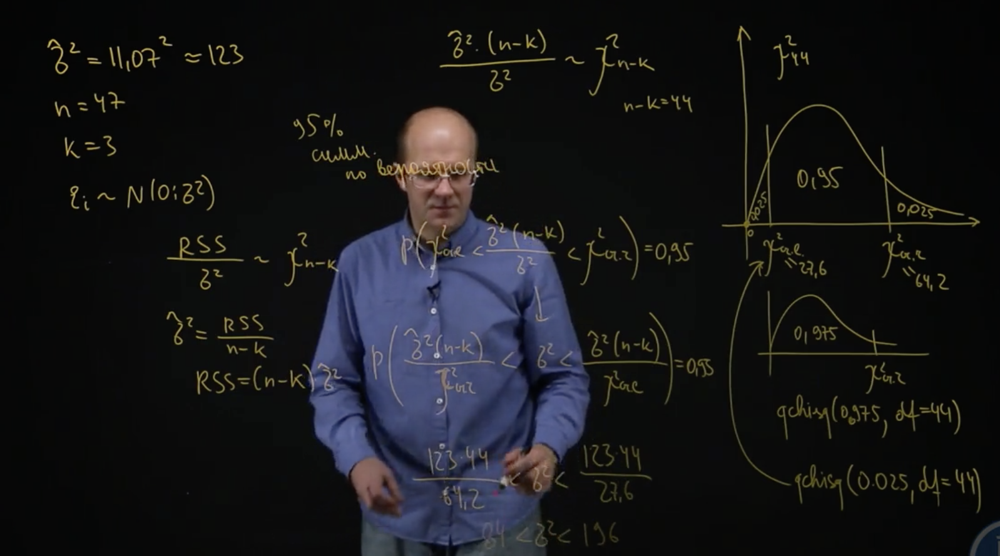
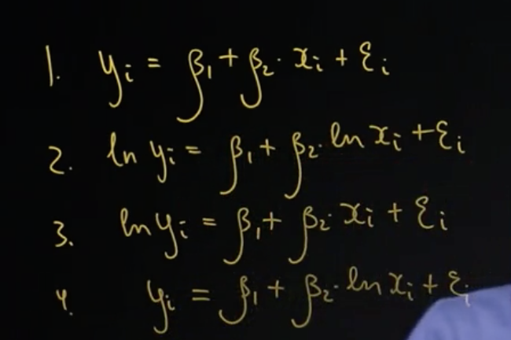
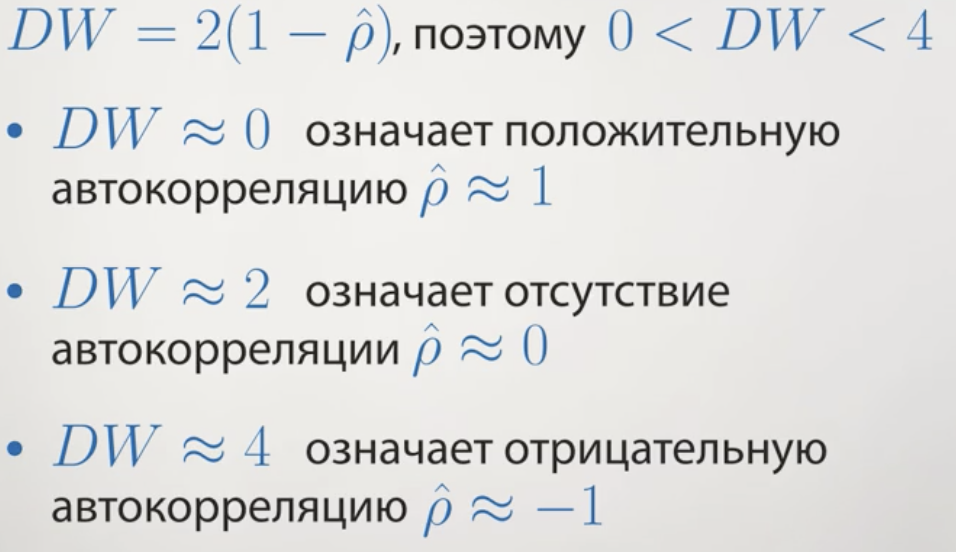

# Неделя 1

## Обозначения

* Одна зависимая (объясняемая) переменная: *y*

* Несколько регрессоров (предикторов, объясняющих переменных): *x, z...*

* По каждой переменной n наблюдений: $y_1, y_2...y_n$

Модель --- это формуля для объясняемой переменной.

### Пример

Возьмём например данные по машинам 1920-х годов. Тут видимая линейная взаимосвязь.


Модель для этих данных может иметь вид $y_i = \beta_1 + \beta_2x_i +  \varepsilon_i$

Что здесь есть что? У нас есть наблюдаемые переменные, 

* *y* — это длина тормозного пути

* *x* — это скорость, с которой ехала машина. 

* Есть неизвестные коэффициенты $ \beta_1, \beta_2$

* случайная составляющая, ошибка

То есть, $\beta_2$ показывает — насколько увеличивается тормозной путь, если машина разгонится на один лишний километр в час. И есть некая случайная составляющая $ε_i$, это может быть все что угодно:

  * водитель по-другому нажимал на тормоз, 
  * что-то там на дороге было другое, 

то есть это та часть, по которой у нас нет возможности предсказать, но, тем не менее, вот эта случайная ошибка она входит в y.

### План действий

* Придумать адекватную модель

* Получить оценки неизвестных параметров $\widehat\beta_1, \widehat\beta_2$

* Спрогнозировать, заменив неизвестные параметры на оценки $\widehat y_i = \widehat\beta_1 + \widehat\beta_2 x_i$

## Метод наименьших квадратов

Как найти  $\beta_1, \beta_2$? Собственно методом наименьших квадратов.

Если мы придумали какие-то оценки, $\beta_1, \beta_2$ то соответственно возникает такое понятие как ошибка прогноза

$$\widehat  \varepsilon_i = y_i - \widehat y_i$$

Есть суммарная ошибка, чтобы суммарная ошибка не занулялась одна в плюс, другая в минус, не компенсировали друг друга, мы возведем в квадрат. И посчитаем сумму квадратов ошибок прогноза, то есть сумма $\widehat  \varepsilon_i ^2$

$$Q(\widehat\beta_1, \widehat\beta_2) = \sum_{i=1}^{n} \widehat\varepsilon^{2}_{i} =  \sum_{i=1}^{n} (y_i - \widehat y_i)^2 $$


*Суть метода МНК*

Возьмите в качестве оценок такие коэффициенты $\widehat\beta_1, \widehat\beta_2$ при которых сумма квадратов ошибок прогноза будет минимальна

### Случай для одного регрессора

Всё сводится к тому, что в модели $$M_1: y_i = \beta + \varepsilon_i$$

$$\widehat\beta = \bar y$$


### Случай для двух регрессоров

Тут несколько сложнее, подробности на скриншоте


### Случай для множества регрессоров

Что мы получили:


Ещё раз пробежимся по терминам


### Графическое представление

Изобразим на графике, всё то, о чем мы только что проговорили.


В частности $\widehat\beta_1$, т.е. точка на оси ординат от пересечении с прямой регрессии, называют пересечением или Intercept-ом

Метод наименьших квадратов подбирает прямую так, чтобы суммарные расстояния от точек до прямой были минимальными.


### Множественные регрессоры

Случай множественных регрессоров принципиально не отличается от двух регрессоров. Поэтому рассмотрим на примере трёх предикторов.


### Суммы квадратов


Что есть что:

* RSS (Residual Sum of Squares) --- этот показатель меряет, насколько велики эпсилон с крышкой, насколько они далеко лежат от нуля.

* TSS (Total Sum of Squares) ---  этот показатель меряет, насколько каждый из $y_i$ не похож на $y$ среднее. Если $y_i$ далеко лежит от $y$ среднее, соответственно, это слагаемое в сумме квадратов будет большим. И вся сумма квадратов будет большой. 

* ESS (Explained Sum of Squares) --- она показывает, насколько прогнозное значение $y_i$ с крышкой далеко легло от $y$ среднего. 

## Лекбез по линейной алгебре

Язык эконометрики во многом — это язык линейной алгебры, нужно его знать.

### Обозначения


* Маленькой буквой $y$ мы будем обозначать вектор, то есть столбик из всех игреков, записанных друг под другом: у_1, у_2 и так далее, у_n. 

* Ну, соответственно, $х$ маленькое — это все иксы: х_1, х_2 и так далее, х_n, записанные друг под другом. 

* Аналогично $\widehat\beta$. 

* И еще введем обозначение: единичку со стрелочкой. Это будет вектор-столбец, то есть столбик из единичек в количестве n штук, потому что у нас в модели будет n наблюдений. 

Тогда для нашей модели

$$\widehat y = \widehat\beta_1 \cdot \overrightarrow 1 + \widehat\beta_2 \cdot x + \widehat\beta_3 \cdot z$$

* Большая буква *X* --- это все регрессоры, помещенные в одну большую табличку чисел, которые называются матрицей. 


* Рассмотрим ещё такое понятие как длина вектора


Где у нас бывают длины векторов: 


Есть одно замечательное применение. Если скалярное произведение векторов равно нулю, значит они перпендикулярны.


```{r}
x <- c(1,2, -3)
y <- c(-6,0,-2)

sum(x * y)
```

### Линейная модель регрессии в n-мерном пространстве


Есть вектор *y*, есть вектор из одних 1, я продолжаю этот вектор до прямой и оказывается, что 

* в простой модели без регрессоров спроецировав вектор *y* на эту прямую, я получу вектор *y* с крышкой --- предсказанные значения. 

Соответственно, мы получили попутно еще один факт: если любой вектор проецировать на вектор из 1, то получится вектор средних значений

## Геометрия множественной регрессии

Напомню, что мы вывели условие первого порядка


Это означает, что вектора перпендикулярны.

Облачко это все те вектора, которые можно получить, складывая с некоторыми весами вектор x, вектор z и вектор из единичек. Это гиперплоскость.

Мы получаем следующую интрпретацию метода наименьших квадратов:

  1. Первый геометрический факт
  Прогнозы, которые мы получаем по методу наименьших квадратов --- это проекция исходного вектора зависимых переменных *y* на множество векторов, получаемых с помощью сложения с разными весами вектора из единичек, вектора *x* и вектора *z*.
  
  2. Второй геометрический факт
  Если я спроецировать вектор *y* на прямую, порождаемую вектором из единичек, и спроецировать *y* с крышечкой на ту же самую прямую, то эти проекции попадут в одну и ту же точку.
  
  3. $TSS = ESS + RSS$
  
  4. $\frac{ESS}{TSS}= \frac{BC^2}{AB^2}=(\frac{BC}{AB})^2= (cos \varphi)^2$
  


## Коэффициент детерминации

Если в регрессию включён свободный член $\beta_1$ то действуют следующие правила:


Эти правила позволяют придумать простой показатель качества работы модели --- коэффициент детерминации.

Чем прогнозы точнее похожи на настоящие значения, тем меньше будут ошибки прогнозов и тем меньше будет сумма квадратов ошибок прогнозов RSS. Соответственно $\frac{ESS}{TSS} = R^2$ будет примерно равен 1 если RSS  будет у ноля. Соответственно мы получим коэффициент детерминации, который всегда лежит от 0 до 1. 

Другими словами --- коэффициент детерминации это доля объяснённого разброса в общем разбросе.


С одной стороны, коэффициент детерминации --- это доля объясненной дисперсии игрек, доля объясненного разброса. 

С другой стороны, коэффициент детерминации --- это выборочная корреляция между прогнозами и настоящим игрек, взятое в квадрат. 

Чем коэффициент детерминации выше, тем больше предсказание похожи на реальные значения. 
Чем коэффициент детерминации выше, тем выше доля объясненной дисперсии. 

#### Пример с фертильностью. МНК в R

Посмотрим как зависит фертильность от других 

```{r, include=FALSE}
t <- swiss
# нарисовать много диаграм рассеивания
# install.packages("GGally") # матрица диаграмм рассеяния
library("GGally")
str(t)
ggpairs(t)

```

Уже тут можно посмотреть много всяких корреляций.

Перейдём к оценке

```{r}
model2 <-  lm(data = t, Fertility ~ Agriculture + Education + Catholic)
# КОэффициенты
coef(model2)

# Спрогнозированные значения
fitted(model2)
# Остатки
residuals(model2)
# ПОказатель RSS
deviance(model2)
# Показатель R квадрат
report <- summary(model2)
report$r.squared

# Это тоже самое что
cor(t$Fertility, fitted(model2))^2
```


# Неделя 2

Вторая неделя --- стат.свойства оценок коэффициентов

Формулируем стандартные предпосылки --- они ведут к свойствам --- свойства позволят строить доверительные интервалы.

Для формулировки предпосылок --- сформулируем поняти условное мат.ожидание.

## Условное математическое ожидание


Если формально: это некая случайная величина s с тильдой, которая является, с одной стороны, функцией от r, и, с другой стороны, эта самая s с тильдой очень похожа на s, а именно: математической ожидание от s с тильдой равно математическому ожиданию от s, и ковариация между s и любой функцией от r равна ковариации между s с тильдой и той же самой функцией от r. 

То есть получается, что s с тильдой и s очень похожи, s с тильдой и s невозможно отличить, если смотреть только на математическое ожидание или на ковариацию с r, с r-квадрат, с любой функцией от r

Условное мат. ожидание --- это Верно! $E(y_i | x_i)$  это наилучший прогноз $y_i$ формулируемый с помощью $x_i$.

На практике 


### Пример

Здесь показано как рассчитывать


## Условное дисперсия

Если величины непрерывны и есть совместная функция плотности


### Свойства условного ожидания


Найдите $E(x_i^2+2x_i | x_i)$ это  $x^{2}_i+2x_i$. Потому что если мы знаем $x_i$, то и всё выражение слева мы легко спрогнозируем.

### Условная дисперсия и условная ковариация


Свойства:


*Пример *

Упростите $Var(x^{2}_i+2x_i+\varepsilon_i|x_i)$ это равно $Var(\epsilon_i | x_i)$ Потому что 
Вспомним свойство $Var(s+h(r) | r)=Var(s|r)$ В роли s выступает $\varepsilon_i$. А если интуитивно: хотим спрогнозировать выражение слева, зная $x_i$ часть $x_i^2+2x_i$ нам доподлинно известна и на точность прогнозирования (а именно её меряет условная дисперсия) не влияет.

## Геометрическая иллюстрация условного мат.ожидания


Запомнить

* Интерпретируем дисперсию как квадрат длины случайной величины, 

* Интерпретируем корреляцию между случайными величинами как косинус угла между ними.

С помощью условного математического ожидания мы сформулируем стандартные предпосылки на случайную составляющую $\varepsilon$, а миеннто три предпосылки

* Математическое ожидание от каждой случайной составляющей при известных иксах, то есть при известном каждом регресссоре для каждого наблюдения, я пишу коротко матрицу X. Условное математическое ожидание от $\varepsilon_i$ при всех известных регрессорах равна 0

* Условное математическое ожидание от $\varepsilon^2$ при всех условных регрессорах равна $\sigma^2$. Или можно точно так же сказать, что условная дисперсия $\varepsilon_i$  при известной матрице X равна $\sigma^2$.

* Kовариация между $\varepsilon_i$  и $\varepsilon__j$  при фиксированной матрице X равна нулю.


Предпосылки про ковариацию и дисперсию можно коротко записать с помощью такого понятия как ковариационная матрица


Когда мы говорим «ковариационная матрица некоего случайного вектора», мы имеем в виду здоровую табличку чисел. Первое число в первой строке — это дисперсия  $\varepsilon_1$ . Второе число в первой строке, то есть первая строчка, второй столбец, (1,2) координаты, — это ковариация  $\varepsilon_1$  и  $\varepsilon_2$. 

Соответственно, в ковариационной матрице, скажем, в третьей строчке, втором столбце находится ковариация  $\varepsilon_3$  и  $\varepsilon_2$, это третья строчка, второй столбец. С

оответственно, в этой матрице находятся и все дисперсии каждого  $\varepsilon$ , и все попарные ковариации:  $\varepsilon_1$  с  $\varepsilon_3$ ,  $\varepsilon_2$  с  $\varepsilon_7$ ... все-все-все ковариации и дисперсии находятся в одной матрице, в одной табличке чисел.


Соответственно, первые наши две предпосылки на ε можно как сформулировать?
Что ковариации равны нулю, а на диагонали дисперсии равны $\sigma^2$. То есть матрица принимает такой простой вид. 


Соответственно, в нашем случае наши предпосылки можно записать как ковариационная матрица вектора $\varepsilon$ при фиксированных регрессорах X равна $\sigma^2$ умножить на эту самую единичную матрицу, которая обозначается буковкой I, сокращение от английского «identity». 

### Итоги

* У нас есть предпосылки, что дисперсия $\varepsilon$ при фиксированных регрессорах X равна $\sigma^2$ умножить на единичную матрицу, что на самом деле просто означает, что дисперсия $\varepsilon_i$ при фиксированном X равна $\sigma^2$, а ковариация разных  $\varepsilon$  при фиксированном X равна нулю.

* И у нас есть линейная модель,


Это для примера двух объясняющих переменных. И, соответственно, эти предпосылки позволяют посчитать дисперсию любой оценки МНК $\beta_j$ с крышкой и любую ковариацию $\beta_j$ с крышкой и $\beta_l$ с крышкой. 

Мы посчитаем для начала дисперсию, условную, оценки метода наименьших квадратов и ковариацию оценки метода наименьших квадратов для случая парной регрессии.


## Условная дисперсия МНК оценок. Доказательство


Что мы получаем. Запишем примечания


Посчитаем в рамках предположений ковариацию $\widehat\beta_2$  и среднее

ПОлучаем не что иное как


Итого в парной регрессии мы имеем


Если регрессор $z$ сильно коррелирован с другими регрессорами, то Величина $RSS_z$ будет примерно равна 0 и поэтому дисперсия $Var(\widehat\beta_z|X)$ будет большой


Штрих --- это транспонированная матрица.


### Доказательство формулы для ковариационной матрицы

Этот фрагмент особо полезен тем, кто знает линейную алгебру. Оказывается, средствами линейной алгебры легко не только сразу посчитать дисперсию $\widehat\beta_1$ с крышкой или $\widehat\beta_2$ с крышкой, одним махом можно найти все эти дисперсии и все ковариации.

Свойства ковариационных матриц


В этой матрице находятся и дисперсии условные каждого  $\widehat\beta$, и ковариации каждого $\widehat\beta$ с каждым $\widehat\beta$. И в скалярном виде мы их выводили долго по отдельности и только для случая парной регрессии, а в матричном виде они выводятся легко, все и сразу, и этой формулой можно будет пользоваться.


## Оценка ковариационной матрицы

Константа $\sigma^2$ неизвестна, и именно эта константа входит в формулу для условной дисперсии любого оценённого коэффициента. А нам хочется строить доверительные интервалы для коэффициентов, проверять гипотезы, поэтому нам нужен какой-то способ оценить неизвестную константу.


## Статистические свойства оценок коэффициентов

Оценки коэффициентов, которые мы получаем методом наименьших квадратов, обладают рядом замечательных статистических свойств. Эти свойства, их очень много, и поэтому, чтобы как-то их было проще все осознать, мы их поделим на три части


Предпосылки для применения метода наименьших квадратов и для получения хороших свойств коэффициентов.

Предпосылки


Предположения на $\varepsilon_i$


Предпоссылки на регрессоры


Когда все эти предпосылки, которые мы сформулировали: 

  * предпосылки о зависимости y от x, 
  * предпосылки о распределении $\varepsilon$, 
  * предпосылки о регрессорах, 

когда все они выполнены, мы получаем, что верны три группы свойств.

### Базовые


Это очень хорошее свойство. Это говорит о том, что наш метод, конечно, может ошибаться, и оценка $\widehat\beta$, которую мы получаем, может не совпадать с настоящим $\beta$, но $\widehat\beta$ иногда будет больше настоящего $\beta$, иногда будет меньше настоящего $\beta$, но в среднем,$\widehat\beta$ попадает то влево, то вправо, но в среднем попадает в неизвестный коэффициент $\beta$


Это очень хорошее свойство. Оно говорит о том, что если вы хотите простую оценку, то есть линейную, хотите оценку несмещенную, которая в среднем бы попадала в неизвестную истину, то ничего лучше оценок метода наименьших квадратов у нас не получится. То есть математически это означает, что условная дисперсия$\widehat\beta$ при фиксированных регрессорах альтернативного больше либо равна, чем условная дисперсия $\widehat\beta$, полученная по методу наименьших квадратов опять же при фиксированных регрессорах. 


То есть это свойство говорит, что оценка $\widehat\sigma^2$, предложенная нами, — RSS, делённая на (n – k), — она тоже несмещённая, и она несмещённым образом оценивает $\sigma^2$.

### Асимптотические

Это те, что предполагают что число экспериментов велико


### Требующие нормальности


## Построение доверительных интервалов и проверка гипотез

Проверять гипотезы можно в двух случаях 

* Число наблюдений велико 

* Случайные ошибки нормальны

### Построение доверительного интервала


С ростом стандартной ошибки ширина доверительного интервала для коэффициента увеличивается


## Проверка гипотез

Нулевая гипотеза может только отвергаться или не отвергаться

#### Описание любого теста

* Предпосылки теста

* $H_0$ --- проверяемая гипотеза

* $H_1$ или $H_a$ --- альтернативная или другими словами конкурирующая гипотеза

* Формула для вычисления статистики

* Закон распределения статистики при верной $H_0$

#### Последовательность действий

1. Формулируем гипотезу $H_0$ и выбираем уровень значимости. Это вероятность ошибки первого рода или вероятность отвергнуть $H_0$ при условии, что она верна. $\alpha = P (отвергнуть H_0| принять H_0)$. Можно формулировать гипотезу и под неё собирать данные

2. Рассчитываем наблюдаемое значение тестовой статистики $S_obs$

3. Находим критическое значение тестовой статистики $S_cr$

4. (a) Сравниваем $S_obs$ и $S_cr$ и делаем вывод о $H_0$ --- устаревший вариант. Сейчас всё чаще делают так:

4. (b) Сравниваем P-значение и $\alpha$, делаем вывод о $H_0$. Если P-значение больше чем уровень $\alpha$, то гипотеза не отвергается. Если полученной P-значение меньше, то гипотеза отвергается

### Пример. Доверительный интервал для коэффициента бета

считается это всё вот так


`qt()` --- это функция в R

### Пример. Доверительный интервал для дисперсии

Мы опираемся на теорему RSS делённое на сигма квадрат

`qchisq()` --- это функция в R



### Пример. Проверка гипотезы о коэффициенте beta

Предпологаем что коэффициент при доле сельскохозяйственного мужского населения равен нулю --- другими словами фертильность не зависит от показателя того, насколько этот регион является сельскохозяйственным. Есть три способа проверить эту гипотезу 


В литературе, скажем в научных статьях, очень часто стандартные ошибки выписывают под коэффициентами.


### Интерпретация стандартной таблички

При оценке линейной модели регрессии, любой статистический пакет выдает более-менее стандартную табличку. Вот такую табличку выдает R.


1. Первый столбик в ней это, собственно, оценки коэффициентов.
Т.е. смысл этого столбика, что мы можем записать уравнение линейной регрессии по используя эти коэффициенты.

2. Второй столбик --- это стандартные ошибки. Это корни из диагональных элементов ковариационной матрицы

3. Третий столбик --- это компьютер автоматом проверяет гипотезу о том, что на самом деле, зависимости от данной переменной нет. Он делает это при помощи Т-статистики. Т.е. это первый столбец делить на второй. T-статистика, проверяющая гипотезу о незначимости коэффициента может принимать любое значение. Знак T-статистики определяется знаком оценки коэффициента, и по модулю она может быть произвольной

4. P-value

## Особенности проверки гипотез

* Если $H_0$ не отвергается, это говорит о том, что зависимости нет. 

* Надо говорить аккуратно: «$H_0$ не отвергается» — это означает, что данные не противоречат гипотезе $H_0$

* Значимость и существенность. Значимость это статистический факт --- равен коэффициент нулю или не равен. Существенность --- это на сколько он не равен нулю.

* Стандартизировать коэффициенты перед анализом. Чтобы получить одинаково интерпритируемые единицы измерения

* К сожалению, очень часто распространена такая порочная практика, что исследователь берет, включает кучу, не задумываясь о теоретической модели, включает кучу объясняющих переменных в свою модель и выбирает те из них, которые по t-статистикам оказались значимы. Это подход неправильный, поскольку как только мы согласились на некую вероятность ошибки первого рода, например, мы выбрали вероятность ошибки первого рода типичную в экономических приложениях 5%. «Я запустил регрессию на кучу переменных и отобрал те, которые значимы» — это неправильный подход. 


## Проверка гипотезы о связи коэффициентов

К примеру, мы хотим в рамках нашей модели проверить, что воздействие, рост фертильности, вызванный увеличением доли мужчин, занятых в сельском хозяйстве, одинаков по силе с ростом фертильности при росте католического населения, то есть я хочу проверить гипотезу о том, что разница этих двух коэффициентов равна нулю. Как это сделать?


Второй способ --- подобрать коэффициенты. Т.е. отнять и прибавить коэффициент при втором регрессоре. Программа автоматом рассчитает вероятность того, что разница коэффициентов равна нулю


## Задания на R

Подключаем нужные пакеты

```{r, include=FALSE}
library(memisc)
library(tidyverse)
library(psych)
library(lmtest)
library(sjPlot)
library(sgof)
library(foreign)
library(car)
library(hexbin)
#library(rlms)
#install.packages("rlms")
```

### Работа со случайными величинами

* Генерация случайных величин. 

100 величин, распределение нормально.
Любое распределение генерится в R функцией, которая начинается с *r* и далее название распределения.


```{r}
z <- rnorm(100, mean = 5, sd = 3)
z[56]
z[2:9]
qplot(z)
```

* Построим функцию плотности

Все функции плотности начинаются с буквы *d* (от density) в R.
```{r}
x <- seq(-10, 15, by = 0.5)
y <- dnorm(x, mean = 5, sd = 3)
qplot(x, y, geom = "line")
```

* Расчёт вероятностей

Все функции плотности начинаются с буквы *p* (от probability) в R.

```{r}
pnorm(3, mean = 5, sd = 3)
```

если я хочу найти вероятность того, что z лежит в диапазоне от 4 до 9, то это есть с точки зрения здравого смысла вероятность того, что z меньше 9 минус вероятность того, что z меньше 4

```{r}
pnorm(9, mean = 5, sd = 3) - pnorm(4, mean = 5, sd = 3)
```

* Квантили распределения. $P(Z<a)=0.7$ какое $a$

Все функции плотности начинаются с буквы *q* (от quantile) в R.

```{r}
qnorm(0.7, mean = 5, sd = 3)
```

Квантиль — это на самом деле, обратная функция к функции распределения. То есть, если, например, я хочу найти такое число а, чтобы вероятность того, что z меньше а была равна, скажем, 0.7. И вот надо найти такое а. То соответственно, это можно найти с помощью квантильной функции

Есть разные популярные распределения. chisq --- хи квадрат. t --- стьюдента. f --- Эф распределение

### Проверка гипотез о распределениях 

Множественная регрессия, проверка гипиотез

```{r}
h <- swiss
glimpse(h)
```

Мы оценим линейную модель регрессии. Будем предполагать, что фертильность, Fertility, зависит  от доли католического населения в данном кантоне, от показателя, насколько это регион сельскохозяйственный, и, скажем, от Examination.


```{r}
model <- lm(data = h, Fertility ~ Catholic + Agriculture + Examination)
```

Посмотрим отчет по этой моделе

```{r}
summary(model)
```

Отсюда можем сказать,  что 
гипотеза о том, что $\beta_1$ равно нулю, отвергается; 
гипотеза о том, что $\beta_2$ равно нулю, не отвергается; 
гипотеза о том, что $\beta_3$ равно нулю, не отвергается;
гипотеза о том, что $\beta_4$ равно нулю, отвергается.

Только значения коэффициентов, И также можем легко получить доверительные интервалы:

```{r}
coeftest(model)
confint(model)
```


* Проверка линейных гипотез

проверим линейную гипотезу о том, что коэффициент зависимости при доле католического населения и при доле населения, занятого в сельском хозяйстве, одинаковые.

Воспользуемся хитрым способом, в котором мы складываем две переменные --- способ с построением вспомогательной регрессии --- чтобы проверить гипотезу.

Значок `I` означает инструкцию для R, что надо трактовать `Catholic + Agriculture` — «плюс» в прямом смысле.

```{r}
model_aux <- lm(data = h, 
                Fertility ~ Catholic + I(Catholic + Agriculture) + Examination)
```

Выведем отчёт о модели

```{r}
summary(model_aux)
```

Коэффициент при Catholic незначим, потому что P-уровень равен `0.158483`. Это говорит о том, что гипотеза о том, что коэффициенты при Catholic и Agriculture равны, не отвергается.

Таким образом, мы смогли проверить гипотезу о том, что два коэффициента истинных, неизвестных нам, равны, и эта гипотеза в нашем случае не отвергается.

### Стандартизированные коэффициенты и эксперимент с ложно-значимыми регрессорами

Один из способов почувствовать существенный коэффициент или нет, — это посчитать стандартизированные коэффициенты $\widehat\beta$, то есть привести все объясняющие переменные и объясняемую переменную к неким универсальным единицам измерения, чтобы они были сравнимы, а именно: вычесть из каждой переменной её среднее и поделить на оценённое стандартное отклонение.

Шаг 1 --- Стандартизация коэффициентов

На шаге один мы преобразуем каждую переменную, масштабируем каждую переменную. Значит, создадим набор `h_st`, где мы изменим каждую переменную, функция называется `mutate_each`, в наборе данных `h`, а формула, по которой мы будем, функция, по которой мы будем менять каждую переменную, называется `scale`, она осуществляет как раз масштабирование, вычитание среднего и деления на стандартную ошибку.

```{r}
h_st <- mutate_each(h, "scale")
glimpse(h_st)
```

Шаг 2 --- построение модели

```{r}
model_st <- lm(data = h_st, Fertility ~ Catholic + Agriculture + Examination)
summary(model_st)
```

Шаг 3 --- визуализация коэффициентов. 

Шаг 4 --- принятие решения

#### Искусственный эксперимент

Сейчас мы на искусственных данных проиллюстрируем идею того, что нельзя просто так построить регрессию и отвечать на вопрос, а какие коэффициенты у меня значимы. 

Мы сочиним в нашем искусственном эксперименте совершенно несвязанный игрек, который никак не зависит от якобы объясняющих переменных. У нас будет 40 якобы объясняющих переменных, одна якобы зависимая, хотя на самом деле независимая, и мы будем строить, оценивать модель линейной регрессии. 

Генерим данные

```{r}
set.seed(42)
d <- matrix(rnorm(100*41, mean = 0, sd = 1), nrow = 100)
df <- data.frame(d)
glimpse(df)
```

Будем объяснять первую переменную, всеми оставшимися в наборе данных переменными. Для этого есть удобное сокращение в виде точки `.` 

```{r}
model_pusto <- lm(data = df, X1~.)

summary(model_pusto)
```

У нас получилось, что переменные X3 и X35 ылияют на первую переменную при 5% уровне значимости, а X19 и X32 влияют на 10% уровне значимости. 

С чем это связано? Это связано с тем, что когда мы фиксируем уровень значимости, мы соглашаемся на некоторую вероятность ошибиться.

Соответственно, когда мы зафиксировали уровень значимости 10%, это означает, что с вероятностью 10% мы в случае на самом деле отсутствия зависимости якобы её обнаружим.

#### Вывод

Соответственно, из этого искусственного эксперимента нужно сделать простой вывод, что стратегия «я оценю модель с большим количеством объясняющих переменных и выпишу из них значимые, и скажу, что от них игрек зависит», — неправильная, потому что в силу того, что есть для каждого регрессора десятипроцентный или пятипроцентный шанс сделать ошибку, при большом количестве регрессоров кто-то якобы значимым будет, даже если на самом деле никакой зависимости нет.

### Сравнить несколько моделей

Есть несколько моделей 

```{r}
model <- lm(data = h, Fertility ~ Catholic + Agriculture + Examination)
model2 <- lm(data = h, Fertility ~ Catholic + Agriculture)
```

Как нам лучше их сравнить. Сделаем табличку, сравниваем при помощи функции `mtable()` из пакета `memisc`

```{r}
compare_12 <- mtable(model, model2)
```

# Неделя 3

## Прогнозирование во множественной регрессии

Первый сюжет — это прогнозирование, как строить прогнозы и, более интересно, как строить доверительные интервалы для прогнозов. 
И второй сюжет — это как выбрать наилучшую модель.

*Прогнозирование.* 

Есть некоторая теоретическая модель, на примере двух объясняющих переменных:


соответственно, оценив неизвестные коэффициенты методом наибольших квадратов, мы получаем оценённую регрессию, которая нам позволяет делать точечные прогнозы.

Но интересно не точечные прогнозы построить, а интересно построить доверительный интервал. Интересно, вот мы, хорошо спрогнозировали, что завтра будет минус 20 градусов: это от минус 21-го до минус 19-ти? Или это от минус 40-ка до нуля?

*Интервальное прогнозирование*

Точность прогноза определяется шириной доверительного интервала. 

Допустим, я хочу построить прогноз для человека с заданным ростом, скажем, с ростом 170 сантиметров для мужчины. И тут возникает два варианта: 

* я могу строить доверительный интервал для веса среднестатистического мужчины с ростом 170 сантиметров, 

* а могу строить доверительный интервал, который называется предиктивный интервал, для конкретного мужчины с ростом в 170 сантиметров. 

В чём разница?

В первом случае средний вес всех мужчин, которые имеют рост 170 сантиметров — это какая-то константа. 
Вот эта вот одна константа — средний рост всех мужчин. Я его не знаю, и я имею выборку наблюдений, могу попытаться его спрогнозировать. Соответственно, ошибка прогноза, которая возникает, она связана только с тем, что у меня данные не по всем мужчинам Земли, а у меня данные только по небольшой случайной выборке. А вторая задача, если я пытаюсь спрогнозировать рост конкретного мужчины, который вот сейчас войдёт в комнату, и у него рост 170 сантиметров. Если я пытаюсь спрогнозировать его вес, то здесь источников ошибки два. Первый источник ошибки — это то, что я руководствовался при оценке модели выборкой, а второй источник ошибки состоит в том, что это не среднестатистический мужчина, рост которого равен константе, а это случайный мужчина ростом 170 сантиметров. *Поэтому во втором случае два источника ошибки, и предиктивный интервал будет шире. *

Оценки дисперсии


Подходить к оценке доверительного интервала можно двумя способами: либо нужно иметь большое количество наблюдений, либо нужно верить в нормальный закон распределения $\varepsilon_i$ при фиксированных иксах.


Предиктивный интервал --- аналогично


Предиктивный интервал для $y_i$ шире.  Дисперсия ошибки прогноза $y_i$ больше чем дисперсия ошибки прогноза $E(y_i|X)$ на $\sigma^2$.

Ещё раз о терминологии: 

* когда говорят «доверительный интервал», обычно имеют в виду доверительный интервал для среднего значения зависимой переменной, 
 
* когда говорят «предиктивный интервал», обычно имеют в виду интервал для значения зависимой переменной для конкретного наблюдения.

### Пример построения интервалов для прогнозов

Исследователь оценил по 2040 наблюдениям модель стоимости квартир в Москве и получил следующие результаты. 
Оценка цены квартиры равна минус 62 плюс 2.6 умножить на общую площадь 
Оценка неизвестной дисперсии $\varepsilon$ $\widehat\sigma^2 = 1154$. Известна так же оценка для неизвестных коэффициентов матрица $\widehat{Var}(\widehat{\beta}|X)$. Наша цель — мы хотим спрогнозировать стоимость квартиры площадью 60 метров

мы для данных регрессоров, для данного значения регрессоров хотим посчитать 

a) прогноз точечный price F с крышечкой и хотим посчитать два интервала. 

b) Один 95 %-ный доверительный интервал для неизвестной средней стоимости квартиры с площадью 60 метров. 

c) И хотим посчитать 95 %-ный предиктивный, предиктивный интервал для фактической стоимости одной случайно выбираемой квартиры опять же с площадью 60 метров. 

Еще раз, в чем разница между этими объектами b и с?  
b --- это средняя стоимость квартиры в Москве с площадью 60 метров.
c --- это стоимость случайно выбираемой квартиры в Москве с площадью 60 метров. 

Перейдем к построению доверительного интервала, у нас в каждом случае, в случае b и в случае c, есть ошибка прогноза.

В первом случае --- это на сколько наша спрогнозированная цена отличается от средней стоимости по Москве для квартиры размера 60 метров. 
А второй, на сколько наш прогноз отличается от конкретно выбранной случайной квартиры с площадью 60 метров. Во втором случае ошибка больше

Давайте сначала посчитаем дисперсию $\widehat{price}$ при фиксированных иксах. Расчёт:


Зная оценку дисперсии прогноза, мы можем легко оценить дисперсию ошибки прогноза в первом случае и дисперсию ошибки прогноза во втором случае. Давайте мы их сразу оценим. 


Вот у меня получается два доверительных интервала. 


То есть ширина доверительного интервала и ширина прогнозного интервала резко отличается. Почему? Потому что наша модель довольно хорошо точно оценивает среднюю стоимость квартиры с площадью 60 метров. И вот про среднюю стоимость квартиры в Москве, мы уверены, что она от 92 до 96. Однако если мы возьмем не некую мифическую среднестатистическую квартиру, а просто выберем наугад из всех предложений квартиру с площадью 60 метров, она, естественно, не среднестатистическая. Она может отличаться от среднестатистической как в плюс — быть дороже ее, так и быть дешевле нее. Поэтому наш доверительный интервал, наш предиктивный интервал для конкретного значения y, он оказывается шире и он соответственно равен от 94 минус 68, до 94 плюс 68.

### Интерпретация коэффициента при логарифмировании

Одним из частых преобразований при построении модели является логарифмирование.


Рассмотрим четыре варианта комбинации нелогарифмированной переменной и логарифмированной переменной.



1. Поскольку здесь производная $y_i$ по $x_i$ в первом случае равна $\beta_2$. Это означает что при росте икса на один игрик растёт на $\beta_2$

2. $\beta_2$ показывает на сколько процентов изменится y при росте x на 1 $\%$

3. Аналагочино предыдущему пункту. 100 $\beta_2$ это изменение y в процентах при росте x на единицу в абсолютном выражении. 

4. $\frac{\beta_2}{100}$ показывает примерно изменение, изменение y в абсолютных единицах при росте x на 1 $\%$.


### Дамми-переменные. Разные зависимости для подвыборок

Если объясняющая переменная (предиктор) принимает значение 1 или 0, то она называется дамми-переменной, это очень просто. Номинативная переменная.

#### Пример 1

Есть базовая модель --- Мы смотрим, как зарплата зависит от опыта работы и уровня образования.


В этой модели пол никак не учитывается, то есть мы предполагаем, что при равном опыте и при равном образовании зарплата определяется вот этой случайной составляющей $\varepsilon$, и то есть в среднем при равном опыте и при равном образовании зарплаты равны. 

#### Пример 2

Введём в модель пол --- которая равна 1 для мужчины, 0 – для женщины, для определенности. Тогда модель примет вид.


Это означает, что смысл коэффициента $\beta_4$  состоит в том, на сколько при одинаковом уровне обучения и стажа работы отличается зарплата у мужчин и женщин. 

#### Пример 3

В предыдущем примере зависимость, тем не менее, влияния опыта работы на зарплату у мужчин и женщин было одинаковое. С помощью дамми-переменных легко реализовать ситуацию, где мы предполагаем, что опыт работы по-разному влияет на заработную плату у мужчин и заработную плату у женщин. 
А именно, если в наше уравнение модели, помимо, собственно, переменной male, включить переменную male помножить на experience, то что мы получим? Мы получим, что для мужчин, у них male равно 1, для них уравнение превратится в 


Таким образом, мы с помощью дамми-переменных можем посмотреть, а правда ли, что стаж у мужчин и женщин по-разному влияет на заработную плату.

#### Пример 4

Если я поставлю дамми-переменную


То что это означает ---  что $\beta_5$показывает, насколько год, дополнительный год обучения, по-разному влияет у мужчин и женщин. Например, если $\beta_5$ меньше 0, это означает, что дополнительный год обучения для женщин больше увеличивает заработную плату, чем для мужчин. Если $\beta_5$ положительно, то, соответственно, дополнительный год обучения сильнее увеличивает заработную плату мужчин, нежели заработную плату женщин. 

### Факторные переменные с несколькими значениями

С помощью цифр это реализуется следующим образом. Выбирается один сезон за базовый. Вот сейчас у нас зима, поэтому будем считать, что базовый сезон – это зима. И, соответственно, мы вводим 3 дамми-переменных, каждая дамми-переменная по-прежнему принимает значение 1 или 0. Мы вводим переменную «весна», которая равна 1, если весна соответствует наблюдению, и 0 иначе; переменная «лето», которая принимает значение 1, если это наблюдений летнее, и 0 иначе; и переменная «осень», которая равна 1, если наблюдение осеннее, и 0 иначе


К примеру, исследователь интересуется объемом спроса на мороженое в зависимости от цены средней в киоске и сезона, в котором, значит, к которому относится наблюдение.


Соответственно, если наблюдение относится к зиме, то модель для этой части выборки, для зимних наблюдений превращается в совсем простую


$\beta_3$ – это насколько спрос на мороженое весной больше, чем спрос на мороженое зимой при той же самой цене, при фиксированной переменной price. Соответственно, $\beta_4$ показывает, насколько лето отличается от зимы. $\beta_5$ показывает, насколько осень отличается от зимы. 

#### Частая ошибка

Включать обе переменные сразу. Это неправильно


Неважно какую, уравнение для отдельных подвыборок получится совершенно одинаковым, неважно, какую вы включите, но если вы включите обе, то у вас возникнет жесткая линейная зависимость между регрессорами, а именно переменная male + переменная female всегда будет равняться единичке. И, соответственно, невозможно будет получить однозначные оценки метода наименьших квадратов в этом случае. Это связано с тем, что нарушена наша восьмая предпосылка. Мы говорили, что с вероятностью 1 среди регрессоров нет линейно зависимых. Если включить дамми-переменных слишком много на каждое возможное значение факторной переменной, то эта предпосылка о независимости регрессоров будет нарушена.

### Проверка гипотезы о нескольких линейных ограничениях

У нас фактически две разные модели, одна для мужчин, другая для женщин.

Естественно, возникает вопрос. А вообще, нужны ли разные модели для двух подвыборок? То есть вопрос: подвыборки отличаются или для них можно использовать одну и ту же модель? 


Нулевая гипотеза в том,  что сразу два коэффициента $\beta_4$ и $\beta_5$ одновременно равны нулю. Здесь альтернативная гипотеза состоит в том, что хотя бы один из коэффициентов $\beta_4$ или $\beta_5$ не равен нулю. 

Проверка гипотезы несколько шагов:

1. На первом шаге мы оцениваем так называемую неограниченную модель. Неограниченная модель предполагает, что выборки, подвыборки по мужчинам и по женщинам, модели могут отличаться. То есть мы оцениваем одну модель, куда входит и β_4 male и β_5, помноженная на male на education. В этой модели мы считаем RSS — сумму квадратов остатка.

2. Оцениваем ограниченную модель.то есть фактически мы просто оцениваем одно уравнение по всем наблюдениям, но не включаем переменную male, ни произведение male на education. То есть мы оцениваем по тем же наблюдениям модель с меньшим количеством регрессоров. Она называется ограниченной, из нее мы также вытаскиваем RSS, но этот RSS отличается — это RSS restricted. 


Оказывается что при верно нулевой гипотезе можно сконструировать дробь, которая асимптотически будет иметь $\chi^2$ распределение. 
А при предварительном предположении о нормальности ошибок $\varepsilon_i$-тых, при фиксированных $x$, ну, практически эта же дробь, только поделенная на количество ограничений $R$, она будет иметь f-распределение с r и (n-k) степенями свободы.


Вывод при проверке: Если f наблюдаемое больше f критического, то $H_0$ отвергается. 
Или если мы работаем в рамках большого количества наблюдений, то мы считаем $\chi^2$ наблюдаемое и если оно больше $\chi^2$ критического, то мы H_0 отвергаем.


Примечание


####  Пример проверки гипотезы о нескольких линейных ограничениях

 К примеру, исследователь оценил модель зависимости стоимости квартиры в Москве от ряда факторов. У исследователя была модель один (M1) и модель два (M2) 
 
M1 --- Логарифм стоимости квартиры объяснялся следующим образом: минус 0.215 плюс 0.83 умножить на логарифм общей площади плюс 0.268 помножить на логарифм жилой площади плюс 0.196 на логарифм площади кухни плюс 0.112 умножить на дамми-переменную, которая равна единичке для кирпичных домов и ноль иначе, минус 0.01 на расстояние до метро в минутах и плюс 0.1 на дамми-переменную, которая означает метро пешком. 


M2 --- А давайте вот мы уберём те переменные, которые характеризуют удаленность от метро. Собственно, и метро пешком или на транспорте, и время, — они характеризуют удалённость квартиры от метро, то есть эти две переменные, они отвечают за одну и ту же идею. Давайте мы их уберём, рассмотрим модель попроще.


Так же известно что в модели 1 сумма квадратов остатков RSS оказалась равна 62.6, а в модели 2 RSS оказался равен, сумма квадратов остатков, 69.3. И известно, что оценивание производилось по 2040-ка наблюдениям. 

*Вопрос* ---  какую модель следует предпочесть? Первую модель — она, конечно, более сложная, но она, вроде, и предсказывает получше, RSS поменьше? Либо вторую — она, может, чуть-чуть похуже предсказывает, но зато она проще? Вот вопрос, является ли разница RSS вызванной случайными факторами или у нас вот просто систематически мы пропустили в модели 2 значимые важные переменные?

*Формально*:


Решение: Эта гипотеза проверяется с помощью F-статистики.

В нашем случае два ограничения --- те, что заданы в нулевой гипотезе.
Ограниченной моделью является модель, где мы считаем, что β равны нулю, то есть более короткая модель ограниченная. 
М2 — это ограниченная модель, 
а М1 — это неограниченная модель. 
В неогрниченной модели оценивалось семь коэффициентов бета с крышкой.
Вероятность ошибки первого рода $5\%$.

Считаем Эф-значение. 


Получили 110.

Теперь посчитаем теоретическое эф критическое. Можно в R.


Получаем 3. 

Теперь нарисуем Эф распределение, для случаев с двумя степенями свободы у нас особый вид. Обычно оно выглядит по другому. Но это сейчас не главное, главное, что полученное наблюдаемое Эф существенно дальше.

То есть у нас разница между $RSS_r$ и $RSS_ur$ слишком велика. То есть мы попадаем в область, где $H_0$ отвергается. То есть первая модель предсказывает существенно лучше, это не случайность — такое большое отличие в RSS

Мы делаем вывод, что нам нужно предпочесть модель один а не модель два

### Гипотеза о незначимости регрессии

Вдруг все те объясняющие переменные, которые я использую, вдруг они все совершенно бесполезные, вдруг ни одна из них не помогает объяснить зависимую переменную $y$.

Математически эта гипотеза сводится к тому, что все коэффициенты $\beta$  равны нулю


Я буду разбирать ситуацию множественной регрессии на примере двух регрессоров. Я хочу проверить гипотезу о том, что те две объясняющие переменные x и z, которые я включил в модель, — это абсолютно полная ерунда, их не стоило включать, и мой y вообще ни от чего не зависит.

Оценим дме модели ограниченная и неограниченная.


Проверяем при помощи Эф-статистики. Оказывается можно оценить только одну модель --- первую, и вторую вообще не оценивать.

Вызвано это следующими фактами: 

мы знаем что $RSS_r > RSS_{ur}$ а так же знаем что $TSS_r = TSS_{ur}$.А это говорит о том что  $RSS_r=TSS_{ur}$ К этому пришли исходя из того что во второй модели предсказание будет равно просто среднему.


И тогда формула для проверки будет иметь вид


Хотя опять же на сленге часто говорят «мы проверили гипотезу о значимости регрессии». Когда говорят такие слова, имеют в виду на самом деле проверку гипотезы о незначимости регрессии, о том, что все коэффициенты равны нулю.

#### Пример проверки гипотезы о незначимости регрессии

РАссмотрим пример. Исследователь оценил зависимость заработной платы от количества лет обучения, 0,6 помножить на количество лет обучения плюс 0.157 помножить на опыт работы.

И исследователь хочет проверить гипотезу о том, что все включенные им факторы абсолютно бесполезны. То есть он хочет проверить гипотезу $H_0$ о том, что одновременно коэффициент истинный $\beta$ при количестве лет обучения равен нулю и коэффициент $\beta$ при опыте работы также равен нулю против альтернативной гипотезы о том, что хотя бы один из коэффициентов $\beta$ при переменной «количество лет обучения» или $\beta$ при переменной «опыт работы» не равен нулю. Еще известен коэффициент детерминации R = 0.09, уровень значимости равень 0.05 и количество измерений равно 3294


Для конкретной задачи значение эф статистики будет равно 


Но у нас тут ESS нет в этой задаче и RSS нет, а есть только коэффициент детерминации и поэтому чтобы решить, нам нужно немножко вспомнить, что такое коэффициент детерминации. Коэффициент детерминации — это ESS деленное на TSS. 

А еще мы знаем, что RSS плюс ESS равняется общей сумме квадратов TSS. Если мы поделим на TSS каждое слагаемое в этой части, то мы получим следующую формулу, что RSS делить на TSS плюс ESS делить на TSS равняется единице. Вот эта величина — это по определению $R^2$, стало быть, чтобы это равенство выполнялось, то эта величина — это единичка минус $R^2$.

Таким образом получаем F наблюдаемое


Теперь найдём F критическое --- для этого посчитаем это значение в R `qf(0.95, df1 = 2, df2 = 3291)`. Получаем что наблюдаемое много меньше критического. 

Таким образом, наблюдаемая статистика 165 попала в область, где $H_0$ отвергается и мы приходим к выводу, что гипотеза $H_0$ отвергается. Это означает, что хотя бы один из коэффициентов значим или мы просто говорим регрессия в целом значима. То есть есть среди включенных нами переменных те, которые влияют как-то, статистически связаны с заработной платой. Таким образом, в нашем случае, регрессия оказалась значима.

### Лишние и пропущенные переменные

Подведём итог.

Если выполнен ряд предпосылок:

1. истинная зависимость имеет вид $y_i = \beta_1 + \beta_2x_i + \beta_3z_i + \varepsilon_i$

2. Если мы оцениваем эту же модель с помощью метода наименьших квадратов, то есть мы, действительно, строим регрессию у на константу и те переменных, от которых он зависит. 

3. Eсли наблюдений больше, чем оцениваемых коэффициентов,

4. если имеет место строгая экзогенность, то есть математическое ожидание от случайной ошибки $\varepsilon_i$ при фиксированных регрессорах равно нулю

5. Если имеет место условная гомоскедастичность, то есть математическое ожидание от $\varepsilon_i$ в квадрате при фиксированных регрессорах равно $\sigma^2$, или, что тоже самое, что дисперсия $\varepsilon_i$ при фиксированных регрессорах равна $\sigma^2$.

6. Если имеет место условная некоррелированность случайных ошибок, корреляция $\varepsilon_i$, $\varepsilon_j$ при фиксированном X равна нулю,

7. Отдельные наблюдения являются случайной выборкой из некоего большого набора объектов. о есть регрессоры, относящиеся к разным наблюдениям, независимы, и вместе с тем разные наблюдения имеют одинаковые законы распределения

8. Что с вероятностью 1 среди объясняющих переменных, среди регрессоров, отсутствует линейная зависимость,

То у нас есть ряд Асимптотических свойств:


А так же свойств при нормальности


Теперь в рамках этих предпосылок отдельно оговорим два особых случая

* А что произойдет, если я включу лишние переменные. То есть на самом деле y зависит только от x, а я этого не знаю же на самом деле. И я буду строить, оценивать регрессию, оценивать зависимость y от x и от z. Что произойдет в этом случае, когда я включу лишнюю переменную? 

В случае если будет модель с лишними свойствами --- потеряна будет только эффективность. Будут слишком большие доверительные интервалы


* И что произойдет в противоположенном случае, когда я не включу переменную, от которой на самом деле зависимость есть? Тут всё плохо.

Лучше включить лишнюю, чем не включить нужную.


#### Мораль


### Тест Рамсея

С пропущенными понятно.
Гораздо более интересной является гипотеза о том — а вот у меня каких-то переменных нет. А может быть я их, как раз-то может быть их и надо было включить, а у меня их нет. Как проверить гипотезу о том, что не пропустил ли я чего-нибудь важное, за чем у меня нет наблюдений.

И вот тест Рамсея — это такая изящная попытка, успешная попытка проверить гипотезу о том, надо ли мне было включать те переменные, которых у меня на самом деле нет.

Итак, текст Рамсея, нулевая гипотеза у него состоит в том, что $H_0:y_i = \beta_1 + \beta_2 х_i + \beta_3 z_i + \varepsilon_i$

Альтернативная гипотеза --- есть неизвестные нам пропущенные регрессоры.

#### Алгоитм тест Рамсея

1. На первом шаге теста Рамсея оценивается исходная модель, и из нее получаются прогнозы yi с крышкой.

2. На втором шаге оценивается вспомогательная регрессия, то есть строится регрессия yi на исходные переменные и на степени прогнозов из регрессии на первом шаге.

3. считается Эф статистика проверяющая гипотезу о равенстве всех коэффициентов перед искусствеными переменными нулю.


Если на самом деле пропущенных переменных нет, то значение yi с крышкой не будет содержать в себе информацию о пропущенных переменных, ну и стало быть тогда $\gamma_1$, $\gamma_2$, $\gamma_3$ будут равняться нулю.


### Пример на тест Рамсея

Предположим, что исследователь оценил зависимость заработной платы от количества лет обучения и от опыта работы. И он хочет проверить гипотезу, что пропущенных регрессоров, пропущенных объясняющих переменных нету. То есть он хочет проверить гипотезу $H_0$ о том, что в модели нет пропущенных переменных. Против альтернативной $H_a$ о том, что есть пропущенные переменные. 

Чтобы проверить это исследователь в тесте Рамсея строится вспомогательная регрессия. Нам на уровне значимости 5 процентов нужно проверить что нет пропущенных переменных


Что говорит тест Рамсея? Тест Рамсея основан на следующей идее, что если, действительно переменных нет, то включение чего бы то ни было в уравнение, будет приводить к оценкам, близким к нулю, и соответственно, можно проверить с помощью обычной F-статистики. А ежели какие-то переменные на самом деле пропущены, то, скорей всего, эти пропущенные переменные, они хоть как-то связаны с включенными переменными, и, соответственно, они как-то будут связаны с y с крышкой. И, соответственно, включив y с крышкой в квадрате, y с крышкой в кубе, мы получим коэффициенты, которые не равны нулю. Поэтому проверка гипотезы о том, что в модели нет пропущенных переменных, у нас превращается конкретно в гипотезу о том, что β при y с крышкой в квадрате равен нулю, и о том, что β при y с крышкой в кубе равен нулю. То есть мы получаем обычный F-тест, только мы включили не отсутствующие у нас в данных переменные, а мы включили y с крышкой в квадрате, y с крышкой в кубе. Почему? Потому что в нем есть отчасти информация о пропущенных, отсутствующих у нас в данных переменных.

Считаем F-статистику, получаем что наблюдаемое значение больше критического. Значит нулевая гипотеза отвергается и у нас есть пропущенные наблюдения.


### Простые показатели качества модели

* $R^2$. Но у него есть проблема --- он в ограниченной модели всегда больше чем в неограниченной.

Чтобы нивелировать эту проблему. Был придуман $R^2_{adj}$ скоректированный $R^2$. В чём его суть

Мы оштрафовали обычный показатель на количество оцениваемых коэффициентов.


* Критерий Акаике 

* Критерий Шварца

 в данном случае --- лучше та модель, где штрафной критерий меньше. 

## Задания на R

### R --- графики и переход к логарифмам

Загрузим пакеты:

```{r, include=FALSE}
library("vcd")
library("devtools")
library("hexbin")
library("knitr")
```

Проиллюстрируем графически переход к логарифмам

```{r}
h <- diamonds
glimpse(h)
qplot(data=h, carat, price)
```

На графике видно, что связь не линейна. Построим в других осях

```{r}
qplot(data=h, log(carat), log(price))
```

Перейдём в ggplot, так

```{r}
ggplot(h, aes(log(carat), log(price))) + geom_hex()
```

Возьмём другой файл.

```{r}
f <- read.csv("datasets/flats_moscow.txt", sep = "\t", header = T, dec = ".")
glimpse(f)

ggplot(f, aes(totsp, price)) + geom_point()
```

Возьмём логарифм данных

```{r}
ggplot(f, aes(log(totsp), log(price))) + geom_point()
```


Как визуализировать много качественных данных. Мозаичный график!!

```{r}
mosaic(data=f, ~walk+brick+floor, shade = T)
```

Проинтерпритируем.

Мы поделили на квартиры в пешей доступности. Что мы видим --- доля кирпичных домов в пешей доступности от метро больше. Что означают площади --- количество наблюдений.
Что означают цвета --- независимость признаков.

### R: графики для качественных и количественных переменных

Заведём факторные переменные

```{r}
f <- mutate_each(f, "factor", walk, brick, floor, code)
glimpse(f)
```

Стриом график

```{r}
ggplot(f, aes(log(price), fill = brick)) + 
  geom_histogram(binwidth = 0.09, position = "dodge")
```

Можно функции плотности --- сглаженные гистограммы

```{r}
ggplot(f, aes(log(price), fill = brick)) + 
  geom_density(position = "dodge", alpha = 0.5)
```

Добавим несколько фасеток

```{r}
ggplot(f, aes(log(price), fill = brick)) + 
  geom_density(position = "dodge", alpha = 0.5) +
  facet_grid(walk~floor)
```

Дом с пешой доступность и керпичностью и этажностью сильно различается по цене

### Оценивание моделей с дамми-переменными в R

Оценим модель ноль

```{r}
model_0 <- lm(data=f, log(price)~log(totsp))
model_1 <- lm(data=f, log(price)~log(totsp)+brick)
model_2 <- lm(data=f, log(price)~log(totsp)+brick+brick:log(totsp))
```

вторая модель в конце это  переменная, которая равна произведению кирпичности дома помножить на логарифм общей площади, то есть эта переменная — она равна нулю, ну когда умножаем ноль на неважно какое число, мы получаем ноль, поэтому эта переменная равна нулю для некирпичных домов, и эта переменная равна логарифму общей площади для кирпичных домов. 

```{r}
summary(model_0)
mtable(model_2)
```

Для второй модели использовался не значок умножить. Потому что он означает нечто другое.

Значок умножить означает не алгебраичное умножение, а включение трёх коэффициентов. Т.е. их взаимодействие двух переменных

```{r}
model_2b <- lm(data=f, log(price)~brick*log(totsp))

mtable(model_2,model_2b)
```

Т.е видно что это эквивалентные модели.

Что означает каждая модель.

* Модель ноль. Она не отличает кирпичный дом или нет. Это модель для обоих типов.

* модель один. Она выдаёт разные зависимости для кирпичных и некирпичных. Т.е. последний коэффициент он зануляется для некирпичных домов, и получается две модели.

* модель два. Вместо дамми-переменной подставляем единицу и ноль. Опять получим две модели.
  
В чем разница. Модель ноль не разделяет кирпичные и не кирпичные --- мы проверяем только влияние площади квартиры.   Модель один говорит что есть зависимость от кирпичности. При одной и той же площади разная стоимость для кирпичных и некирпичных. Модель два и площадь по разному меняется для кирпичных и некирпичных домов


### Построение прогнозов

Как использовать модели для прогнозирования. Создадим новый датафрейм

```{r}
nw <- data.frame(totsp=c(60,60), brick= factor(c(1,0)))
nw
predict(model_2, newdata = nw)
```

У нас получисля логарифм прогнозов, постромм

```{r}
exp(predict(model_2, newdata = nw))
```

Построим доверительные интервалы

```{r}
predict(model_2, newdata = nw, interval = "confidence")
exp(predict(model_2, newdata = nw, interval = "confidence"))
```

Это стоимость среднестатистической квартиры. Построим прогнозное значение.

```{r}
predict(model_2, newdata = nw, interval = "prediction")
exp(predict(model_2, newdata = nw, interval = "prediction"))
```

Вот разница между доверительным интервалом пронозным и для средней стоимости квартиры. Пронозный шире.

### Проверка гипотезы о линейных ограничениях, графическое представление результатов

Чтобы выбрать между трех оцененных нами моделей, мы можем использовать F-тест

ЗАметим ограниченность модели ноль к одному, один к двум, ноль к двум. 
Соответственно, мы можем провести три теста, сравнивающих три модели.
Для этого есть специальный тест. Тест Вальда

```{r}
waldtest(model_0, model_1)
```

Мы видим что p-value  очень маленький. Это означает, что гипотезу H_0 надо отвергнуть, а гипотеза H_0 состоит в том, что у нас верна ограниченная модель в том, что ограничение выполнено. Соответственно, в нашем случае гипотеза H_0 о том, что верна модель 0 отвергается. 


```{r}
waldtest(model_1, model_2)
```

Df = 1 потому что различаются модели на один коэффициент.

Разница не такая большая как в предыдущем варианте. но п уровень значимости тоже мал.

```{r}
waldtest(model_0, model_2)
```

Понятно, что модель ноль хуже второй

Также мы можем проиллюстрировать, построить графики с линиями регрессии, даже в принципе не оценивая сами регрессии

```{r}
gg0 <- qplot(data=f, log(totsp), log(price))
gg0 + stat_smooth(method = "lm")

gg0 + aes(col=brick) + stat_smooth(method = "lm") + facet_grid(~walk)
```

Или тоже самое с библиотекой ggplot2

```{r}
f %>% 
  ggplot(aes(log(totsp), log(price), color = brick)) + 
  geom_point() +
  geom_smooth(method = "lm") + 
  facet_grid(~walk)
```

В модели, которую мы оценивали, мы никак не учитывали, находится ли квартира в пешей доступности от метро, а вот здесь на графиках видно очень интересный эффект, что если квартира не в пешей доступности от метро, walk равно 0, тогда зависимость для кирпичных и не кирпичных квартир, она практически одинаковая. Вот эти прямые, они совпадают. А вот если квартира в пешей доступности от метро, то уже мы видим разную зависимость для кирпичных и не кирпичных домов

### Ловушка дамми-переменных, информационные критерии, тест Рамсея

Рассмотрим такой маленький вопрос, а что было бы, если бы мы неправильно включили дамми-переменные, то есть мы бы использовали сразу две, например, дамми-переменные: одну, которая бы обозначала, что дом кирпичный, единичка, и нолик, что дом некирпичный, а вторую, наоборот, что единичка — дом не кирпичный, а нолик — дом кирпичный. 

Давайте мы создадим искусственно эту лишнюю дамми-переменную.

```{r}
f$nonbrick <- memisc::recode(f$brick, 1 <- 0, 0 <- 1)

model_wrong <- lm(data=f, log(price)~log(totsp)+brick+nonbrick)
summary(model_wrong)
```

R просто взял и выкинул лишнюю переменную. Круто. 


Проверим критерии Акаике. Напомню что Чем меньше штрафной критерий, тем лучше!

```{r}
mtable(model_0, model_1, model_2)
mtable(model_0, model_1, model_2)
```

Проверка гипотезы о пропущенных переменных. Тест РАмсея

```{r}
resettest(model_2)
```

df = 2, это означает что было включено две вспомогательные переменные две последовательные степени 2 и 3.

хотя на 5% уровне значимости мы ртвергаем нулевую гипотезу о том что пропущены значимые данные


### Нано-исследование

Грамотное программирование --- это оказывается вот такие вот отчёты писать в Rmd.
В этом исследовании мы рассмотрим цены на квартиры в Москве.
Подгружаем пакеты. Ониу у нас уже подгружены

Специальные настройки для таблиц. `pander()`

#### Тесты

По правилам курсеры я удалил ответы на тестирование


# Неделя 4

Программа недели мультиколлинеарность и метод главных компонент.

## Определение мультиколлинеарности

Мультиколлинеарность --- наличие между регрессорами линейной зависимости

* Строгая мультиколлинеарность --- идеальная линейная зависимость

* Не строгая мультиколлинеарность --- примерная линейная зависимость


## Строгая мультиколлинеарность

Например строгая мультиколлинеарность. 


Частая причина --- ошибочное включение дамми-переменной. Например в данных с мужчинами и женщинами завести переменную для каждого пола.


### Последствия строгой мультиколлинеарности

Проблема состоит в том, что оценки метода наименьших квадратов являются не единственными в такой ситуации. Т.е. абсолютно разные модели будут давать одинаковые оценки.


### Что делать?

Нужно правильно завести переменные. 

## Нестрогая мультиколлинеарность

Например температура и квадрат температуры.
 Например, если рассмотреть такие регрессоры потенциальные, как стаж работы, количество лет обучения и возраст, то между ними существует примерное соотношение. Возраст примерно равен количеству лет обучения, плюс стаж работы. Понятно, что есть люди не работавшие. Понятно, что есть кто-то, кто болел или просто решил не выходить на работу, но в целом для большинства людей, которые обучались, а потом вышли на работу, соответственно, возраст будет равен сумме двух оставшихся переменных. 
 
### Последствия нестрогой мультиколлинеарности

Получаются большие стандартные ошибки.


В свою очередь, стандартные ошибки делают

* широкие доверительные интервалы

* незначимые коэффициенты

* Чувствительность модели к добавлению или удалению наблюдения

### Как проявляется?

- Несколько коэффициентов незначимы по отдельности. Исследователь видит несколько групп незначимых коэффициентов. То есть второй, скажем, регрессор незначим, третий регрессор незначим. Он их выкидывает оба, а модель при этом резко ухудшается.

### Как обнаружить

* Показатель вздутия дисперсии (Variance Inflaction Factor) $VIF_j = \frac{1}{1-R^2_j}$

* Выборочные корреляции 


Смотрят выборочные корреляции между отдельными регрессорами, и если они слишком велики, то это тоже является показателем мультиколлинеарности. Тут нет никакой строгой границы, но тем не менее в ряде источников приводят границы для показателя вздутия дисперсии — 10 и для корреляции — около 0,9. То есть такие показатели — значения коэффициентов вздутия дисперсии больше 10 или корреляции между регрессорами больше 0,9 — может говорить о потенциальном наличии, о потенциальной проблеме мультиколлинеарности.

## Что делать с мультиколлинеарностью


Жертвуем несмещённостью, чтобы снизить дисперсию


### Пример

Исследователь оценил модель зависимости $y$ от нескольких объясняющих переменных.
И между регрессорами, между объясняющими переменными x, z и w, потенциально ожидается мультиколлинеарность.

Известно, что при построении регрессора x на остальные z и w R-квадрат второй во вспомогательной регрессии равен 0,5. То есть это имеется в виду R-квадрат в регрессии x на остальные регрессоры.

На скрине будут разные гаммы, но записанные одними буквами.

Итак мы хотим узнать, то что под вопросами


Для ответа на эти вопросы воспользуемся показателем вздутия дисперсии. Он считается отдельно для каждого регрессора


Условно говоря, строгих границ нет, но если больше 10, то говорят что они скорее всего линейно зависимы

Соответственно, по имеющимся вспомогательным регрессиям мы можем сделать вывод, что да, мультиколлинеарность, скорее всего, имеет место, а связаны между собой переменные z и w.

## Ридж и LASSO регрессия

Второй способ борьбы с мультиколлинеарностью --- это включение штрафа в сумму наименьших квадратов.

Соответственно, мы минимизируем не просто сумму квадратов остатков, а мы минимизируем сумму квадратов остатков плюс штраф за слишком большие коэффициенты. Мы штрафуем нашу модель за то, что коэффициенты $\widehat{\beta}$ оказываются слишком далеко от 0.

1. Ридж регрессия

2. Второй алгоритм называется LASSO, где мы штрафуем нашу сумму квадратов остатков на сумму модулей оцененных коэффициентов, опять же с весом λ.


### Пример

Ридж регрессия вводит штрафной коэффициент лямбда. Как выбирать лямбда?


## Метод главных компонент

1. Сумма весов главных компонент должна равняться единичке


Исходные переменные центрированы, а значит и среднее у каждой главной компоненты равно нулю

### Пример

Мы для удобства центрируем. Переносим начало координат в центроиду и далее смотрим куда вытянуты наши данные и переносим под этим углом первую координату. И перпендикулярно ей строим вторую координату.


Посчитаем на практике на небольшом искусственом примере.


### Свойства главных компонент

1. Главных компонент столько же сколько исходных

2. Суммарная дисперсия, суммарный разброс всех исходных регрессоров равен суммарному разбросу всех главных компонент. 

3. Вставка из линейной алгебры


### Что дают главные компоненты

* Помогают визуализировать сложный набор данных 

* Увидеть наиболее информативные переменные

* Увидеть особенные наблюдения

* Переход к некоррелированным данным

### Подводные камни на практике

* Разницы единицы измерения

* Бездумное применение метода главных компонент при отборе переменных для построения регрессии. Из-за того, что метод главных компонент выбирает самую изменчивую переменную или несколько самых изменчивых, он не дает никакой гарантии, что будет выбрана переменная сильнее всего связанная с объясняемой переменной.

Разные единицы измерения решается легко: нормируем переменную. Со вторым камнем сложнее.


## Задания на R

### доверительные интервалы при мультиколлинеарности

Подготовим пакет

```{r}
library("HSAUR") # из этого пакета возьмем набор данных по семиборью
library("psych") # описательные статистики
library("lmtest") # тесты для линейных моделей
library("glmnet") # LASSO + ridge
library(tidyverse)
```

```{r}
h <- cars
ggplot(cars, aes(speed, dist)) + 
  geom_point()
```

Построим модель

```{r}
model <- lm(data=h, dist~speed)
summary(model)
```

Если посмотреть на отчет по этой модели, то в этой модели, конечно, никакой мультиколлинеарности нет, видно, что коэффициент прекрасно значим. 

Мультиколлинеарность проявляется в том, что у нас получается широкий доверительный интервал и коэффициент получается незначимым.

Поскольку по графике нельзя сказать --- строгая тут линейная зависимость или слабая квадратичная или линейная. 


```{r}
h <- mutate(h, speed2 = speed^2, speed3 = speed^3)

model_mk <- lm(data=h, dist~speed + speed2 + speed3)
summary(model_mk)
```

Если посмотреть на эту модель. То у нас тут нет ни одного значимого коэффициента. Однако, если обратить внимание на p-value всей модели, оно будет очень маленьким. 
Соответственно --- модель в целом предсказывает хорошо, но коэффициенты по отдельности не значимы. О чём это говорит? перед нами мультиколлинеарность.

Посмотрим коэффициенты вздутия дисперсии

```{r}
vif(model_mk)
```

Т.е. у нас есть индикация мультиколлинеарности. И аналогично мы можем посмотреть на корреляции.

```{r}
x0 <- model.matrix(data=h, dist~0 + speed + speed2 + speed3)
cor(x0)
```

Корреляции очень высокие. Посмотрим как работают обе модели. 

```{r}
nd <- data.frame(speed = 10, speed2 = 100, speed3 = 1000)
```

Построим два интервала. Предиктивный для модели с одним объясняющим предиктором

```{r}
predict(model, newdata = nd, interval = "prediction")
```

Соответственно это предиктивный интервал, для модели с одной объясняющей переменной без мультиколлинеарности.

```{r}
predict(model_mk, newdata = nd, interval = "prediction")
```

Интервал изменился несущественно. 

Однако если я посмотрю на значимость и доверительные интервалы для отдельных коэффициентов, то разница существенная.

```{r}
confint(model)
confint(model_mk)
```

### LASSO регрессия в R

Борьба с мультиколлинеарностью. Ридж и Лассо

Для этой регрессии требуется отдельно получить регрессоры в отдельную матрицу (X0) и в один вектор отдельный зависимую объясняемую переменную (y). lambda --- это у нас вектор штрафов. Последовательность векторов нужно указывать от большего к меньшему.

```{r}
y <- h$dist
x0 <- model.matrix(data=h, dist~0 + speed + speed2 + speed3)
lambdas <- seq(50,0.1, length = 30)
```

Оценим сначала LASSO

```{r}
m_lasso <- glmnet(x0, y, alpha = 1, lambda = lambdas)
```

Построим ряд графиков, чтобы визуализировать результаты оценивания лассо-регрессии.

```{r}
plot(m_lasso, xvar = "lambda", label = TRUE)
```

У нас в модели имеется коэффициент перед скоростью, перед скоростью в квадрате, перед скоростью в кубе. И, соответственно, по горизонтали здесь на графике отложим логарифм лямбды, а по вертикали отложим размер коэффициента. 

Единичка — это размер первого коэффициента. Двоечка и троечка, здесь они сливаются, коэффициенты практически равны нулю. Это размер второго и третьего коэффициента. 

 Соответственно, если lambda очень маленький, то есть маленький минус 2 логарифм lambda — это означает очень маленький lambda. Это означает, что практически мы имеем МНК оценки, то есть никакого штрафа за размер β c крышкой у нас нет. Соответственно, здесь у нас первый коэффициент равен 2 с небольшим, а остальные два равны 0. Однако, если мы увеличиваем lambda, то при большом размере штрафа, при размере штрафа около, соответственно, Е. Ну то есть логарифм около одного, соответственно, сам коэффициент штрафа около 2,7. Резко падает первый коэффициент, ну и потихоньку при огромном-огромном размере штрафа все коэффициенты равны 0.
 
 Соответственно, у нас получается некая содержательная первая интерпретация. 
 
Второй график. Показывает долю объяснённой дисперсии.

```{r}
plot(m_lasso, xvar = "dev", label = TRUE)
```

Соответственно, если я хочу объяснить очень, ну практически максимум, который может объяснить метод наименьших квадратов разброса, то мне надо взять первый коэффициент, равный чуть больше 2, ну и остальные около 0. Однако, если я согласен пожертвовать небольшим количеством... смотрите, я жертвую совсем небольшим процентом объясненной дисперсии. То есть где-то от, ну, наверное, 0,67. Если я снижу желаемую долю объясненной дисперсии до 0,63, то коэффициент резко падает. Коэффициент резко приближается к 0. То есть, приблизив резко коэффициент к 0, вот такое вертикальное падение в процентах, оно очень большое, я получу всего лишь небольшую жертву в виде потери доли объясненной дисперсии. Соответственно, имеет смысл, если я хочу, чтобы коэффициенты были небольшие, с небольшой дисперсией, соответственно, можно чуть-чуть пожертвовать долей объясненной дисперсии зависимой переменной.

```{r}
plot(m_lasso, xvar = "norm", label = TRUE)
```

Здесь по горизонтали отложена, собственно, величина штрафа, то есть это сумма модулей $\widehat{\beta}$ И мы видим, что первый коэффициент, он, собственно, практически полностью определяет нам величину штрафа. Чем больше совокупная сумма модулей $\widehat{\beta_1}$  + $\widehat{\beta_2}$ + $\widehat{\beta_3}$, тем больше первый коэффициент, а два остальных колеблются около 0.

Посмотрим на сами коэффициенты. 

```{r}
coef(m_lasso, s=c(0.1, 1))
```

Коэффициент при speed2 точно попал в ноль.

### Ридж-регрессия и идея оценки лямбды

основное отличие от лассо регрессии с точки зрения R это `alpha = 0`

```{r}
m_rr <- glmnet(x0, y, alpha = 0, lambda = lambdas)
```

Возникает вопрос --- как выбрать штрафной коэффициент лямбда.

Здесь используется метод кросс-валидации.

Кратко лишь скажу, что строятся, наши данные разбиваются на десять случайных групп. Соответственно, по девяти группам мы оцениваем модель и предсказываем, находим сумму квадратов ошибок для десятой группы и соответственно, посчитав десять вариантов суммы квадратов ошибок, мы выбираем то lambda, при котором сумма квадратов ошибок каждый раз выкидывая одну группу, будет наименьшей. Соответственно, покажем как реализовать этот метод на примере регрессии lasso.

```{r}
cv <- cv.glmnet(x0, y, alpha=1) # кросс-валидация для лассо-регрессии, потому что альфа = единице
plot(cv)
```

Cоответственно, что сделал компьютер? Компьютер перебрал разные варианты lambdas и обнаружил, при каком lambda сумма квадратов остатков, посчитанная путем кросс-валидации будет наименьшей. 
И вторая оценка это там, где резко увеличив величину штрафа, мы не сильно проиграем в сумме квадратов ошибок.

Соответственно есть две ошибки, две идеи оценивать lambda с крышкой. Одна – по минимуму суммы квадратов ошибок. Другая – с некоторой подстраховкой, которая предпочитает модель с коэффициентами более близкими к нулю.

можно вытащить из нашей, алгоритма можно вытащить lambda минимизирующая сумма квадратов ошибок. 
```{r}
cv$lambda.min
cv$lambda.1se
```

и можно выбрать для каждого из lambdas, можно посмотреть, чему равны коэффициенты. Соответственно, в первом случае можно посмотреть коэффициенты из модели,

```{r}
coef(cv, s = "lambda.1se")
```

### Метод главных компонент в R

Возьмём данные по результатам спортивного соревнования

```{r}
h <- heptathlon
h <- select(h, -score)
glimpse(h)
describe(h)
```

Нужно стандартизировать данные, так как разброс переменных слишком разный.

```{r}
cor(h)
```

Еще можно перед методом главных компонент посмотреть на корреляции. И здесь как раз мы видим, что корреляции бывают довольно высокие. Ну, вот, например, корреляция между прыжками в длину и бегом с препятствиями — минус 0,91. Ну, тут связано, конечно... Отрицательность корреляции означает то, что прыжок в длину чем длиннее, тем лучше, а результат бега с препятствиями — чем меньше время, тем лучше, поэтому корреляция разумно, что она отрицательная. 

Примение метод главных компонент.

```{r}
h.pca <- prcomp(h, scale  = TRUE) # scale, это к тому что нужно стандартизировать.
```

Вытащим данные ---  новые иксы и веса первой главной компоненты

```{r}
pca1 <- h.pca$x[,1]
v1 <- h.pca$rotation[,1]
```

v1 --- веса, с которыми старые переменные результаты отдельных видов спорта входят в новую синтетическую переменную.

Посмотрим описание по главным компонентам

```{r}
summary(h.pca)
```

Значит 80 процентов данных можно описать первыми двумя компонентами.

Визуализируем две главные компоненты

```{r}
biplot(h.pca, xlim=c(-1,1))
```

### Несколько примеров

```{r}
h <- airquality
glimpse(h)

ggplot(h, aes(Ozone, Temp)) +
  geom_point()

model <- lm(data = h, Ozone ~ Solar.R + Wind + Temp)

vif(model)
```


Оценим ту же самую модель методом LASSO! Для этого нам надо сделать ряд вещей (в том же порядке, в каком они делались на лекциях):

0) На подготовительном этапе нужно убрать все наблюдения, где есть NA (пропущенные значения). Это делается командой na.omit. К примеру, если Ваши данные находятся в переменной data, команда будет: data<-na.omit(data). Это убирает из data все строки, где есть NA и позволяет работать с данными, не думая о пропущенных значениях.

1) Выделим зависимую переменную в отдельный вектор, а регрессоры (Wind, Solar.R и Temp) - в отдельный объект model.matrix

2) Создадим вспомогательную последовательность значений параметра $\lambda$ следующим образом: seq(50,0.1,length=30)

3) Оценим модель при помощи команды glmnet (из пакета glmnet), используя построенные на шаге 2 lambda и параметр alpha = 1 (что соответствует LASSO, при других alpha можно получить Ридж-регрессию или эластичную сеть)

Посмотрим на коэффициенты модели при lambda = 1. Для этого используем команду coef с опцией s=1. В ответ введите коэффициент при переменной Temp с точностью до третьего знака после запятой. Не забывайте про округление!


```{r}
h <- na.omit(h)
y <- h$Ozone
x0 <- model.matrix(data=h, Ozone~0 + Wind + Solar.R + Temp)
lambda <- seq(50,0.1,length=30)
m_lasso <- glmnet(x0, y, alpha = 1, lambda = lambda)
coef(m_lasso, s=1)

m_rr <- glmnet(x0, y, alpha = 0, lambda = lambda)
coef(m_rr, s=2)

plot(m_lasso, xvar = "norm", label = TRUE)

h.pca <- prcomp(x0, scale = TRUE)

data <- as.data.frame(h.pca$x)

ggplot(data, aes(PC2, PC3)) + geom_point()

```

# Неделя 5

## Гомоскедастичность


Если бы гетероскедастичность придумали в Древней Руси, ее бы называли *разноразбросие*. 
Что такое гетероскедастичность?

В отличие от условной гомоскедастичности в условной гетероскедастичности предполагается, что дисперсия $\varepsilon_i$ при фиксированных Х не постоянна, то есть не равна константе и как-то определяется самими регрессорами.

### Условная и безусловная гетероскедостичность. Примеры


Чтобы лучше разобраться в разнице между условной гетероскедастичностью и безусловной гетероскедастичностью, рассмотрим три случая, три простых примера. 

  * Случай А
  
  
  
  * Случай Б. Опять же в силу того, что закон распределения пары $\varepsilon_2$, $x_2$ точно такой же, как закон совместного распределения пары $\varepsilon_1$, $x_1$, то поэтому аналогичные характеристики для $\varepsilon_2$ будут полностью совпадать с характеристиками для $\varepsilon_1$
  
  
  
  С одной стороны --- имеет место условная гетероскедостичность. С другой стороны имеет место безусловная гомоскедостичность.
  
  * Случай C. Безусловная гетероскедастичность.

  
  
### Последствия гетероскедастичности для малых выборок

#### Когда логично ожидать гетероскедастичность

* Безусловной гетероскедастичности не бывает

* Условная возникает при наличии "размера" объекта. Размером может быть что угодно: на предприятии это может быть, скажем, численность персонала. Или размером может быть расходы людей на отдых. То есть как только у нас в выборке могут попасться объекты разного размера, что бы этот размер ни значил, скорее всего, есть основания подозревать наличие условной гетероскедастичности.

* Условная присутстсвует практически всегда.

Сделаем утверждение. Что сейчас мы говорим о случаях, когда кроме гетероскедастичности всё ок


Мы используем прежние формулы.


Рассмотрим от изначальных трёх группах


Итак, поочереди. 

#### Конечная выборка без предположения о нормальности


На этот раз последнее свойство не выполнено, и, соответственно, получаемые нами оценки, хотя они несмещённые, они не самые лучшие: у них не самая маленькая дисперсия, которая могла бы быть.

#### Конечная выборка c предположением о нормальности


Если мы, игнорируя нарушение предпосылки, будем по-прежнему использовать эту t-статистику, то окажется, к сожалению, что она только называется t-статистикой, а t-распределения она не имеет. И проверять таким образом гипотезу с помощью неё о значимости отдельного коэффициента или строить доверительные интервалы для значимости отдельного коэффициента сейчас нельзя.

К сожалению, для конечных выборок, несмотря на то, что ε нормально, в силу того, что нарушена одна из предпосылок, оказывается, что RSS, деленное на σ² при фиксированном X, уже не имеет хи-квадрат распределение с n – k степенями свободы.

F-статистика тоже не работает.

Итог: все свойства, которые связаны с точным законом распределения в конечной выборке, перестали выполняться. Ппроверять гипотезы с помощью эф или тэ статистики уже нельзя.

#### Асимптотические свойства


#### Итоги 

* сами $\widehat{\beta}$ по-прежнему довольно хороши, их можно интерпретировать, их можно использовать при прогнозировании. 

* Проблема лежит в $se(\widehat{\beta_j})$ Эти стандартные ошибки, к сожалению, несостоятельны. То есть даже при большом количестве наблюдений дисперсия оценки оценивается неправильно.

Что делать? Ответ: использовать другие стандартные ошибки.

### Робастные стандартные ошибки и обнаружение гетероскедастичности

Обозначение HC означает *heteroskedasticity consistent* устойчивые к состояниям гетероскедостичности.


### Суть корректировки

Мы вместо старой формулы для стандартных ошибок $\widehat{\beta_j}$ используем новую формулу для стандартных ошибок $\widehat{\beta_j}$, которую мы будем помечать стандартные ошибки с индексом НС, то есть состоятельные в условиях гетероскедастичности. 


сли мы используем эту формулу, то что меняется? К сожалению, точных распределений в конечных выборках получить не удается. Однако ассимптотические результаты с использованием новых стандартных ошибок совпадают со старыми. То есть если мы в формуле t-статистики вместо обычных стандартных ошибок будем использовать стандартные ошибки устойчивой гетероскедастичности, то t-статистики при большом количестве наблюдений будут иметь нормальные распределения, а это как раз нам и нужно для проверки гипотез о значимости коэффициентов.

Соответственно, с точки зрения практика, все довольно просто. Мы, если исследователь использует R, он запускает R, там есть команда `vcovHC()` для оценки ковариационной матрицы оценки коэффициентов, и, соответственно, эта оценка является состоятельной, и ее можно прекрасно использовать для проверки гипотез, построения доверительных интервалов для коэффициентов, построения доверительных интервалов для прогнозов. 

#### Когда следует использовать робастные оценки

* Как только есть случайная выборка и объекты могут быть разного "размера". И поэтому, как только мы ожидаем условную гетероскедастичность, мы тут же вместо обычных стандартных ошибок используем стандартные ошибки Уайта или современную подправку стандартных ошибок, и, соответственно, тогда спокойно проверяем гипотезы о значимости отдельного коэффициента или строим доверительные интервалы или строим доверительные интервалы для прогнозов

#### Как обнаружить гетероскедостичность

1. Графически. 

Если вы оцените на первом шаге модель методом наименьших квадратов, а потом по горизонтали отложите тот регрессор, который, вы подозреваете, связан с условной дисперсией $\varepsilon$, то, соответственно, вы можете по вертикали отложить просто модуль остатка, модуль $\widehat{\varepsilon}$ и $\widehat{\varepsilon}^2$. То есть в каком-то смысле расстояние от $\widehat{\varepsilon}$ до нуля. 


2. Формальные тесты

* Тест Уайта 

* Тест Голдфельда-Квандта

### Тест Уайта

* Этот Тест асимптотический --- то есть он применим, когда у вас достаточно много наблюдений. 

* Не требуется нормальность остатков

Как работает? Он делается с помощью одной дополнительной вспомогательной регрессии.


Сначала оценивается исходная модель. И оценив исходную модель, вы получаете остатки $\widehat{\varepsilon}$ с крышкой. И дальше вы оцениваете вспомогательную регрессию, то есть вы берете квадраты полученных в первой регрессии остатков ε с крышкой i-тая в квадрате. И строите регрессии на те переменные, от которых, по вашему мнению, может зависеть условная гетероскедастичность, условная дисперсия ε. Если вы не знаете, от каких факторов может зависеть условная дисперсия ε, тогда в качестве факторов берут исходные регрессоры, их квадраты и попарные произведения исходных регрессоров в основной модели.

После этого вы в вспомогательной регрессии вы считаете  $R^2$ вспомогательной и умножаете его на n, получаете значения статистики Уайта.

И Уайт в своей работе доказал, что при верной $Н_0$, то есть при гипотезе об условной гомоскедастичности, то есть при условии о том, что дисперсия $\varepsilon_i$-тых при фиксированном x постоянна, эта статистика имеет  $\chi^2$ распределение с n минус 1 степенью свободы, где n — это число параметров во вспомогательной регрессии, а, соответственно, n минус 1 — это количество осмысленных объясняющих переменных во вспомогательной регрессии, то есть кроме единичного столбца.

Соответственно, если значение статистики Уайта оказывается слишком большим, то гипотеза Н0 отвергается. А если значение статистика Уайта небольшое, то есть до критического порога, соответственно, Н0 о гомоскедастичности не отвергается.


#### Пример теста Уайта

Предположим, исследователь оценил модель. Он оценивал зависимость спроса на мороженое, $q_i$, то есть количество купленного мороженого в киоске, от некоторых объясняющих переменных. Ну, например, это была $p_i$, средняя цена мороженого в киоске, плюс $\beta_3$ умножить на $a_i$, на ассортимент, то есть количество разных видов мороженого, которые продаются в i-том киоске, плюс $\beta_4$ помножить на $d_i$, $d_i$ — это расстояние от киоска до ближайшей остановки общественного транспорта, плюс случайная ошибка.

И вот исследователь оценил эту модель и хочет проверить, а есть ли в модели гетероскедастичность. То есть исследователь хочет протестировать $H0$ о том, что гетероскедастичности на самом деле нет условной и есть условная гомоскедастичность, то есть хочет проверить гипотезу, что условная дисперсия равна константе сигма квадрат, против альтернативной гипотезы о том, что условная дисперсия $\varepsilon_i$ при фиксированных X не равна сигма квадрат, то есть зависит от i.


Помимо нулевой гипотезы зададимся вопросом как выглядит вспомогательная регрессия. Выглядит она следующим образом


W-статистика считается просто  по принципу n помножить на  $R^2$ во вспомогательной регрессии на втором шаге.

Теперь найдём критическое значение W. Это хи-квадрат распределение с 9 (в нашем случае т.е. n-1 в общем) степенями свободы. В R это его найти можно `qchisq(0.95)`


Значит, хи-квадрат критическое равно 16,9, а наблюдаемое значение статистики Уайта оказалось рано 30. Соответственно, у нас получается вывод, что значение статистики Уайта слишком далеко от математического ожидания хи-квадрат распределения, то есть оно вышло за хи-квадрат критическое. Это говорит о том, что R-квадрат слишком большой. Это говорит о том, что размер остатка, измеряемый как $\widehat{\varepsilon}^2$, хорошо объясняется регрессорами, чего в условиях гомоскедастичности не должно быть. Значит, мы получаем вывод, что H0 о том, что у нас имеет место гомоскедастичность, эта H0 отвергается в пользу H альтернативное о том, что имеет место условная гетероскедастичность.

### Тест Голдфельда-Квандта

При проведении теста Голдфельда-Квандта на условную гетероскедастичность, предполагается, что есть некоторая переменная, от которой зависит эта самая условная дисперсия ошибок.


Процедура теста


В тесте Голдфельда-Квандта предполагается, что наблюдения можно упорядочить по любому регрессору, не обязательно по регрессору, включенному в модель. ПОтому что тест Голдфельда-Квантда основан на отделении наблюдений с предположительно высокой условной дисперсией от наблюдений с предположительно низкой условной дисперсией. Критерий разделения может быть любым.


#### Пример теста Голдфельда-Квандта

Исходная модель такая же как в примере выше.

Делим на две группы.

И, к примеру, исследователь предположил, что величина дисперсии условной $\varepsilon_i$-того при фиксированных регрессорах что она зависит монотонно от расстояния до метро. Ну если киоск рядом с метро или рядом с какой-то остановкой общественного транспорта другой, то, соответственно, можно ожидать, что там бывают какие-то пики, когда приезжает много пассажиров, когда там рабочие дни там больше, а если киоск удален от остановки, то, соответственно, там, скорей всего, можно ожидать меньше разброс $\varepsilon_i$-тых.

исследователь предположил, что условная дисперсия зависит от d_i-тых, и зависит отрицательно.

У него было 200 наблюдений он выкинул 40 из центра. И посчитал RSS по двум оставшимся выборкам


Считаем статистику. Получаем что нулевая гипотеза отвергается. То есть в наших данных имеет место условная гетероскедастичность.


### Последствия гетероскедостичности


 В редких случаях, когда всё-таки удаётся построение более эффективных оценок, нужно очень хорошо понимать, как конкретно устроена условная дисперсия εi при фиксированном X. То есть вы должны чётко осознавать или сделать какие-то очень ограничивающие предположения о структуре дисперсии. Если вы их сделали, то вы можете получить более эффективные оценки, чем оценки метода наименьших квадратов.
 
#### Пример с известной структурой гетероскедастичности


предположим, что мы исследуем результат по математике, средний результат, скажем, ЕГЭ в разных классах, в разных школах. То есть, соответственно, mi — это средний результат какого-то i-того класса по математике, и мы предполагаем, что у нас есть следующие данные. Нам доступно, скажем: размер класса ri — размер i-того класса, плюс мы опросили учащихся класса и выяснили некое среднее количество времени, которое учащиеся каждого класса тратили на домашнее задание по математике, там, скажем, тут введём переменную ti, плюс $\varepsilon_i$. Такая простая, несложная модель, то есть средний результат каждого класса — это, соответственно, размер каждого класса и это средние затраты времени, измеренные во времени на занятие математикой.

Итак первый вопрос --- какую структуру гетероскедостичности логично ожидать в этой модели?

второй вопрос --- как получить эффективные оценки бета с крышкой.

Решение первого вопроса 

Поскольку mi — это средний результат класса, то что собой представляет mi? Это складываются результаты каждого ученика: mi первого ученика плюс mi второго ученика плюс и так далее плюс mi — всего у меня в i-том классе ri учеников. И делится, естественно, на количество учеников в классе. Соответственно, если, скажем, предположить, что результаты учащихся независимые и имеют одинаковую дисперсию, то есть если сделать предположение, что дисперсия результата каждого ученика mij, — то есть это результат учащегося, j-тый номер учащегося в i-том классе, — если предположить, что эта дисперсия равна какой-то, пусть будет σ-квадрат, и mij независимы, то тогда мы получим результат, что дисперсия mi как дисперсия среднего арифметического, — она, соответственно, равна σ-квадрат, делённое на количество наблюдений, то есть на ri. То есть у нас имеет место условная гетероскедастичность, но не абы какая, а вполне определённой структуры. А если нам структура гетероскедастичности доподлинно известна, что бывает очень редко, то есть эта модель с усреднением — один из немногих примеров такой ситуации, — то мы можем легко откорректировать гетероскедастичность. 


### Итоги


Правильно делать так --- как только у вас есть теоретические основания подозревать наличие гетероскедастичности, надо использовать устойчивые робастные стандартные ошибки.

## Задания на R

### функции циклы

подробно не будем останавливаться разберём лишь пример считывания большого объёма данных

```{r}
all_data <- NULL
for (fname in c("datasets/file01.csv", "datasets/file01.csv")) {
  temp <- read.csv(fname)
  all_data <- rbind(all_data, temp)
}

```

### Прежние оценки для сравнения

Подготовка библиотек

```{r}
library("sandwich") # vcovHC, vcovHAC
library("lmtest") # тесты
library("car") # еще тесты
library("dplyr") # манипуляции с данными
library("broom") # манипуляции
library("ggplot2") # графики
```

Первый пакет. sandwich, который оценивает оценки... получает робастные стандартные ошибки/


```{r}
h <- read.table("datasets/flats_moscow.txt", header = TRUE)
head(h)
tail(h)

qplot(data=h, totsp, price)
```

На этом графике мы видим типичное проявление условной гетероскедастичности. При маленьких значениях общей площади, когда total span мало, то мы видим, ну, конечно, и цена мала, но нас интересует не малость цены, а малость разброса цены. При малом значении общей площади вот здесь вот колебания по вертикали стоимости квартир небольшие. А если я возьму большую площадь, 120 метров, то, соответственно, у меня разброс данных гораздо больше. Средний, конечно, тоже больше, да, но меня интересует вот именно сейчас разброс по вертикали при заданном значении общей площади. 

 В принципе, я вижу, что разброс данных большой при больших total span, при малых total span – маленький разброс по вертикальной оси цены. Это говорит об условной гетероскедастичности.
 
Тем не менее имеет смысл строить самую простую модель

```{r}
model <- lm(data=h, price~totsp)
summary(model)
```

Ну, помимо оценок коэффициентов и их стандартных ошибок t-статистк и p-значений, есть у нас F-statistic, которое проверяет гипотезу о незначимости регрессии в целом с ее p-значением, но сейчас, в условиях гетероскедастичности, часть из этих показателей рассчитывается по неправильным формулам. Ну, в частности, если мы посмотрим на тесты на значимость каждого коэффициента coeftest (model), то в этой табличке сами оценки коэффициентов по прежнему хорошие, не смещенные, состоятельные, однако вот эти стандартные ошибки считаются по умолчанию по формулам, которые годны только для случая условной гомоскедастичности, а для нашего случая мы визуально диагностировали гетероскедастичность, ну и кроме того, было логично ожидать просто по здравому смыслу, даже не глядя на график, что разброс цен для больших квартир больше, чем разброс цен для маленьких квартир, то поэтому вот эти стандартные ошибки, они уже считаются по некорректным формулам. 

```{r}
coeftest(model)
confint(model)
```

Ковариационная матрица считается неверно:

```{r}
vcov(model)
```

### Доверительные интервалы при гетероскедастичности 

Проверим наличие гетероскедостичности при помощи остатков. Добавим их в модель

```{r}
h <- augment(model, h)
glimpse(h)
```

Добавились новые переменны

* .resid --- остатки

* .fitted --- прогнозное значение стоимости квартиры

Построим график зависимости как зависит от регрессора размер остатка. По горизонтали объясняющая переменная, в данном случае это общая площадь. F по вертикали отложим абсолютное значение остатка модуль остатка

```{r}
qplot(data=h, totsp, abs(.resid))
```

ЧТо видим --- когда общадь маленькая разброс ошибок небольшой. когда плозадь большая разброс ошибок больше. Что ещё раз подтверждает гетероскедастичность.

### Робастные оценки

Давайте попробуем, соответственно, вместо ковариационной матрицы, оцениваемой стандартными формулами по умолчанию, получить оценки устойчивой гетероскедастичности.

```{r}
vcovHC(model)
vcov(model)
```

Как изменились стандартные ошибки? Видно, что оценки стандартных ошибок существенно выросли.

### Проверека гипотезы о равенстве нулю коэффициентов с использованием верных стандартных ошибок.

```{r}
coeftest(model, vcov. = vcovHC(model))
coeftest(model)
```

Оценки коэффициентов не поменялись. Однако стандартные ошибки меняются сильно.

Теперь построим, не только проверим гипотезы, но и построим доверительные интервалы устойчивой гетероскедастичности.

Поскольку асимптотически эти t-статистики имеют нормальное распределение, то мы можем использовать соответствующие квантили, отступить от оцененного коэффициента 2,59 влево и вправо на две стандартных ошибки и получить 95 процентный доверительный интервал. 

Помещаем результаты в одтельную таблицу.

```{r}
conftable <- coeftest( model, vcov. = vcovHC(model))
ci <- data.frame(estimate = conftable[,1], 
                 se_hc = conftable[,2])
```

Теперь добавим границы доверительногт интервала

```{r}
ci <- mutate(ci, left_ci = estimate - 1.96*se_hc,
             right_ci = estimate + 1.96*se_hc)
ci
```

мы видим, что гетероскедастичность чуть-чуть расширила доверительный интервал, то есть сделала оценки менее точными.

```{r}
confint(model)
```

### Тесты на гетероскедастичность

#### Тест Уайта 

или по другому его называют тест Бройша-Пагана.

```{r}
bptest(model)
```

 В чем состоит этот тест? Помимо оценки основной регрессии оценивается вспомогательная регрессия, где квадраты остатков ε с крышкой в квадрате проверяется их зависимость от тех же объясняющих переменных, что и в исходной модели
 
  оказалось, что гипотеза о том, что зависимости во вспомогательной регрессии нет, эта гипотеза отвергается в силу маленького p-value. 
  
  То есть, у нас имеет место гетероскедастичность, так как гипотеза об условной гомоскедастичности была отвергнута.
  
  Чтобы провести все-таки классический вариант теста Уайта, где во вспомогательной регрессии включаются не только исходные регрессоры, но и их квадраты, попарные произведения, надо это отдельно, специально указать 
  
```{r}
bptest(model, data = h, varformula = ~ totsp + I(totsp^2))
```

во вспомогательной регрессии окажется две объясняющих переменных (смотри на df), соответственно, получится классическая формула статистики Уайта, и тут опять гипотеза о том, что зависимости во вспомогательной регрессии нет, отвергается, значит, имеет место условная гетероскедастичность.
  
тот же самый результат можно записать по другому, короче и немного яснее

```{r}
bptest(model, data = h, varformula = ~ poly(totsp, 2))
```

#### Тест Голдфелда-Квандта

для теста Голдфелда-Квандта уже надо указать некую переменную, которая объясняет гетероскедастичность, то есть от которой условная дисперсия ε i-того зависит монотонно.

```{r}
gqtest(model, order.by = ~totsp, data = h, fraction = 0.2) # фракшн --- доля выкинутых наблюдений из серёдки
```

Этот тест оценил две модели. Далее тест поделил два RSS это значение находится в GQ и равно 8.2. СНова у нас p-value очень мал, значит нулевая гипотеза отвергается. Значит присутствует гетероскедостичность.

### Какие меры кроме робастных оценок можно применять

Можно прологарифмировать исходные данные. 

```{r}
qplot(data = h, log(totsp), log(price))
gqtest(model2, order.by = ~totsp, data = h, fraction = 0.2)
```

Здесь на графике разброс данных уже не так сильно отличается.

```{r}
model2 <- lm(data = h, log(price) ~ log(totsp))
```

Это позволит сократить отношение RSS. Для данной модели почти в 4 раза


### Обратим внимание на порядок действий.

1. сначала использовал робастные стандартные ошибки

2. а потом, собственно, выяснял, есть ли гетероскедастичность или нет.


К сожалению, очень распространена практика, когда исследователь сначала проверяет гипотезу, есть гетероскедастичность или нет, и, соответственно, узнав, что гетероскедастичность есть, тогда используются робастные стандартные ошибки, а если гетероскедастичности по тестам не обнаружено, используются обычные стандартные ошибки. Эта практика, к сожалению, неверная, потому что двойное тестирование всегда приводит к неправильным рассчитываемым по умолчанию уровням значимости, поэтому двойного тестирования следует избегать. Как только у вас есть теоретические основания ожидать гетероскедастичность, а у нас они есть, логично предположить, что разброс цены квартиры связан с ее размером, то надо использовать робастные стандартные ошибки даже до, собственно, тестирования гипотезы о том, есть гетероскедастичность или нет.

## Экзамен

```{r}
library("Ecdat")
library("glmnet") # LASSO + ridge
library("lmtest")
library("car")
library("dplyr") # манипуляции с данными
library("ggplot2") # графики
```


```{r}
data(ChickWeight)
glimpse(ChickWeight)

#5
ChickWeight %>% 
  filter(Time == 10) %>% 
  summarise(mean = mean(weight)) %>% 
  round(digits = 2)

#6
ChickWeight %>% 
  filter(Time == 21) %>% 
  group_by(Diet) %>% 
  summarise(mean = mean(weight))


#7
model <- lm(data = ChickWeight, weight ~ Time + Diet)
summary(model)
round(0.7453, 2)

-245+0.08
```

$$test-statistic = \frac{\hat{\beta}_2 + \hat{\beta}_3 - (\beta_2 + \beta_3)}{\sqrt{\widehat{Var}(\hat{\beta}_2 + \hat{\beta}_3)}}$$]

```{r}
#12

data("diamonds")
glimpse(diamonds)
qplot(data = diamonds, log(price), color = cut) + facet_grid(~cut)

#13
model <- lm(data=diamonds, price~carat+table+x+y+z+depth)
summary(model)

#14
model <- lm(data=diamonds, price~carat+table+x+y+depth)
summary(model)

round(-102.490 - (qt(0.95, 53934))*3.084, 2)
-102.490 + (qt(0.95, 53934))*3.084
```

```{r}
#19
data(BudgetFood)
glimpse(BudgetFood)

model <- lm(data = BudgetFood, wfood ~ totexp + size)
summary(model)

nd <- data.frame(size=4,totexp=700000)
predict(model, newdata=nd, interval="prediction", level=0.9)
```

```{r}
#20
model <- lm(data = BudgetFood, wfood ~ totexp + size)
resettest(model)

#21

h <- na.omit(BudgetFood)
model_r <- lm(data=h, wfood~totexp+size)
model_ur <- lm(data=h, wfood~totexp*sex+size*sex)
waldtest(model_r,model_ur)
```


```{r}
#26
data(mtcars)

model <- lm(data=mtcars, mpg~disp+hp+wt)
vif(model)
round(7.324517, 2)

#27
data <- mtcars[,c(3,4,6)]

pca <- prcomp(data, scale  = TRUE)
v <- pca$x[,1]
round(sqrt(sum(v^2)),2)
summary(pca$rotation)

data <- as.data.frame(pca$x)
data <- cbind(data, mtcars$mpg)

model1 <- lm(data=data, mtcars$mpg~PC1+PC2)
summary(model1)

model2 <- lm(data=data, mtcars$mpg~PC1+PC2+PC3)
summary(model2)

```

Для чего можно проверять гипотезу о том, что несколько коэффициентов одновременно равны нулю?
Для того чтобы понять, необходимо ли добавлять в короткую (ограниченную) модель дополнительные регрессоры

# Неделя 6

## Автокорреляция

Автокорреляция --- это ситуация, в которой нарушается предпосылка теоремы Гаусса-Маркова о независимости различных ошибок между собой.

Итак, для проверки гипотез, для построения доверительных интервалов и получения качественных выводов об оценках мы предполагали, что ошибки, относящиеся к разным наблюдениям, ε_i и ε_j независимы или, строго говоря, что математическое ожидание произведения двух разных ошибок при фиксированных Х равно 0. Что произойдет, если эта предпосылка будет нарушена, и что с этим можно сделать? Во-первых, когда логично ожидать, что у нас будет автокорреляция, то есть что математическое ожидание произведения двух разных ошибок не будет равняться 0? 

Ситуация автокорреляции возникает при наличии некоторой близости наблюдений. 

Близость может быть, как правило, в двух смыслах: **во времени** или в **пространстве**

### Автокорреляцию подробно изучают

Наприме две дисциплины:

* Анализ временных рядов

* Пространственная эконометрика

### Проблема

Даже в очень простой ситуации может случиться так, что оценки β с крышкой в ситуации коррелированных ошибок не являются состоятельными. 

#### Пример

В идеале, при отсутствии ошибок полностью, математическое ожидание равнялось бы


Если бы не было ошибок, т.е. отсутствовала случайная составляющая, то мы бы наблюдали следующую идеальную картину. Игрики ложились бы на соответствующие иксы


не было бы никаких проблем с оценкой коэффициентов бета один и бета два. 
Мы бы просто по двум точкам определили бы прямую.

А теперь предположим, что все наши ошибки одинаковы и при этом принимают одновременно одни и те же значения, равные либо -1, либо +1. 


Соответственно, я буду наблюдать один из двух вариантов: либо я буду наблюдать прямую на единичку выше, чем настоящая, либо на единичку ниже


И, соответственно, сколько бы ни было наблюдений, даже если n стремится к бесконечности, то сколько бы ни было наблюдений, увидев одну из этих двух пунктирных прямых, я никогда не смогу понять, где же была настоящая, была ли настоящая выше пунктирной или ниже пунктирной, поскольку у меня по-прежнему с ростом количества наблюдений нет никакой информации о том, чему же были равны ε: 1 или -1.

Автокорреляции имеют очень богатую структуру.

Мы рассмотрим автокорреляцию довольно простой структуры, мы рассмотрим структуру авторегрессии порядка p или автокорреляции порядка p = 1. Со следующими свойствами


Это означает, что сегодняшняя ошибка ε_t равна какой-то константе ρ помножить на предыдущую, вчерашнюю ошибку $ε_{t-1}$, плюс еще одна случайная составляющая u_t. Вот эти новые случайные составляющие u_t предполагаются независимыми между собой, одинаково распределенными, не зависящими от регрессоров, с нулевым математическим ожиданием и, в частности, с постоянной конечной дисперсией Σ-квадрат(u). Рассмотрим последствия, к которым приводит автокорреляционная схема первого порядка. Какая структура корреляций структура временной зависимости возникает между ошибками ε_t?

### Свойства автокорреляции первого порядка

Мы предпологаем, что имеет место автокорреляционная схема первого порядка.
$\rho$ это некий коэффициент от -1 до 1.


Для начала мы получим представление для $ε_t$ только через $u_t, u_{t-1}, u_{t-2}$ и так далее, без $ε$. Сделать это можно следующим образом. 

Мы сделаем это на примере, для удобства возьмем $\rho$, равное 1/2. В этом случае


Мы будем подставлять одно значение от другого, процесс повторим бесконечного долго, до тех пор пока степень при коэффициенте $\varepsilon_{k}$ не станет очень большим и не занулит этот коэффициент.

Соответственно, какие выводы мы можем получить из этого представления для ε_t?

* Дисперсия ε_t постоянна, потому что характеристики $u_t$ постоянно.

* не поменяются все различные ковариации


Теперь, когда мы поняли, что характеристики ε_t во времени не меняются, это свойство мы будем отдельно изучать через некоторое время, и оно будет называться «стационарность».

Знание этого свойства позволяет понять, как же зависят ε между собой и чему равны коэффициенты γ_1 и γ_2 и так далее. Давайте попробуем их найти.


Соответственно, мы получили первое наше уравнение, то что в углу.
Теперь посчитаем ковариацию двух соседних ε.


Аналогично находим ковариацию ε_t и ε_{t-2}. 


Точно такой же логикой приходим к тому, что для k-того случая. Так же посчитааем корреляцию и ковариацию.


Как ведут себя ковариация $Cov(ε_t,ε_t−k$) и корреляция $Corr(ε_t,ε_t−k)$ в авторегрессии первого порядка с ростом k при положительном $ρ$?


Какой качественный вывод?

То есть мы обнаружили, что для авторегрессии первого порядка Corr(ε_t, ε_{t-k}) равна ρ^(k). Это означает, что зависимость убывает во времени. Чем дальше друг от друга по времени находятся две ошибки ε_t и ε_{t-k}, тем слабее связь, корреляция между ними. Потому что если я возведу число ρ от -1 до 1 в высокую степень k, то есть возьму две далеко отстоящие друг от друга ошибки, то я получу маленькую корреляцию. А если я возьму корреляцию ε_t и ε_{t-1}, то будет ρ^(1), и по модулю она будет гораздо выше. То есть авторегрессионная схема первого порядка подразумевает данную конкретную структуру корреляции между ε и, в частности, означает, что корреляция между ε, отстоящими далеко друг от друга по времени, очень маленькая.

## Последствия автокорреляции

Автокорреляция порядка P более богатая, а именно


Из этого в частности следует, что 


Посмотрим, как взаимодействует предпосылка об автокорреляции с другими предпосылками. 


Во временных рядах обычно нарушается предпосылка о строгой экзогенности (второе поинт).

### Включение прошлого значения

Для возможности включения прошлого значения зависимой переменной в регрессоры есть два подхода.

Первый подход — это ослабить предпосылки, 
и второй подход — это использовать принципиально другой метод, метод максимального правдоподобия, и работать с ним, а не с методом наименьших квадратов и не с его свойствами.
В основном, большая часть временных рядов построена на методе максимального правдоподобия, поэтому мы не будем разбирать варианты с ослаблением предпосылок, которые подходит для того, чтобы принять метод наименьших квадратов для временных рядов.

### Что произойдёт если использовать прежние формулы для оценок коэффициентов


У нас были три группы свойств


1. Конечная выборка без предположения о нормальности $\varepsilon$


2. Конечная выборка с предположением о нормальности $\varepsilon$


3. Асимптотические свойства


### Выводы


## Робастные стандартные ошибки и тест Дарбина-Уотсона

Что можно сделать, чтобы устранить негативные последствия автокорреляции? Одна из стандартных мер, которая не требует больших усилий от практика — это исправить стандартные ошибки.То есть использовать другую формулу, а именно формулу для оценки ковариационной матрицы оценок β с крышкой состоятельной в условиях автокорреляции и гетероскедастичности. **HAC** расшифровывается как **heteroscedasticity and autocorrelation consistent**. 
Следовательно, у нас получатся другие стандартные ошибки, и если мы с помощью них будем проверять гипотезы, то уже асимптотическое распределение статистики, t-статистики будет нормальным 0,1, и мы можем проверять гипотезы и строить доверительные интервалы. 

Робастная (устойчивая) к условной автокорреляции оценка ковариационной матрицы была предложена Нью-Вестом 
 


### С точки зрения практика

Всё просто. 
Мы меняем одни стандартные ошибки на рассчитываемые по другим формулам, и использование оценки ковариационной матрицы Нью-Веста решает проблему тестирования гипотез об отдельном коэффициенте и построении доверительных интервалов для отдельного коэффициента. 


### Какие проблемы не решаются

Во-первых, оценки β с крышкой остаются неэффективными, и, конечно, не решаются проблемы с распределением статистик в конечных выборках даже с предположением о нормальности ε.


### Что делать в R


### Когда на практике следует использовать эту формулу

* Как только вы подразумеваете наличие зависимости между близкими наблюдениями в ваших данных и не хотите заниматься специально моделированием этой структуры зависимости. То есть, если ваши данные представляют собой временные ряды или ваши данные — это данные, где имеет место географическая близость между отдельно взятыми наблюдениями, во всех этих случаях имеет смысл использовать ошибки, стандартные ошибки Нью-Веста, то есть состоятельные в условиях автокорреляции.


### Как обнаружить автокорреляцию

Можно графически. Oценивают исходную модель с помощью метода наименьших квадратов, получают остатки в исходной модели, то есть ε_1 с крышкой, ε_2 с крышкой и так далее. А дальше на графике по одной оси, по горизонтальной оси откладывают предыдущий остаток ε_{t–1} с крышкой, а по вертикали откладывают следующий остаток ε_t с крышкой. Соответственно, если зависимости между остатками нет, то облако получающихся точек будет примерно похоже на круг.


А если зависимость есть, то распределение точек будет отлично от круглого облака точек. Причём если положительная автокорреляция то будет облако из первой четверти в третью


А если будет отрицательная, то из второй в четвёртую.


### Формальные тесты на автокорреляцию

Два, пожалуй, самых известных теста — это тест Дарбина-Уотсона и тест Бройша-Годфри. Несмотря на большую применимость теста Бройша-Годфри, тест Дарбина-Уотсона достаточно популярный, поэтому я начну свое изложение с него, хотя, конечно, он уступает тесту Бройша-Годфри по своим возможностям, то есть по предпосылкам использования. 

#### Тест Дарбина-Уотсона 

##### Описание

Предназначен для тестирования автокорелляции только первого порядка. То есть для тестирования гипотезы в рамках предположения $ε_t = ρ ε_{t–1} + u_t$ мы в рамках этого предположения тестируем гипотезу о том, что $\rho$ = 0.


##### Процедура

Построить модель метом наименьших квадратов, посчитать статистику


##### Распределение статистики Дарбина-Уотсона 

К сожалению, распределение статистики Дарбина-Уотсона, даже при выполнении гипотезы H0 об отсутствии автокорреляции является довольно неприятным. Оно сложным образом нетривиальным зависит от X. К счастью, можно сделать некоторые простые качественные выводы, основываясь на том, что статистика Дарбина-Уотсона примерно равна 2 *(1 – оценку корреляций ρ).


##### Качественные выводы

если статистика Дарбина-Уотсона около нуля, это означает корреляцию ρ с крышечкой, оцененную около единички. То есть статистика Дарбина-Уотсона около нуля означает сильную зависимость между сегодняшним ε и предыдущим, сильную положительную зависимость. Статистика Дарбина-Уотсона около 2 означает отсутствие автокорреляции. И статистика Дарбина-Уотсона около 4 означает сильную отрицательную корреляцию, примерно равную –1 между сегодняшним ε и вчерашним. 



##### Что делать в R

Несмотря на сложный закон распределения статистики Дарбина-Уотсона, на практике все довольно просто. Статистические пакеты, такие как R, автоматически рассчитывают P-значение для теста Дарбина-Уотсона, поэтому мы просто можем сравнить посчитанное в R P-значение с уровнем значимости. Если оно оказывается меньше 5 % посчитанное P-значение, то мы отвергаем гипотезу об отсутствии автокорреляции и таким образом признаем наличие автокорреляции, а если P-значение велико, больше 5 %, то мы не отвергаем гипотезу об отсутствии автокорреляции.


#### Тест Бройша-Годфри

##### Описание

Он предназначен для тестирования автокорреляции произвольного порядка p, то есть мы предполагаем, что ε_t = φ_1 ε_{t-1} + φ_2 ε_{t-2} +... + φ_p ε_{t-p} + u_t. Этот тест, в отличие от теста Дарбина-Уотсона, не требует нормальности остатков, и этот тест допускает ряд нарушений предпосылки о строгой экзогенности, то есть теперь математическое ожидание от ε_t при условии x, при фиксированных регрессорах не обязано равняться 0. И этот тест, конечно, асимптотический, то есть он верен при больших n. Проверяет он гипотезу H_0 об отсутствии автокорреляции, то есть о том, что φ_1 = φ_2 = φ_3 и так далее. Все они равны 0.


##### Процедура

Процедура теста Бройша-Годфри состоит из построения двух регрессий: первой регрессии, основной, ту самую, которую мы хотим оценить, из нее мы получаем остатки ε_1 с крышкой, ε_2 с крышкой и так далее. И на втором шаге мы строим вспомогательную регрессию ε_t с крышкой на исходные регрессоры, которые были на шаге 1, и предыдущие значения остатков, ε_{t-1} с крышкой, ε_{t-2} с крышкой и так далее до шага p, а некий шаг p, порядок автокорреляции мы предполагаем. И в этой второй вспомогательной регрессии мы находим коэффициент детерминации R-квадрат. Назовем его R² вспомогательный. И потом мы R² вспомогательный домножаем на количество наблюдений минус p, предполагаемый порядок автокорреляции, и получаем статистику Бройша-Годфри. При верной H0 об отсутствии автокорреляции статистика Бройша-Годфри имеет асимптотический χ² распределения с p-степенями свободы.


##### Распределение статистики Бройша-Годфри

При верной H0 об отсутствии автокорреляции статистика Бройша-Годфри имеет асимптотический χ² распределения с p-степенями свободы. Соответственно, на графике мы видим простой критерий. Если статистика Бройша-Годфри оказывается больше χ² критического, то гипотеза об отсутствии корреляции отвергается, а ежели статистика Бройша-Годфри оказывается небольшой, меньше χ² критического, то гипотеза об отсутствии автокорреляции не отвергается. 


##### Пример расчёта

Итак, исследователь оценил по 19 наблюдениям зависимость инвестиций в момент времени, t от процентной ставки и валового национального продукта. В рамках двух предположений, предположение А, что имеет место автокорреляция первого порядка в остатках, то есть сегодняшний остаток – это γ_1 помножить на вчерашнюю случайную составляющую. В рамках этого предположения необходимо оценить корреляцию между случайной составляющей вчерашней и сегодняшней. И в рамках предположения B, что ошибки в модели, ε_t, подчиняются авторегрессионной схеме второго порядка, то есть сегодняшние ошибки зависят от вчерашних и позавчерашних с коэффициентами γ_1 и γ_2 соответственно. В рамках второго предположения B с помощью вспомогательной регрессии провести тест Бройша-Годфри на наличие автокорреляции. Известно, что в вспомогательной регрессии остатков ε_t с крышкой на процентную ставку, валовый национальный продукт и предыдущие остатки, R-квадрат вспомогательный был равен 0,075. 


**Решение**

В рамках предположения А.

В рамках этого предположения авторегрессионной схемы первого порядка, мы знаем, что можно оценить корреляцию с помощью статистики Дарбина-Уотсона, поскольку имеет место следующая связь между ними: статистика Дарбина-Уотсона – это 2(1 - ρ с крышкой). Отсюда оценка корреляции


В рамках предположения B

Если мы работаем в рамках второй модели, в рамках предположения B об авторегрессионной схеме второго порядка и хотим протестировать наличие автокорреляции, то мы должны построить вспомогательную регрессию и извлечь из нее R², а R² равен 0.075. Соответственно, статистика Бройша-Годфри – это есть количество наблюдений минус порядок авторегрессий, помножить на R-квадрат во вспомогательной регрессии. Следовательно, в нашем случае мы получаем (19 - 2)0.075, это примерно равно 1.28. При верном предположении H_0, то есть я проверяю гипотезу H_0 о том, что одновременно γ_1 = 0 и γ_2 = 0, то есть о том, что на самом деле автокорреляции нет, против альтернативной о том, что хотя бы один из коэффициентов не равен 0, γ_1 не равна 0 или γ_2 не равна 0. При этих предположениях статистика Бройша-Годфри имеет χ² распределения с p-степенями свободы. В данном случае это χ² распределения с двумя степенями свободы. Функция плотности χ² с двумя степенями свободы имеет примерно следующий вид. Здесь где-то находится справа 5 %, слева – 0.95, отмечаем χ² критическое. Следовательно, здесь около 0 H_0 не отвергается, а при большом значении χ² статистики Бройше-Годфри гипотеза H0 отвергается. Наблюдаемое значение статистики Бройша-Годфри равно 1.28, осталось определить критическое. Критическое мы можем определить с помощью R, нам нужно значение квантильной функции χ² распределения с двумя степенями свободы. Квантиль порядка 0.95, соответственно, χ² критическое равняется квантиль χ² распределения, квантиль порядка 0.95, степени свободы равны двум, и если эту команду запустить в R, то мы получим, что квантиль равна примерно 5.99. В нашем случае наблюдаемое значение статистики Бройша-Годфри равно 1.28, а критическое равно 5.99. Следовательно, мы приходим к выводу, что H0 не отвергается.


**Что это означает?**

Это означает, что при предположении об авторегрессионной схеме второго порядка мы не можем отвергнуть гипотезу, у нас недостаточно данных, конечно, 19 наблюдений – это довольно мало. У нас не хватает данных, чтобы отвергнуть гипотезу о полном отсутствии автокорреляции в этой модели. 

## Выводы

В этой лекции мы рассмотрели ситуацию нарушения предпосылки о некоррелированности ошибок модели ε_i, ε_j. Эта проблема называется автокорреляцией. Если автокорреляция подчиняется авторегрессионной схеме порядка p, то эта проблема не является такой страшной. Мы просто используем специальные стандартные ошибки Ньюи-Уеста, которые позволяют нам проверять гипотезы и строить доверительные интервалы. А если же мы хотим углубленно заняться моделированием структуры автокорреляции, то нам необходим другой метод, не только метод наименьших квадратов, но и метод максимального правдоподобия, о котором мы поговорим в следующей лекции.


## Работа в R

### Работа с данными

Подготовка данных скриптом для шестой недели. Данные как правило данные в текстовом формате. Для обработки временных переменных используем лубридэйт

```{r}
x <- c("2010-02-09", "2010-12-24")
y <- ymd(x)
y + days(20)
y - years(10)
```

Тут подробно про lubridate

```{r}
vignette("lubridate")
```

Создадим данные.

```{r}
x <- rnorm(5)  # пять N(0,1) случайных величин
x

y <- ymd("2014-01-01") + days(0:4)  # даты к этим величинам
y
```

Пакет, который реализует, в частности, возможность нерегулярных дат, например, данные могут быть с пропусками, не каждый день, – это пакет zoo. Соответственно, мы введем объект от ts, это наш временной ряд. Это будет zoo(x,order.by=y), а упорядочены наши наблюдения будут в порядке, задаваемом переменной y.

```{r}
ts <- zoo(x, order.by = y)  # склеим числа и даты в один временной ряд
ts
```

функция lag есть в разных пакетах, и действует, она, увы, по-разному

```{r}
# функция lag из пакета stats:
stats::lag(ts, -1)  # лаг, то есть прошлое значение ряда
stats::lag(ts, 1)  # форвардный лаг, то есть будущее значение
# функция lag из пакета dplyr
#dplyr::lag(ts, -1)  # не должна сработать
dplyr::lag(ts, 1)  # лаг, то есть прошлое значение ряда
```

Tе же пять чисел, только оформленные как квартальные данные

```{r}
ts2 <- zooreg(x, start = as.yearqtr("2014-01"), freq = 4)
ts2
```

 те же пять чисел, только оформленные как месячные данные

```{r}
ts3 <- zooreg(x, start = as.yearmon("2014-01"), freq = 12)
ts3
```

### Базовые действия с временными рядами

Рассмотрим встроенный набор данных, многомерный временной ряд под названием Investment, data("Investment")

```{r}
data("Investment")
start(Investment)  # момент начала временного ряда
end(Investment)  # окончания
time(Investment)  # только моменты времени
coredata(Investment)  # только сами числа без дат

```

Действия с пропущенными значениями. Для этого создадим искусственные значения

```{r}
dna <- Investment  # скопируем набор данных Investment
dna[1, 2] <- NA  # и внесем туда искусственно пропуски
dna[5, 3] <- NA
```

Собственно очень простые два способа это скопировать предыдущее значение и линейно апроксимировать.

```{r}
na.approx(dna)  # линейная аппроксимация
na.locf(dna)  # заполнение последним известным значением
```

### Загрузка данных из внешних источников

Теперь рассмотрим открытые источники финансовых и экономических данных, доступные в Интернете. Ну, пожалуй, самые известные — это Google и Yahoo, то есть, если мы наберем finance.google.com, то мы получим финансовую базу данных Гугла. АНалогчино для yahoo.
Русские есть финам и что-то еще нагугить можно.

#### загрузка данных с sophist.hse.ru 

```{r}
a <- sophisthse("POPNUM_Y")
a
```

другие названия рядов можно глянуть на http://sophist.hse.ru/hse/nindex.shtml. 
например, CPI_Y_CHI --- индекс потребительских цен

#### загрузка данных с quandl

это огромная база, по ней есть удобный поиск https://www.quandl.com/

```{r}
b <- Quandl("FRED/GNP")
b
```


#### загрузка данных finance.yahoo.com

```{r}
# Sys.setlocale("LC_TIME", "C")  # это шаманское заклинание позволяет избежать проблем с русской кодировкой месяцев под windows
```

цены акций компании Apple:

```{r}
getSymbols(Symbols = "AAPL", from = "2010-01-01", to = "2014-02-03", src = "yahoo")
head(AAPL)
tail(AAPL)
```


#### загрузка данных с finam.ru 

цены акций компании Газпром

```{r}
getSymbols(Symbols = "GAZP", from = "2011-01-02", to = "2014-09-09", src = "Finam")
head(GAZP)
tail(GAZP)

plot(GAZP)
```

Давайте, например, построим четыре цены: открытия, закрытия, минимальную и максимальную на одном графике: autoplot (GAZPOM).

```{r}
autoplot(GAZP[,1:4], facets = 2)
```

Или вот ещё с объёмом торгов

```{r}
chartSeries(GAZP)
```

## Построение робастных доверительных интервалов

Теперь перейдем к анализу какого-нибудь набора данных.

возвращаемся к набору данных с инвестициями в R есть два популярных формата
хранения табличных данных это data.frame для невременных рядов и zoo или xts
для временных рядов некоторые функции заточены под один формат, некоторые - под
другой мы превращаем data.frame Investment в zoo временной ряд

```{r}
d <- as.zoo(Investment)
autoplot(d[, 1:2], facets = NULL)
```

Посмотрим, от чего зависят реальные инвестиции. Значит, оценим модель, равняется линейная модель. Данные возьмем из набора данных d и посмотрим, от чего зависит переменная реальной инвестиции. И в качестве объясняющих возьмем реальную процентную ставку и, соответственно, реальный GNP.

простая линейная модель.

```{r}
model <- lm(data = d, RealInv ~ RealInt + RealGNP)
summary(model)
```

Можем посмотреть на проверку гипотез о равенстве коэффициентов нулю и можем посмотреть доверительные интервалы, 

```{r}
coeftest(model)  # тесты на коэффициенты
confint(model)  # доверительные интервалы для коэффициентов
```

В этих трех командах по умолчанию используются некорректные для автокорреляции станадртные ошибки

### Поиск автокорреляции

Попробуем определить теперь, есть ли в нашей модели автокорреляция. 

Для этого сначала посмотрим на графики остатков, как текущее значение остатка модели зависит от прошлого значения остатков модели. 

Добавим к исходных данным остатки и прогнозы

```{r}
d_aug <- augment(model, as.data.frame(d))
glimpse(d_aug)
```

Нас интересуют в данном случае остатки: как сегодняшний остаток зависит от вчерашнего и зависит ли вообще. Для начала мы построим график. Возьмем данные из вот этого расширенного набора данных d. По горизонтали отложим предыдущий остаток, то есть lag (.resid), а по вертикали отложим текущее значение остатка, .resid.

```{r}
qplot(data = d_aug, lag(.resid), .resid)  # график остатка от предыдущего значения
```

Теперь посмотрим обычная оценка ковариационной матрицы. Она **не** годная в условиях автокорреляции

```{r}
# не годная в условиях автокоррелляции
vcov(model)
```

А теперь посчитаем робастная оценка ковариационной матрицы годная в условиях автокорреляции

```{r}
# ГОДНАЯ в условиях автокоррелляции
vcovHAC(model)
```

В первом случае оценка дисперсии, например, коэффициента при реальной процентной ставке  5,6, а во втором та же самая дисперсия практически в три раза больше. 
Это говорит о том, что способ построения доверительных интервалов по умолчанию занижает их ширину, и правильные доверительные интервалы будут шире. 

Давайте попробуем сделать корректную проверку гипотез и, соответственно, построить правильные доверительные интервалы. 

**Матрица vcovHAC даёт ошибки, робастные и к гетероскедастичности, и к автокорреляции**

### Построение правильных доверительных интервалов

Используем функцию coeftest на отсутствие воздействия объясняющих переменных на зависимую, то есть coeftest(model), и, соответственно, указываем, что ковариационная матрица должна использоваться правильная, vcoHAC(model). Можно сравнить результаты исходного теста и теста с использованием робастной автокорреляции ковариационной матрицы.

```{r}
# тестируем гипотезы о равенстве коэффициентов нулю с помощью правильной оценки
# ковариационной матрицы
coeftest(model, vcov. = vcovHAC(model))
```

Ну, мы видим, что, к счастью, качественно результаты о значимости коэффициентов не поменялись. Первые два, как были незначимы, так и остались незначимы. Третий коэффициент, как был значим, так и остался значим.

### Построение корректных доверительных интервалов

```{r}
# строим корректные при автокоррреляции доверительные интервалы
conftable <- coeftest(model, vcov. = vcovHAC(model))
ci <- data.frame(estimate = conftable[, 1], se_ac = conftable[, 2])
ci <- mutate(ci, left_95 = estimate - 1.96 * se_ac, right_95 = estimate + 1.96 *
  se_ac)
ci
```

## Тесты на автокорреляцию

Переходим к формальным тестам на автокорреляцию. Два самых популярных теста – это тест Дарбина-Уотсона и тест Бройша-Годфри. 

### Тест Дарбина-Уотсона

Проведем тест Дарбина-Уотсона для нашей модели.

```{r}
# Durbin-Watson H0: нет автокорреляции Ha: автокорреляции 1-го порядка
dwt(model)
res <- dwt(model)
res$dw  # значение статистики DW
res$p  # симуляционное p-value.
```

В силу небольшого количества наблюдений и симуляционных свойств алгоритма может колебаться

```{r}
res$r  # оценка корреляции
```

### Тест Бройша-Годфри

```{r}
# Тест Бройша-Годфри H0: нет автокорреляции Ha: автокорреляция k-го порядка
bgtest(model, order = 2)
# H0 не отвергается
```

Ну и так же можно вытащить нужные данные

```{r}
res <- bgtest(model, order = 2)
res$statistic  # значение статистики BG
res$p.value  # P-значение
```

### Итоги

мы попали в такую ситуацию, которая некоторых пугает, хотя на самом деле не должна. Если один тест отверг H_0, вот здесь результатом теста было отвержение H_0, а тест Бройша-Годфри у нас H0 не отвергнул. Что делать в таком случае? Ответ очень простой: гипотеза отвергается. Почему? Потому что что означает фраза «гипотеза не отвергается»? Это означает: не хватило данных, чтобы ее отвергнуть. Соответственно, одному тесту хватило данных, чтобы отвергнуть H_0, поэтому вывод: H_0 отвергается. Таким образом, в наших данных имеет место автокорреляция. В нашем случае было логично ожидать появления автокорреляции, потому что наши данные являются временным рядом и вполне логично, что сегодняшнее значение показателя связано со вчерашним. 
