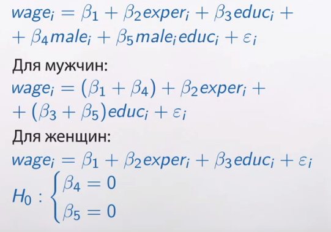
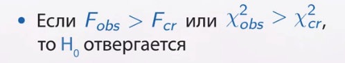
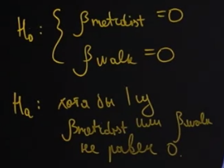
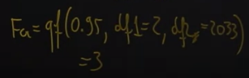
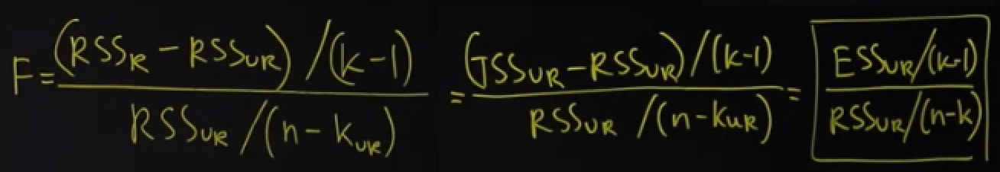

### Проверка гипотезы о нескольких линейных ограничениях

У нас фактически две разные модели, одна для мужчин, другая для женщин.

Естественно, возникает вопрос. А вообще, нужны ли разные модели для двух подвыборок? То есть вопрос: подвыборки отличаются или для них можно использовать одну и ту же модель? 

Нулевая гипотеза в том,  что сразу два коэффициента $\beta_4$ и $\beta_5$ одновременно равны нулю. Здесь альтернативная гипотеза состоит в том, что хотя бы один из коэффициентов $\beta_4$ или $\beta_5$ не равен нулю. 

Проверка гипотезы несколько шагов:

1. На первом шаге мы оцениваем так называемую неограниченную модель. Неограниченная модель предполагает, что выборки, подвыборки по мужчинам и по женщинам, модели могут отличаться. То есть мы оцениваем одну модель, куда входит и β_4 male и β_5, помноженная на male на education. В этой модели мы считаем RSS — сумму квадратов остатка.

2. Оцениваем ограниченную модель.то есть фактически мы просто оцениваем одно уравнение по всем наблюдениям, но не включаем переменную male, ни произведение male на education. То есть мы оцениваем по тем же наблюдениям модель с меньшим количеством регрессоров. Она называется ограниченной, из нее мы также вытаскиваем RSS, но этот RSS отличается — это RSS restricted. 

Оказывается что при верно нулевой гипотезе можно сконструировать дробь, которая асимптотически будет иметь $\chi^2$ распределение. 
А при предварительном предположении о нормальности ошибок $\varepsilon_i$-тых, при фиксированных $x$, ну, практически эта же дробь, только поделенная на количество ограничений $R$, она будет иметь f-распределение с r и (n-k) степенями свободы.

Вывод при проверке: Если f наблюдаемое больше f критического, то $H_0$ отвергается. 
Или если мы работаем в рамках большого количества наблюдений, то мы считаем $\chi^2$ наблюдаемое и если оно больше $\chi^2$ критического, то мы H_0 отвергаем.

Примечание

###  Пример проверки гипотезы о нескольких линейных ограничениях

 К примеру, исследователь оценил модель зависимости стоимости квартиры в Москве от ряда факторов. У исследователя была модель один (M1) и модель два (M2) 
 
M1 --- Логарифм стоимости квартиры объяснялся следующим образом: минус 0.215 плюс 0.83 умножить на логарифм общей площади плюс 0.268 помножить на логарифм жилой площади плюс 0.196 на логарифм площади кухни плюс 0.112 умножить на дамми-переменную, которая равна единичке для кирпичных домов и ноль иначе, минус 0.01 на расстояние до метро в минутах и плюс 0.1 на дамми-переменную, которая означает метро пешком. 

M2 --- А давайте вот мы уберём те переменные, которые характеризуют удаленность от метро. Собственно, и метро пешком или на транспорте, и время, — они характеризуют удалённость квартиры от метро, то есть эти две переменные, они отвечают за одну и ту же идею. Давайте мы их уберём, рассмотрим модель попроще.

Так же известно что в модели 1 сумма квадратов остатков RSS оказалась равна 62.6, а в модели 2 RSS оказался равен, сумма квадратов остатков, 69.3. И известно, что оценивание производилось по 2040-ка наблюдениям. 

*Вопрос* ---  какую модель следует предпочесть? Первую модель — она, конечно, более сложная, но она, вроде, и предсказывает получше, RSS поменьше? Либо вторую — она, может, чуть-чуть похуже предсказывает, но зато она проще? Вот вопрос, является ли разница RSS вызванной случайными факторами или у нас вот просто систематически мы пропустили в модели 2 значимые важные переменные?

*Формально*:

Решение: Эта гипотеза проверяется с помощью F-статистики.

В нашем случае два ограничения --- те, что заданы в нулевой гипотезе.
Ограниченной моделью является модель, где мы считаем, что β равны нулю, то есть более короткая модель ограниченная. 
М2 — это ограниченная модель, 
а М1 — это неограниченная модель. 
В неогрниченной модели оценивалось семь коэффициентов бета с крышкой.
Вероятность ошибки первого рода $5\%$.

Считаем Эф-значение. 

Получили 110.

Теперь посчитаем теоретическое эф критическое. Можно в R.

Получаем 3. 

Теперь нарисуем Эф распределение, для случаев с двумя степенями свободы у нас особый вид. Обычно оно выглядит по другому. Но это сейчас не главное, главное, что полученное наблюдаемое Эф существенно дальше.

То есть у нас разница между $RSS_r$ и $RSS_ur$ слишком велика. То есть мы попадаем в область, где $H_0$ отвергается. То есть первая модель предсказывает существенно лучше, это не случайность — такое большое отличие в RSS

Мы делаем вывод, что нам нужно предпочесть модель один а не модель два

### Гипотеза о незначимости регрессии

Вдруг все те объясняющие переменные, которые я использую, вдруг они все совершенно бесполезные, вдруг ни одна из них не помогает объяснить зависимую переменную $y$.

Математически эта гипотеза сводится к тому, что все коэффициенты $\beta$  равны нулю

Я буду разбирать ситуацию множественной регрессии на примере двух регрессоров. Я хочу проверить гипотезу о том, что те две объясняющие переменные x и z, которые я включил в модель, — это абсолютно полная ерунда, их не стоило включать, и мой y вообще ни от чего не зависит.

Оценим дме модели ограниченная и неограниченная.

Проверяем при помощи Эф-статистики. Оказывается можно оценить только одну модель --- первую, и вторую вообще не оценивать.

Вызвано это следующими фактами: 

мы знаем что $RSS_r > RSS_{ur}$ а так же знаем что $TSS_r = TSS_{ur}$.А это говорит о том что  $RSS_r=TSS_{ur}$ К этому пришли исходя из того что во второй модели предсказание будет равно просто среднему.

И тогда формула для проверки будет иметь вид

Хотя опять же на сленге часто говорят «мы проверили гипотезу о значимости регрессии». Когда говорят такие слова, имеют в виду на самом деле проверку гипотезы о незначимости регрессии, о том, что все коэффициенты равны нулю.

